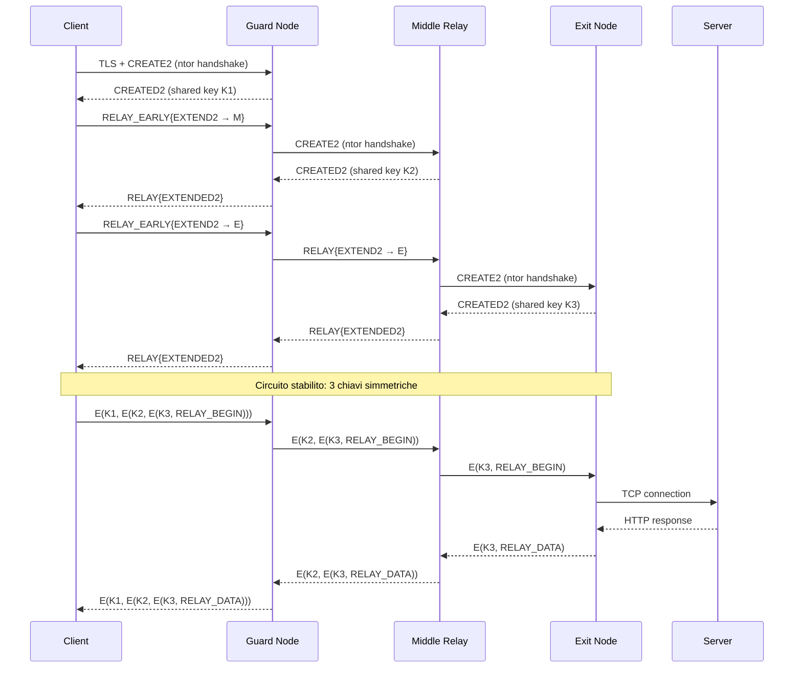

# Architettura di Tor — Analisi a Basso Livello

Questo documento descrive l'architettura interna della rete Tor con un livello di dettaglio
che va oltre la classica spiegazione "3 nodi e crittografia a cipolla". Qui analizziamo come
Tor funziona realmente a livello di protocollo, quali componenti software interagiscono,
come il daemon Tor gestisce connessioni, circuiti e stream, e quali sono le implicazioni
pratiche di ogni scelta architetturale.

Include note dalla mia esperienza diretta nell'uso di Tor su Kali Linux (Debian), con
proxychains, ControlPort, bridge obfs4 e script personalizzati.

---
---

## Indice

- [Visione d'insieme: cosa succede quando lanci Tor](#visione-dinsieme-cosa-succede-quando-lanci-tor)
- [I componenti dell'architettura Tor](#i-componenti-dellarchitettura-tor)
- [Come Tor costruisce un circuito — Dettaglio protocollo](#come-tor-costruisce-un-circuito-dettaglio-protocollo)
- [Celle Tor — L'unità di trasporto](#celle-tor-lunità-di-trasporto)
- [Connessioni TLS tra relay](#connessioni-tls-tra-relay)
- [Stream Isolation — Separazione del traffico](#stream-isolation-separazione-del-traffico)
- [Il ciclo di vita di un circuito](#il-ciclo-di-vita-di-un-circuito)
- [Architettura di sicurezza — Il modello di minaccia di Tor](#architettura-di-sicurezza-il-modello-di-minaccia-di-tor)
- [Riepilogo dell'architettura](#riepilogo-dellarchitettura)


## Visione d'insieme: cosa succede quando lanci Tor

Quando esegui `sudo systemctl start tor@default.service`, il daemon `tor` compie queste
operazioni in sequenza:

1. **Lettura del torrc** — il file `/etc/tor/torrc` viene parsato. Ogni direttiva viene
   validata. Se c'è un errore sintattico, Tor si rifiuta di partire (verificabile con
   `tor -f /etc/tor/torrc --verify-config`).

2. **Apertura delle porte locali** — Tor apre i socket in ascolto:
   - `SocksPort 9050` — proxy SOCKS5 per applicazioni client
   - `DNSPort 5353` — resolver DNS locale che instrada query via Tor
   - `ControlPort 9051` — interfaccia di controllo per script e tool esterni

3. **Connessione alla rete Tor** — Il daemon contatta le Directory Authorities (o un
   fallback mirror) per scaricare il **consenso** (network consensus), un documento
   firmato che elenca tutti i relay attivi con le loro proprietà.

4. **Bootstrap** — Tor costruisce i primi circuiti. Il processo è visibile nei log:
   ```
   Bootstrapped 5% (conn): Connecting to a relay
   Bootstrapped 10% (conn_done): Connected to a relay
   Bootstrapped 14% (handshake): Handshaking with a relay
   Bootstrapped 15% (handshake_done): Handshake with a relay done
   Bootstrapped 75% (enough_dirinfo): Loaded enough directory info to build circuits
   Bootstrapped 90% (ap_handshake_done): Handshake finished with a relay to build circuits
   Bootstrapped 95% (circuit_create): Establishing a Tor circuit
   Bootstrapped 100% (done): Done
   ```

5. **Pronto per il traffico** — Una volta raggiunto il 100%, il SocksPort accetta
   connessioni. ProxyChains, curl, Firefox possono instradare traffico.

### Nella mia esperienza

Il bootstrap è il momento più critico. Ho visto fallimenti in diverse situazioni:

- **Bridge saturi**: quando i bridge obfs4 configurati nel torrc erano sovraccarichi,
  il bootstrap si bloccava al 10-15% con `Connection timed out`. Soluzione: richiedere
  bridge freschi da `https://bridges.torproject.org/options`.

- **DNS bloccato**: su alcune reti universitarie il DNS era filtrato, impedendo al daemon
  di risolvere i fallback directory. Con i bridge obfs4 il problema si aggirava perché
  la connessione avviene direttamente all'IP del bridge.

- **Orologio di sistema sballato**: Tor verifica i certificati TLS e il consenso ha una
  finestra temporale di validità. Se l'orologio è fuori di più di qualche ora, Tor rifiuta
  il consenso. Mi è capitato su una VM appena installata dove NTP non era configurato.

---

## I componenti dell'architettura Tor

### 1. Onion Proxy (OP) — Il client

L'Onion Proxy è il software che gira sulla macchina dell'utente. Su Linux è il daemon
`tor`. Le sue responsabilità sono:

- **Scaricare e mantenere il consenso aggiornato** — Il consenso viene refreshato ogni ora.
  Contiene la lista di tutti i relay con flag, bandwidth, exit policy, chiavi pubbliche.

- **Costruire circuiti** — L'OP seleziona i nodi (Guard, Middle, Exit) e negozia chiavi
  crittografiche con ciascuno attraverso l'handshake ntor.

- **Multiplexare stream su circuiti** — Un singolo circuito può trasportare più stream
  TCP simultanei. Ogni connessione SOCKS5 al port 9050 genera un nuovo stream, ma
  potrebbe riutilizzare un circuito esistente.

- **Gestire l'isolamento** — Tor decide quando creare nuovi circuiti in base a criteri
  di isolamento (per porta di destinazione, per indirizzo di origine SOCKS, etc.).

- **Esporre interfacce locali** — SocksPort, DNSPort, TransPort, ControlPort.

#### Dettaglio: il flusso di una richiesta SOCKS5

Quando proxychains esegue `curl https://api.ipify.org`:

```
1. curl → proxychains (LD_PRELOAD intercetta connect())
2. proxychains → 127.0.0.1:9050 (SOCKS5 handshake)
3. SOCKS5 CONNECT api.ipify.org:443
4. Tor daemon riceve la richiesta
5. Tor seleziona un circuito (o ne crea uno nuovo)
6. Tor crea uno stream sul circuito → RELAY_BEGIN cell
7. L'Exit Node apre una connessione TCP verso api.ipify.org:443
8. L'Exit Node risponde → RELAY_CONNECTED cell
9. Dati fluiscono bidirezionalmente attraverso celle RELAY_DATA
10. curl riceve la risposta (IP dell'exit node)
```

Nella mia esperienza, verifico questo flusso così:
```bash
> proxychains curl https://api.ipify.org
[proxychains] config file found: /etc/proxychains4.conf
[proxychains] preloading /usr/lib/x86_64-linux-gnu/libproxychains.so.4
[proxychains] DLL init: proxychains-ng 4.17
[proxychains] Dynamic chain  ...  127.0.0.1:9050  ...  api.ipify.org:443  ...  OK
185.220.101.143
```

L'IP restituito è quello dell'Exit Node, non il mio (che è un IP italiano di Parma).

### 2. Directory Authorities (DA)

Le Directory Authorities sono 9 server hardcoded nel codice sorgente di Tor (+ 1 bridge
authority). Il loro ruolo è fondamentale:

- **Raccolgono i descriptor dei relay** — Ogni relay pubblica periodicamente un
  server descriptor contenente: chiavi pubbliche, exit policy, bandwidth dichiarata,
  famiglia di relay, contatto dell'operatore.

- **Votano il consenso** — Ogni ora, le DA votano su quali relay includere nel consenso
  e quali flag assegnare a ciascuno. Il risultato è un documento firmato dalla
  maggioranza delle DA.

- **Assegnano i flag** — I flag determinano il comportamento del relay nella rete:

  | Flag | Significato |
  |------|-------------|
  | `Guard` | Può essere usato come entry node |
  | `Exit` | Ha una exit policy che permette traffico in uscita |
  | `Stable` | Uptime lungo e affidabile |
  | `Fast` | Bandwidth sopra la mediana |
  | `HSDir` | Può ospitare descriptor di hidden service |
  | `V2Dir` | Supporta il protocollo directory v2 |
  | `Running` | Il relay è attualmente raggiungibile |
  | `Valid` | Il relay è stato verificato come funzionante |
  | `BadExit` | Exit node noto per comportamento malevolo |

- **Bandwidth Authorities** — Un sottoinsieme delle DA esegue misurazioni di bandwidth
  indipendenti (tramite il software `sbws`). Queste misurazioni sovrascrivono la
  bandwidth autodichiarata dai relay, prevenendo attacchi dove un relay malevolo
  dichiara bandwidth altissima per attrarre più traffico.

#### Implicazione pratica

Le DA sono un punto di centralizzazione. Se un avversario compromettesse 5 delle 9 DA,
potrebbe manipolare il consenso. Tuttavia:
- Le DA sono gestite da organizzazioni indipendenti in giurisdizioni diverse
- Il codice verifica firme multiple
- La community monitora anomalie nel consenso

### 3. Relay (nodi Tor)

I relay sono server volontari che trasportano traffico Tor. Ogni relay ha:

- **Chiave d'identità** (Ed25519) — identifica permanentemente il relay
- **Chiave onion** (Curve25519) — usata per l'handshake ntor (negoziazione chiavi di circuito)
- **Chiave di signing** — firma i descriptor
- **Chiave TLS** — per la connessione TLS tra relay

#### Tipi di relay

**Guard Node (Entry)**
- Primo nodo del circuito
- Conosce l'IP reale del client
- NON conosce la destinazione finale
- Selezionato da un pool ristretto di "entry guards" che il client mantiene per mesi
- Motivazione del guard persistente: se il client scegliesse entry random ogni volta,
  un avversario che controlla alcuni relay finirebbe per essere selezionato come entry
  (vedendo l'IP del client). Con guard persistenti, o sei sfortunato dalla prima
  selezione, o sei protetto per mesi.

**Middle Relay**
- Nodo intermedio
- NON conosce né il client né la destinazione
- Vede solo traffico cifrato dal guard e lo inoltra all'exit
- Selezionato con probabilità proporzionale alla bandwidth

**Exit Node**
- Ultimo nodo, esce su Internet
- Conosce la destinazione (dominio + porta)
- NON conosce l'IP del client
- Il suo IP è quello visibile ai siti web
- Definisce una exit policy che limita quali porte/destinazioni sono permesse

### 4. Bridge Relay

I bridge sono relay non elencati nel consenso pubblico. Esistono per aggirare la censura:

- L'ISP non può bloccarli consultando la lista pubblica dei relay
- Usano pluggable transports (obfs4, meek, Snowflake) per offuscare il traffico
- Sono distribuiti tramite canali limitati (sito web con CAPTCHA, email, Snowflake)

Nella mia esperienza, i bridge obfs4 sono stati essenziali per:
- Aggirare firewall universitari che bloccavano le connessioni dirette ai relay Tor
- Nascondere all'ISP il fatto che stavo usando Tor
- Evitare rallentamenti applicati da alcuni ISP al traffico Tor riconosciuto

---

## Come Tor costruisce un circuito — Dettaglio protocollo

La costruzione di un circuito è il cuore dell'architettura Tor. Ecco cosa succede
realmente a livello di protocollo:

### Fase 1: Selezione dei nodi

L'algoritmo di path selection opera così:

1. **Guard selection**: il client mantiene un set di 1-3 guard persistenti (salvati
   nel file `state` in `/var/lib/tor/state`). Se non ne ha, ne seleziona dal consenso
   tra i relay con flag `Guard` + `Stable` + `Fast`. La selezione è pesata per bandwidth.

2. **Exit selection**: tra i relay con flag `Exit`, Tor sceglie quelli la cui exit policy
   permette la porta di destinazione richiesta. Se vuoi raggiungere la porta 443,
   servono exit che accettano `:443`. Anche qui la selezione è pesata per bandwidth.

3. **Middle selection**: qualsiasi relay che non sia il guard o l'exit selezionato.
   La selezione è pesata per bandwidth. Tor evita di selezionare due nodi nella stessa
   `/16` subnet o nella stessa famiglia dichiarata.

### Fase 2: Creazione del circuito (CREATE2 → CREATED2 → EXTEND2 → EXTENDED2)

```
Client                   Guard                   Middle                  Exit
  |                        |                       |                      |
  |--- CREATE2 ----------->|                       |                      |
  |    (ntor handshake     |                       |                      |
  |     client→guard)      |                       |                      |
  |                        |                       |                      |
  |<-- CREATED2 ---------- |                       |                      |
  |    (guard→client       |                       |                      |
  |     handshake done)    |                       |                      |
  |                        |                       |                      |
  | Ora: chiave condivisa con Guard (Kf_guard, Kb_guard)                  |
  |                        |                       |                      |
  |--- RELAY_EARLY ------->|--- EXTEND2 --------->|                      |
  |    {EXTEND2 cifrato    |    (ntor handshake    |                      |
  |     con Kf_guard}      |     client→middle)    |                      |
  |                        |                       |                      |
  |<-- RELAY --------------|<-- EXTENDED2 ---------|                      |
  |    {EXTENDED2 cifrato  |    (middle→client     |                      |
  |     con Kb_guard}      |     handshake done)   |                      |
  |                        |                       |                      |
  | Ora: chiave condivisa anche con Middle (Kf_middle, Kb_middle)         |
  |                        |                       |                      |
  |--- RELAY_EARLY ------->|--- RELAY ------------>|--- EXTEND2 -------->|
  |    {EXTEND2 cifrato    |    {EXTEND2 cifrato   |    (ntor handshake  |
  |     2 strati}          |     1 strato}         |     client→exit)    |
  |                        |                       |                      |
  |<-- RELAY --------------|<-- RELAY -------------|<-- EXTENDED2 -------|
  |    {EXTENDED2 cifrato  |    {EXTENDED2 cifrato |    (exit→client     |
  |     2 strati}          |     1 strato}         |     handshake done) |
  |                        |                       |                      |
  | Ora: 3 chiavi condivise indipendenti                                  |
```

#### Dettaglio dell'handshake ntor

L'handshake ntor è il meccanismo crittografico che Tor usa per negoziare chiavi con
ogni nodo del circuito. Usa:

- **Curve25519** — per il Diffie-Hellman su curva ellittica
- **HMAC-SHA256** — per la derivazione delle chiavi
- **HKDF** (HMAC-based Key Derivation Function) — per generare le chiavi simmetriche
  finali

Il processo per ogni hop:

1. Il client genera una coppia ephemeral Curve25519 (x, X = x*G)
2. Il client conosce la chiave onion pubblica del relay (B) dal consenso
3. Il client invia X nella cella CREATE2/EXTEND2
4. Il relay ha la chiave privata b corrispondente a B
5. Il relay genera la sua coppia ephemeral (y, Y = y*G)
6. Entrambi calcolano: secret = x*Y = y*X (proprietà ECDH)
7. Dalla secret vengono derivate le chiavi simmetriche tramite HKDF:
   - `Kf` — chiave per cifratura forward (client → relay)
   - `Kb` — chiave per cifratura backward (relay → client)
   - `Df`, `Db` — digest per integrità

Le chiavi risultanti sono usate con **AES-128-CTR** per la cifratura simmetrica dei dati.

### Fase 3: Trasmissione dati

Quando il circuito è pronto e un'applicazione invia dati:

1. **Il client cifra 3 volte**: prima con la chiave dell'Exit, poi del Middle, poi
   del Guard. I dati sono wrappati in celle RELAY_DATA.

2. **Il Guard decifra il primo strato** e inoltra al Middle.

3. **Il Middle decifra il secondo strato** e inoltra all'Exit.

4. **L'Exit decifra il terzo strato** e vede i dati in chiaro (a meno che non siano
   HTTPS/TLS, nel qual caso vede il traffico TLS cifrato verso la destinazione).

5. **Al ritorno**: l'Exit cifra con la sua chiave, il Middle aggiunge il suo strato,
   il Guard aggiunge il suo. Il client decifra tutti e 3 gli strati.

---

## Celle Tor — L'unità di trasporto

Tutto il traffico Tor è trasportato in **celle** di dimensione fissa: **514 byte**.
La dimensione fissa è una scelta anti-traffic-analysis: un osservatore non può
distinguere il tipo di cella dalla sua dimensione.

### Struttura di una cella

```
+----------+----------+------------------------------------------+
| CircID   | Command  | Payload                                  |
| (4 byte) | (1 byte) | (509 byte)                               |
+----------+----------+------------------------------------------+
```

- **CircID** (Circuit ID): identifica il circuito sulla connessione TLS tra due nodi.
  Ogni connessione TLS tra due relay può trasportare centinaia di circuiti, ognuno con
  il suo CircID.

- **Command**: tipo di cella. I principali:

  | Comando | Valore | Descrizione |
  |---------|--------|-------------|
  | PADDING | 0 | Cella di padding (anti traffic analysis) |
  | CREATE2 | 10 | Inizio creazione circuito |
  | CREATED2 | 11 | Risposta a CREATE2 |
  | RELAY | 3 | Cella relay (trasporta dati e comandi relay) |
  | RELAY_EARLY | 9 | Come RELAY ma usata solo durante l'estensione del circuito |
  | DESTROY | 4 | Distrugge un circuito |

### Celle RELAY — Il sottosistema di trasporto

Le celle RELAY hanno un payload strutturato:

```
+-----------+-----------+----------+---------+---------------------+
| RelayCmd  | Recognized| StreamID | Digest  | Data                |
| (1 byte)  | (2 byte)  | (2 byte) | (4 byte)| (498 byte)         |
+-----------+-----------+----------+---------+---------------------+
```

- **RelayCmd**: il tipo di comando relay:

  | Comando | Descrizione |
  |---------|-------------|
  | RELAY_BEGIN | Apre un nuovo stream TCP verso una destinazione |
  | RELAY_DATA | Trasporta dati del stream |
  | RELAY_END | Chiude uno stream |
  | RELAY_CONNECTED | Conferma che lo stream è connesso |
  | RELAY_RESOLVE | Risolve un hostname |
  | RELAY_RESOLVED | Risposta a RESOLVE |
  | RELAY_BEGIN_DIR | Apre uno stream verso la directory del relay |
  | RELAY_EXTEND2 | Estende il circuito a un nuovo hop |
  | RELAY_EXTENDED2 | Conferma l'estensione |

- **StreamID**: identifica lo stream specifico all'interno del circuito. Un circuito
  può avere molti stream attivi contemporaneamente (es. più tab del browser sullo
  stesso circuito).

- **Recognized + Digest**: usati per verificare che la cella sia destinata a questo
  nodo. Ogni nodo intermedio vede `Recognized` diverso da zero (cella non per lui)
  e la inoltra. Solo il destinatario finale vede `Recognized = 0` e il digest corretto.

---

## Connessioni TLS tra relay

Tutti i relay Tor comunicano tra loro tramite connessioni TLS persistenti. Queste
connessioni:

- **Sono multiplexate**: una singola connessione TLS tra due relay può trasportare
  centinaia di circuiti di utenti diversi.

- **Usano TLS 1.3** (o 1.2 minimo): con ciphersuite negoziate che includono forward
  secrecy (ECDHE).

- **Hanno un handshake speciale**: Tor usa un protocollo di autenticazione in-band
  dove i relay si scambiano le loro chiavi d'identità Ed25519 dopo il TLS handshake.
  Questo permette a Tor di nascondere l'identità del relay a osservatori passivi
  (il certificato TLS non contiene l'identità del relay).

### Implicazione: cosa vede l'ISP

Quando il mio client Tor si connette al Guard Node, il mio ISP vede:

1. Una connessione TLS verso l'IP del Guard (o del bridge se uso obfs4)
2. Il certificato TLS del Guard — che **non** contiene identificatori Tor espliciti
   (ma le DA pubblicano la lista degli IP, quindi l'ISP può correlare)
3. Con obfs4: nemmeno questo. Il traffico appare come rumore casuale.

Nella mia esperienza a Parma, il mio ISP (Comeser) non ha mai mostrato segni di
interferenza con Tor diretto. Ma su reti universitarie, i firewall bloccavano le
connessioni ai relay noti, rendendo i bridge obfs4 necessari.

---

## Stream Isolation — Separazione del traffico

Tor implementa il concetto di **stream isolation**: stream diversi possono essere
instradati su circuiti diversi per evitare correlazioni.

### Tipi di isolamento

- **Per porta SOCKS di origine** (`IsolateSOCKSAuth`): stream provenienti da porte
  SOCKS diverse usano circuiti diversi.

- **Per credenziali SOCKS** (`IsolateSOCKSAuth`): se il client invia username/password
  diverse nella richiesta SOCKS5, Tor usa circuiti diversi. Tor Browser usa questo
  meccanismo: ogni tab in un dominio diverso usa credenziali SOCKS diverse.

- **Per indirizzo di destinazione** (`IsolateDestAddr`): stream verso destinazioni
  diverse usano circuiti diversi.

- **Per porta di destinazione** (`IsolateDestPort`): stream verso porte diverse
  usano circuiti diversi.

### Configurazione nel torrc

```ini
# Porta principale — isolamento di default
SocksPort 9050

# Porta dedicata per browser con isolamento massimo
SocksPort 9052 IsolateSOCKSAuth IsolateDestAddr IsolateDestPort

# Porta dedicata per CLI senza isolamento (condivide circuiti)
SocksPort 9053 SessionGroup=1
```

Nella mia esperienza, ho usato solo la porta 9050 di default. Ma per un setup avanzato
dove voglio separare il traffico del browser da quello di proxychains, configurare
porte SOCKS multiple con isolamento diverso è la soluzione corretta.

---

## Il ciclo di vita di un circuito

I circuiti Tor non sono permanenti. Ecco il loro ciclo di vita:

1. **Creazione**: il client costruisce il circuito come descritto sopra.

2. **Uso attivo**: gli stream vengono assegnati al circuito. Un circuito "pulito"
   (senza stream attivi) può essere riutilizzato per nuove connessioni.

3. **Dirty timeout**: quando un circuito ha trasportato almeno uno stream, diventa
   "dirty". Dopo 10 minuti dall'ultimo utilizzo, Tor non assegnerà nuovi stream
   a questo circuito (ma gli stream esistenti continuano).

4. **Max lifetime**: un circuito non può esistere per più di ~24 ore, anche se attivo.

5. **NEWNYM**: il segnale NEWNYM (inviato via ControlPort) marca tutti i circuiti
   esistenti come "dirty" immediatamente, forzando Tor a costruirne di nuovi per
   le prossime connessioni. I circuiti con stream attivi non vengono chiusi subito.

6. **Distruzione**: quando un circuito non è più necessario, viene distrutto con
   una cella DESTROY.

### Nella mia esperienza con NEWNYM

Il mio script `newnym`:
```bash
#!/bin/bash
COOKIE=$(xxd -p /run/tor/control.authcookie | tr -d '\n')
printf "AUTHENTICATE %s\r\nSIGNAL NEWNYM\r\nQUIT\r\n" "$COOKIE" | nc 127.0.0.1 9051
```

Quando lo eseguo:
```bash
> ~/scripts/newnym
250 OK
250 closing connection
```

Poi verifico:
```bash
> proxychains curl https://api.ipify.org
185.220.101.143    # primo IP

> ~/scripts/newnym
250 OK
250 closing connection

> proxychains curl https://api.ipify.org
104.244.76.13      # IP cambiato — nuovo circuito, nuovo exit
```

Il cooldown tra due NEWNYM è di circa 10 secondi. Se invio NEWNYM troppo presto,
Tor restituisce comunque `250 OK` ma ignora la richiesta internamente.

---

## Architettura di sicurezza — Il modello di minaccia di Tor

Tor è progettato per proteggere contro specifici avversari e scenari. È fondamentale
capire cosa protegge e cosa NON protegge:

### Cosa Tor protegge

| Scenario | Protezione |
|----------|-----------|
| ISP che monitora il traffico | Vede solo connessione cifrata al Guard/bridge, non la destinazione |
| Sito web che vuole identificarti | Vede solo l'IP dell'exit node, non il tuo |
| Nodo exit malevolo | Non può risalire al tuo IP (conosce solo il Middle) |
| Nodo guard malevolo | Conosce il tuo IP ma non la destinazione (vede solo il Middle) |
| Osservatore sulla rete locale | Vede traffico cifrato verso Guard/bridge |

### Cosa Tor NON protegge

| Scenario | Perché |
|----------|--------|
| Avversario che controlla Guard E Exit | Può correlare timing del traffico (attacco di correlazione) |
| Avversario globale (tipo NSA) | Può fare traffic analysis su larga scala |
| Malware sul tuo sistema | Legge prima che i dati entrino in Tor |
| Fingerprinting del browser | Se non usi Tor Browser, il browser ha un fingerprint unico |
| Errori dell'utente | Login con account personale su Tor, leak DNS, etc. |
| Metadata temporali | Il timing delle richieste può essere correlato |

### Implicazione pratica

La mia configurazione su Kali (proxychains + curl + Firefox con profilo tor-proxy) NON
offre la stessa protezione di Tor Browser. Firefox normale ha un fingerprint unico
(user-agent, font, canvas, WebGL, dimensioni finestra). Lo uso consapevolmente per
comodità e test, non per anonimato assoluto.

Per anonimato massimo: Tor Browser (o Whonix/Tails).

---


### Diagramma: flusso di un circuito Tor



## Riepilogo dell'architettura

```
                    ┌─────────────────────────────┐
                    │    Directory Authorities     │
                    │  (9 server, votano consenso) │
                    └──────────────┬──────────────┘
                                   │ consenso firmato
                    ┌──────────────▼──────────────┐
        ┌───────────│      Relay Network          │───────────┐
        │           │  (~7000 relay volontari)     │           │
        │           └─────────────────────────────┘           │
        │                                                      │
  ┌─────▼─────┐      ┌──────────┐      ┌──────────┐    ┌─────▼─────┐
  │   Guard    │◄────►│  Middle   │◄────►│   Exit   │───►│ Internet  │
  │   Node     │ TLS  │  Relay   │ TLS  │   Node   │    │ (sito web)│
  └─────▲─────┘      └──────────┘      └──────────┘    └───────────┘
        │ TLS (o obfs4)
  ┌─────┴─────┐
  │  Client   │
  │  (tor     │
  │  daemon)  │
  │           │
  │ SocksPort │◄──── proxychains, curl, Firefox
  │ DNSPort   │◄──── risoluzione DNS via Tor
  │ ControlPort│◄──── script NEWNYM, nyx
  └───────────┘
```

Questa architettura garantisce che **nessun singolo nodo conosca contemporaneamente
origine e destinazione del traffico**. Il Guard conosce il client ma non la destinazione.
L'Exit conosce la destinazione ma non il client. Il Middle non conosce nessuno dei due.

---

## Vedi anche

- [Circuiti, Crittografia e Celle](circuiti-crittografia-e-celle.md) — Celle 514 byte, crittografia strato per strato
- [Consenso e Directory Authorities](consenso-e-directory-authorities.md) — Votazione, flag, selezione relay
- [Guard Nodes](../03-nodi-e-rete/guard-nodes.md) — Primo hop del circuito, persistenza
- [torrc — Guida Completa](../02-installazione-e-configurazione/torrc-guida-completa.md) — Configurazione di tutte le componenti
- [Limitazioni del Protocollo](../07-limitazioni-e-attacchi/limitazioni-protocollo.md) — TCP-only, latenza, bandwidth