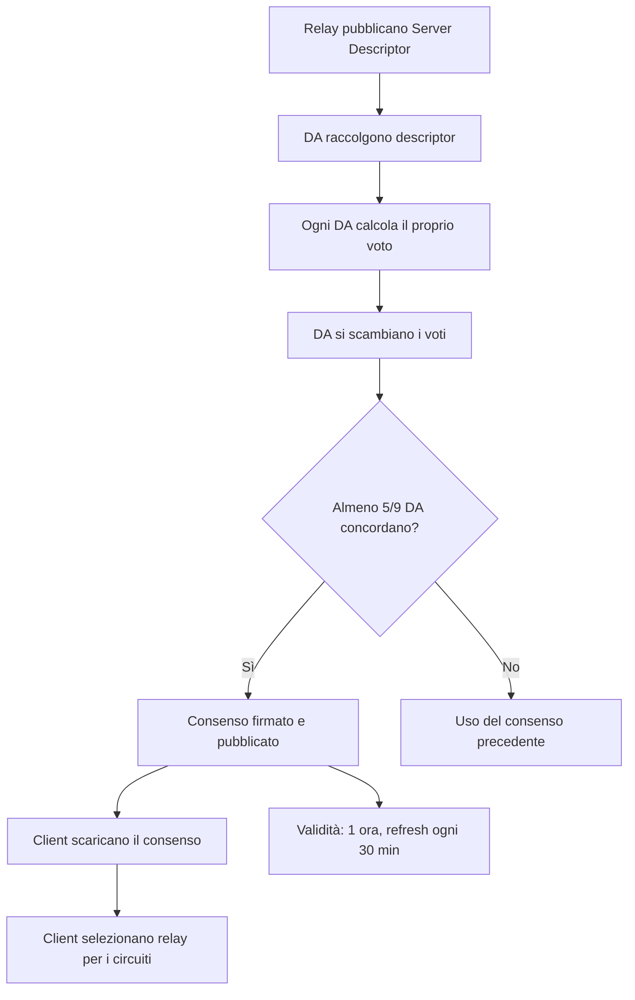

# Consenso e Directory Authorities — Il Sistema Nervoso di Tor

Questo documento analizza in dettaglio come la rete Tor mantiene una visione condivisa
del proprio stato: il meccanismo del consenso, il ruolo delle Directory Authorities,
il processo di votazione, i descriptor dei relay, e le implicazioni per la sicurezza.

Include osservazioni dalla mia esperienza nell'analisi dei log di Tor durante il
bootstrap e nella comprensione di perché certi relay vengono selezionati.

---
---

## Indice

- [Perché serve un consenso?](#perché-serve-un-consenso)
- [Directory Authorities — Chi sono e cosa fanno](#directory-authorities-chi-sono-e-cosa-fanno)
- [Il processo di votazione — Ora per ora](#il-processo-di-votazione-ora-per-ora)
- [Struttura del documento di consenso](#struttura-del-documento-di-consenso)
- [Flag del consenso — Analisi approfondita](#flag-del-consenso-analisi-approfondita)
- [Bandwidth Authorities e misurazione della banda](#bandwidth-authorities-e-misurazione-della-banda)
- [Server Descriptors — L'identità di un relay](#server-descriptors-lidentità-di-un-relay)
- [Microdescriptor vs Server Descriptor](#microdescriptor-vs-server-descriptor)
- [Cache del consenso e persistenza](#cache-del-consenso-e-persistenza)
- [Attacchi al sistema del consenso](#attacchi-al-sistema-del-consenso)
- [Consultare il consenso manualmente](#consultare-il-consenso-manualmente)
- [Riepilogo](#riepilogo)


## Perché serve un consenso?

Tor è una rete decentralizzata di ~7000 relay volontari. Il client deve sapere:

- Quali relay esistono e sono attivi
- Quali sono i loro indirizzi IP e porte
- Quali chiavi pubbliche usano (per l'handshake ntor)
- Quanto bandwidth offrono (per la selezione pesata)
- Quale exit policy hanno (per scegliere l'exit corretto)
- Quali flag hanno (Guard, Exit, Stable, Fast, etc.)

Senza queste informazioni, il client non può costruire circuiti. Il **consenso** è il
documento che contiene tutto questo.

---

## Directory Authorities — Chi sono e cosa fanno

### Le 9 Directory Authorities

Le DA sono server hardcoded nel codice sorgente di Tor. Al momento della scrittura,
sono gestite da:

| Nome | Operatore | Giurisdizione |
|------|-----------|---------------|
| moria1 | MIT (Roger Dingledine) | USA |
| tor26 | Peter Palfrader | Austria |
| dizum | Alex de Joode | Paesi Bassi |
| Serge | Serge Hallyn | USA |
| gabelmoo | Sebastian Hahn | Germania |
| dannenberg | CCC | Germania |
| maatuska | Linus Nordberg | Svezia |
| Faravahar | Sina Rabbani | USA |
| longclaw | Riseup | USA |

Queste 9 autorità **votano ogni ora** per produrre il consenso. Il consenso è valido
solo se firmato da almeno **5 delle 9** DA (maggioranza semplice).

### Bridge Authority

Esiste anche una **bridge authority** separata (attualmente `Serge` ha anche questo ruolo)
che gestisce il database dei bridge. I bridge non compaiono nel consenso pubblico —
sono distribuiti tramite `https://bridges.torproject.org` e altri canali.

### Fallback Directories

Per ridurre il carico sulle DA durante il bootstrap iniziale, Tor include una lista di
**fallback directory mirrors** hardcoded. Questi sono relay normali con flag `V2Dir` che
hanno una copia del consenso. Il client li usa per il primo download, poi passa alle DA.

Nella mia esperienza, il bootstrap usa quasi sempre i fallback. Lo vedo nei log:
```
Bootstrapped 5% (conn): Connecting to a relay
```
Quel "relay" è un fallback directory, non una DA. Le DA vengono contattate direttamente
solo se i fallback non rispondono.

---

## Il processo di votazione — Ora per ora

Ogni ora, il consenso viene rinnovato. Il processo è:

### Fase 1: Pubblicazione dei voti (T+0 min)

Ogni DA produce il proprio **voto** basandosi sui relay che ha testato:

```
Il voto di una singola DA contiene:
- Lista di tutti i relay noti alla DA
- Flag assegnati a ciascun relay
- Bandwidth misurata (se la DA è anche bandwidth authority)
- Timestamp di validità
- Firma della DA
```

I voti vengono pubblicati e condivisi tra le DA.

### Fase 2: Calcolo del consenso (T+5 min)

Ogni DA calcola il consenso combinando tutti i voti ricevuti:

1. **Per ogni relay**: viene incluso nel consenso solo se **almeno la metà delle DA**
   che hanno votato lo include.

2. **Per ogni flag**: un relay riceve un flag se **almeno la metà delle DA** che lo
   conoscono gli assegna quel flag.

3. **Per la bandwidth**: se ci sono misurazioni da bandwidth authorities, queste
   prevalgono sulla bandwidth autodichiarata dal relay.

4. **Firma**: ogni DA firma il consenso risultante.

### Fase 3: Pubblicazione (T+10 min)

Il consenso firmato viene pubblicato. I client (e i relay) lo scaricano.

### Tempistica completa del consenso

```
Ora X + 00:00  → Le DA iniziano a raccogliere i voti
Ora X + 00:05  → Le DA calcolano il consenso
Ora X + 00:10  → Il consenso è pubblicato
Ora X + 01:00  → Nuovo ciclo di votazione

Il consenso è valido per 3 ore dal momento della pubblicazione,
con un periodo di "fresh" di 1 ora. Questo permette ai client
con connessioni lente di usare un consenso leggermente datato.
```

### Nella mia esperienza

Il download del consenso è la prima cosa che Tor fa al bootstrap. Se il consenso è
corrotto, scaduto, o non raggiungibile, il bootstrap fallisce. Ho visto questo errore:

```
[warn] Our clock is 3 hours behind the consensus published time.
```

Questo accadeva su una VM dove NTP non era configurato. L'orologio era indietro di
3 ore, e Tor rifiutava il consenso perché fuori dalla finestra di validità. La
soluzione è stata:

```bash
sudo timedatectl set-ntp true
sudo systemctl restart systemd-timesyncd
```

---

## Struttura del documento di consenso

Il consenso è un documento di testo di circa 2-3 MB. Ecco la sua struttura semplificata:

### Header

```
network-status-version 3
vote-status consensus
consensus-method 32
valid-after 2025-01-15 12:00:00
fresh-until 2025-01-15 13:00:00
valid-until 2025-01-15 15:00:00
voting-delay 300 300
...
```

- `valid-after`: quando il consenso diventa valido
- `fresh-until`: entro quando il client dovrebbe cercare un consenso più recente
- `valid-until`: dopo questa data il consenso è considerato scaduto
- `voting-delay`: tempo per upload dei voti e per il calcolo

### Sezione delle DA

```
dir-source moria1 ...
contact Roger Dingledine
vote-digest ABCDEF1234...
...
```

### Sezione dei relay (il cuore del consenso)

Per ogni relay:

```
r ExitRelay1 ABCDef123 2025-01-15 11:45:33 198.51.100.42 9001 0
s Exit Fast Guard HSDir Running Stable V2Dir Valid
w Bandwidth=15000
p accept 20-23,43,53,79-81,88,110,143,194,220,389,443,464-465,531,543-544,554,563,587,636,706,749,853,873,902-904,981,989-995,1194,1220,1293,1500,1533,1677,1723,1755,1863,2082-2083,2086-2087,2095-2096,2102-2104,3128,3389,3690,4321,4443,5050,5190,5222-5223,5228,5900,6660-6669,6679,6697,8000-8003,8080,8332-8333,8443,8888,9418,11371,19294,19638
```

Spiegazione riga per riga:

- **r** (router): nickname, fingerprint (base64), data pubblicazione, IP, ORPort, DirPort
- **s** (status flags): i flag assegnati dal consenso
- **w** (weight): bandwidth in KB/s (pesata e misurata)
- **p** (exit policy summary): versione compressa dell'exit policy

### Sezione delle firme

```
directory-signature sha256 FINGERPRINT_DA
-----BEGIN SIGNATURE-----
...
-----END SIGNATURE-----
```

---

## Flag del consenso — Analisi approfondita

I flag determinano come il client usa ogni relay. La loro assegnazione è critica per
la sicurezza della rete.

### Flag `Guard`

**Requisiti**: il relay deve essere:
- `Stable` (uptime sopra la mediana dei relay Stable-eligible)
- `Fast` (bandwidth sopra la mediana)
- In funzione da almeno 8 giorni
- Con bandwidth sufficiente (almeno la mediana o almeno 2 MB/s)

**Implicazione**: solo i relay con flag Guard possono essere scelti come entry node
dal client. Questo limita il pool di entry a relay affidabili e ad alta bandwidth,
riducendo il rischio che un relay malevolo venga scelto come guard.

### Flag `Exit`

**Requisiti**: la exit policy del relay permette connessioni verso almeno porta 80 e 443
di almeno 2 indirizzi /8.

**Implicazione**: solo i relay con flag Exit vengono considerati per l'ultimo hop.
Un relay senza flag Exit ma con una exit policy parziale non viene selezionato come
exit dal client (ma potrebbe comunque funzionare se forzato).

### Flag `Stable`

**Requisiti**: MTBF (Mean Time Between Failures) sopra la mediana dei relay con uptime > 1 giorno, OPPURE sopra 7 giorni.

**Implicazione**: usato per circuiti che richiedono connessioni lunghe (SSH, IRC, etc.).
Tor seleziona relay Stable per stream su porte note per connessioni persistenti.

### Flag `Fast`

**Requisiti**: bandwidth misurata sopra la mediana dei relay attivi, O almeno 100 KB/s.

**Implicazione**: aumenta la probabilità di selezione per quel relay (più banda → più
traffico instradato).

### Flag `HSDir`

**Requisiti**: il relay supporta il protocollo directory per hidden services.

**Implicazione**: può memorizzare e servire descriptor di hidden services (.onion).
Importante per la raggiungibilità degli onion services.

### Flag `BadExit`

**Requisiti**: assegnato manualmente dalle DA quando un exit node è stato identificato
come malevolo (sniffing, injection, MITM).

**Implicazione**: il client **non seleziona** mai un relay con flag BadExit come exit
node. Può ancora essere usato come middle.

### Nella mia esperienza

Non ho mai dovuto interagire direttamente con i flag, ma li vedo quando uso Nyx o
quando ispeziono i circuiti via ControlPort. Sapere che il mio guard ha il flag `Guard`
e `Stable` mi dà più fiducia nella stabilità dei circuiti.

---

## Bandwidth Authorities e misurazione della banda

### Il problema della bandwidth autodichiarata

Ogni relay può dichiarare qualsiasi valore di bandwidth nel proprio descriptor. Un
relay malevolo potrebbe dichiarare 100 MB/s quando ne ha 1 MB/s, per attrarre più
traffico e aumentare le probabilità di essere selezionato.

### La soluzione: bandwidth authorities

Un sottoinsieme delle DA esegue misurazioni di bandwidth indipendenti usando il
software **sbws** (Simple Bandwidth Scanner):

1. **sbws** si connette a ogni relay e misura la banda reale
2. Genera un file di voto con le bandwidth misurate
3. Durante la votazione, le bandwidth misurate sovrascrivono quelle autodichiarate
4. Il consenso contiene la bandwidth misurata, non quella dichiarata

### Bandwidth weights nel consenso

Il consenso include anche i **bandwidth weights** — coefficienti globali che determinano
come distribuire il traffico tra guard, middle, exit:

```
bandwidth-weights Wbd=0 Wbe=0 Wbg=4203 Wbm=10000 Wdb=10000 Web=10000 Wed=10000
Weg=10000 Wem=10000 Wgb=10000 Wgd=0 Wgg=5797 Wgm=5797 Wmb=10000 Wmd=10000
Wme=10000 Wmg=4203 Wmm=10000
```

Questi pesi servono per bilanciare il traffico: se ci sono pochi exit rispetto ai
guard, i pesi vengono aggiustati per mandare più traffico attraverso gli exit
disponibili.

---

## Server Descriptors — L'identità di un relay

Ogni relay pubblica periodicamente un **server descriptor** che contiene tutte le
informazioni necessarie per connettersi e negoziare chiavi:

```
@type server-descriptor 1.0
router ExampleRelay 198.51.100.42 9001 0 0
identity-ed25519
-----BEGIN ED25519 CERT-----
...
-----END ED25519 CERT-----
master-key-ed25519 BASE64KEY...
platform Tor 0.4.8.10 on Linux
proto Cons=1-2 Desc=1-2 DirCache=2 FlowCtrl=1-2 HSDir=2 HSIntro=4-5 ...
published 2025-01-15 11:45:33
fingerprint ABCD EFGH IJKL MNOP QRST UVWX YZ01 2345 6789 ABCD
uptime 1234567
bandwidth 10485760 20971520 15728640
extra-info-digest SHA1HASH SHA256HASH
onion-key
-----BEGIN RSA PUBLIC KEY-----
...
-----END RSA PUBLIC KEY-----
signing-key
-----BEGIN RSA PUBLIC KEY-----
...
-----END RSA PUBLIC KEY-----
onion-key-crosscert
-----BEGIN CROSSCERT-----
...
-----END CROSSCERT-----
ntor-onion-key CURVE25519_BASE64_KEY
ntor-onion-key-crosscert 0
-----BEGIN ED25519 CERT-----
...
-----END ED25519 CERT-----
accept *:80
accept *:443
reject *:*
router-sig-ed25519 SIGNATURE...
router-signature
-----BEGIN SIGNATURE-----
...
-----END SIGNATURE-----
```

### Campi chiave

| Campo | Descrizione |
|-------|-------------|
| `router` | Nickname, IP, ORPort |
| `identity-ed25519` | Chiave d'identità Ed25519 (long-term) |
| `ntor-onion-key` | Chiave pubblica Curve25519 per handshake ntor |
| `bandwidth` | Bandwidth: media, burst, osservata (in byte/s) |
| `accept/reject` | Exit policy dettagliata |
| `uptime` | Secondi di uptime corrente |
| `platform` | Versione di Tor e OS |
| `proto` | Protocolli supportati |

### Rotazione delle chiavi

- **Chiave d'identità Ed25519**: permanente (identifica il relay per tutta la sua vita)
- **Chiave onion Curve25519**: ruotata periodicamente (tipicamente ogni settimana)
- **Chiave TLS**: ruotata frequentemente
- **Chiave di signing**: intermediaria tra identità e descriptor

La rotazione della chiave onion è importante: garantisce forward secrecy a lungo termine.
Anche se un avversario ottiene la chiave onion corrente, non può decifrare i circuiti
negoziati con chiavi onion precedenti (che sono state distrutte).

---

## Microdescriptor vs Server Descriptor

Per ridurre la bandwidth necessaria ai client, Tor supporta due formati di descriptor:

### Server Descriptor (completo)

Contiene tutte le informazioni del relay, inclusa la exit policy dettagliata. Usato
dai relay e dai servizi che hanno bisogno di informazioni complete.

### Microdescriptor (compatto)

Versione ridotta che contiene solo le informazioni necessarie per costruire circuiti:

```
@type microdescriptor 1.0
onion-key
-----BEGIN RSA PUBLIC KEY-----
...
-----END RSA PUBLIC KEY-----
ntor-onion-key CURVE25519_BASE64_KEY
id ed25519 ED25519_KEY_BASE64
```

Il client scarica:
1. Il **consenso microdescriptor** (versione compatta del consenso, ~1 MB)
2. I **microdescriptor** di ogni relay elencato (~1-2 MB totali)

Questo riduce significativamente la bandwidth necessaria per il bootstrap iniziale.

### Nella mia esperienza

Il download iniziale del consenso e dei descriptor è la fase più lenta del bootstrap.
Su connessioni lente (o quando uso bridge obfs4 con banda limitata), il bootstrap
può richiedere 30-60 secondi. Lo vedo nei log:

```
Bootstrapped 75% (enough_dirinfo): Loaded enough directory info to build circuits
```

Questa riga indica che Tor ha scaricato abbastanza descriptor per iniziare a costruire
circuiti, anche se non ha ancora tutti i descriptor della rete.

---

## Cache del consenso e persistenza

Tor salva il consenso e i descriptor in `/var/lib/tor/`:

```
/var/lib/tor/
├── cached-certs              # certificati delle DA
├── cached-microdesc          # microdescriptor dei relay
├── cached-microdesc.new      # microdescriptor aggiornati (merge periodico)
├── cached-microdescs.new     # buffer di nuovi microdescriptor
├── cached-consensus          # ultimo consenso scaricato
├── state                     # stato persistente (guard selection, etc.)
├── lock                      # file di lock (un solo processo Tor alla volta)
└── keys/                     # chiavi del relay (se si opera come relay)
```

### Il file `state`

Il file `state` è particolarmente importante perché contiene:

```
EntryGuard ExampleGuard FINGERPRINT DirCache
EntryGuardDownloadedBy 0.4.8.10
EntryGuardUnlistedSince (data, se il guard non è più nel consenso)
EntryGuardAddedBy FINGERPRINT 0.4.8.10 (data)
EntryGuardPathBias 100 0 0 0 100 0
...
```

Questo file preserva la selezione dei guard tra i riavvii di Tor. È fondamentale
perché i guard persistenti sono una protezione contro attacchi di lungo periodo.

### Nella mia esperienza

Dopo aver reinstallato Tor, il primo bootstrap è più lento perché non c'è cache.
I bootstrap successivi sono molto più veloci perché Tor usa i descriptor in cache
e li aggiorna incrementalmente.

Se cancello `/var/lib/tor/state`, Tor seleziona nuovi guard al prossimo avvio. Questo
è **normalmente indesiderabile** perché:
- Si perde la protezione dei guard persistenti
- Si apre una finestra dove un avversario potrebbe essere selezionato come guard

L'unico caso in cui è ragionevole è se sospetto che il guard selezionato sia
compromesso o se sto riconfigurando completamente l'installazione.

---

## Attacchi al sistema del consenso

### 1. Compromissione di Directory Authorities

Se un avversario compromette 5+ DA, può:
- Inserire relay malevoli nel consenso con flag Guard + Exit
- Rimuovere relay legittimi dal consenso
- Manipolare i bandwidth weights per concentrare traffico

**Mitigazione**: le DA sono gestite da organizzazioni indipendenti in giurisdizioni
diverse. Il codice sorgente è open source e auditable.

### 2. Relay malevoli con bandwidth gonfiata

Un avversario gestisce relay che dichiarano bandwidth altissima per essere selezionati
più spesso.

**Mitigazione**: le bandwidth authorities misurano la banda reale e sovrascrivono
i valori dichiarati.

### 3. Sybil attack

Un avversario gestisce centinaia di relay per aumentare le probabilità di controllare
sia il guard che l'exit di un circuito.

**Mitigazione**:
- Le DA verificano che i relay siano raggiungibili
- I relay nella stessa /16 subnet non vengono usati nello stesso circuito
- `MyFamily` dichiara relay co-gestiti per evitare che siano nello stesso circuito
- Le bandwidth authorities limitano la bandwidth effettiva

### 4. Denial of service sulle DA

Se le DA vengono rese irraggiungibili, i client non possono aggiornare il consenso.

**Mitigazione**: il consenso ha una validità di 3 ore. I fallback directories
distribuiscono il carico. I client possono operare con un consenso leggermente
datato.

---

## Consultare il consenso manualmente

### Scaricare il consenso corrente

```bash
# Via Tor (anonimo)
proxychains curl -s https://consensus-health.torproject.org/consensus-health.html

# Il consenso grezzo (grande, ~2 MB)
proxychains curl -s http://128.31.0.34:9131/tor/status-vote/current/consensus > /tmp/consensus.txt
```

### Analizzare i relay nel consenso

```bash
# Contare i relay nel consenso
grep "^r " /tmp/consensus.txt | wc -l

# Trovare relay con flag Guard
grep -B1 "^s.*Guard" /tmp/consensus.txt | grep "^r "

# Trovare relay Exit in un certo paese (richiede GeoIP)
# Tor include un database GeoIP in /usr/share/tor/geoip

# Verificare i bandwidth weights
grep "^bandwidth-weights" /tmp/consensus.txt
```

### Nella mia esperienza

Non consulto il consenso spesso, ma è stato utile per capire:
- Quanti exit esistono realmente per un certo paese (quando provavo `ExitNodes {it}`)
- Perché certi circuiti erano lenti (il relay selezionato aveva bandwidth bassa)
- Come funziona la rotazione dei guard (osservando il file `state`)

---


### Diagramma: processo di votazione del consenso



## Riepilogo

| Componente | Ruolo | Frequenza aggiornamento |
|-----------|-------|------------------------|
| Directory Authorities | Votano il consenso | Ogni ora |
| Consenso | Stato della rete (tutti i relay) | Ogni ora, valido 3 ore |
| Server Descriptors | Dettagli di ogni relay | Ogni 18 ore (o quando cambiano) |
| Microdescriptors | Versione compatta dei descriptor | Quando cambiano |
| Bandwidth Authorities | Misurano la banda reale | Continuamente |
| Cache locale | Consenso + descriptor salvati | Ad ogni aggiornamento |
| File state | Guard selection persistente | Ad ogni cambio |

---

## Vedi anche

- [Architettura di Tor](architettura-tor.md) — Come i componenti usano il consenso
- [Guard Nodes](../03-nodi-e-rete/guard-nodes.md) — Flag Guard e selezione
- [Exit Nodes](../03-nodi-e-rete/exit-nodes.md) — Flag Exit e exit policy
- [Relay Monitoring e Metriche](../03-nodi-e-rete/relay-monitoring-e-metriche.md) — Tor Metrics, bandwidth authorities
- [Attacchi Noti](../07-limitazioni-e-attacchi/attacchi-noti.md) — Sybil attack e manipolazione del consenso
