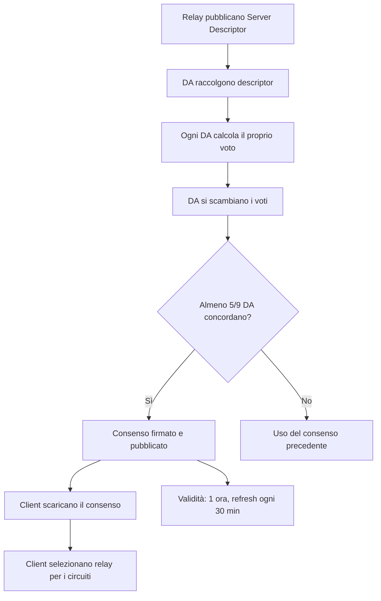

# Descriptor, Cache e Attacchi al Sistema del Consenso

Server descriptor, microdescriptor, cache locale del consenso, e analisi
degli attacchi possibili al meccanismo di votazione delle Directory Authorities.

Estratto da [Consenso e Directory Authorities](consenso-e-directory-authorities.md).

---

## Indice

- [Server Descriptors - L'identità di un relay](#server-descriptors--lidentità-di-un-relay)
- [Microdescriptor vs Server Descriptor](#microdescriptor-vs-server-descriptor)
- [Cache del consenso e persistenza](#cache-del-consenso-e-persistenza)
- [Attacchi al sistema del consenso](#attacchi-al-sistema-del-consenso)
- [Consultare il consenso manualmente](#consultare-il-consenso-manualmente)

---

## Server Descriptors - L'identità di un relay

Ogni relay pubblica periodicamente un **server descriptor** che contiene tutte le
informazioni necessarie per connettersi e negoziare chiavi:

```
@type server-descriptor 1.0
router ExampleRelay 198.51.100.42 9001 0 0
identity-ed25519
-----BEGIN ED25519 CERT-----
...
-----END ED25519 CERT-----
master-key-ed25519 BASE64KEY...
platform Tor 0.4.8.10 on Linux
proto Cons=1-2 Desc=1-2 DirCache=2 FlowCtrl=1-2 HSDir=2 HSIntro=4-5 ...
published 2025-01-15 11:45:33
fingerprint ABCD EFGH IJKL MNOP QRST UVWX YZ01 2345 6789 ABCD
uptime 1234567
bandwidth 10485760 20971520 15728640
extra-info-digest SHA1HASH SHA256HASH
onion-key
-----BEGIN RSA PUBLIC KEY-----
...
-----END RSA PUBLIC KEY-----
signing-key
-----BEGIN RSA PUBLIC KEY-----
...
-----END RSA PUBLIC KEY-----
onion-key-crosscert
-----BEGIN CROSSCERT-----
...
-----END CROSSCERT-----
ntor-onion-key CURVE25519_BASE64_KEY
ntor-onion-key-crosscert 0
-----BEGIN ED25519 CERT-----
...
-----END ED25519 CERT-----
accept *:80
accept *:443
reject *:*
router-sig-ed25519 SIGNATURE...
router-signature
-----BEGIN SIGNATURE-----
...
-----END SIGNATURE-----
```

### Campi chiave

| Campo | Descrizione |
|-------|-------------|
| `router` | Nickname, IP, ORPort |
| `identity-ed25519` | Chiave d'identità Ed25519 (long-term) |
| `ntor-onion-key` | Chiave pubblica Curve25519 per handshake ntor |
| `bandwidth` | Bandwidth: media, burst, osservata (in byte/s) |
| `accept/reject` | Exit policy dettagliata |
| `uptime` | Secondi di uptime corrente |
| `platform` | Versione di Tor e OS |
| `proto` | Protocolli supportati |

### Rotazione delle chiavi

- **Chiave d'identità Ed25519**: permanente (identifica il relay per tutta la sua vita)
- **Chiave onion Curve25519**: ruotata periodicamente (tipicamente ogni settimana)
- **Chiave TLS**: ruotata frequentemente
- **Chiave di signing**: intermediaria tra identità e descriptor

La rotazione della chiave onion è importante: garantisce forward secrecy a lungo termine.
Anche se un avversario ottiene la chiave onion corrente, non può decifrare i circuiti
negoziati con chiavi onion precedenti (che sono state distrutte).

---

## Microdescriptor vs Server Descriptor

Per ridurre la bandwidth necessaria ai client, Tor supporta due formati di descriptor:

### Server Descriptor (completo)

Contiene tutte le informazioni del relay, inclusa la exit policy dettagliata. Usato
dai relay e dai servizi che hanno bisogno di informazioni complete.

### Microdescriptor (compatto)

Versione ridotta che contiene solo le informazioni necessarie per costruire circuiti:

```
@type microdescriptor 1.0
onion-key
-----BEGIN RSA PUBLIC KEY-----
...
-----END RSA PUBLIC KEY-----
ntor-onion-key CURVE25519_BASE64_KEY
id ed25519 ED25519_KEY_BASE64
```

Il client scarica:
1. Il **consenso microdescriptor** (versione compatta del consenso, ~1 MB)
2. I **microdescriptor** di ogni relay elencato (~1-2 MB totali)

Questo riduce significativamente la bandwidth necessaria per il bootstrap iniziale.

### Nella mia esperienza

Il download iniziale del consenso e dei descriptor è la fase più lenta del bootstrap.
Su connessioni lente (o quando uso bridge obfs4 con banda limitata), il bootstrap
può richiedere 30-60 secondi. Lo vedo nei log:

```
Bootstrapped 75% (enough_dirinfo): Loaded enough directory info to build circuits
```

Questa riga indica che Tor ha scaricato abbastanza descriptor per iniziare a costruire
circuiti, anche se non ha ancora tutti i descriptor della rete.

---

## Cache del consenso e persistenza

Tor salva il consenso e i descriptor in `/var/lib/tor/`:

```
/var/lib/tor/
├── cached-certs              # certificati delle DA
├── cached-microdesc          # microdescriptor dei relay
├── cached-microdesc.new      # microdescriptor aggiornati (merge periodico)
├── cached-microdescs.new     # buffer di nuovi microdescriptor
├── cached-consensus          # ultimo consenso scaricato
├── state                     # stato persistente (guard selection, etc.)
├── lock                      # file di lock (un solo processo Tor alla volta)
└── keys/                     # chiavi del relay (se si opera come relay)
```

### Il file `state`

Il file `state` è particolarmente importante perché contiene:

```
EntryGuard ExampleGuard FINGERPRINT DirCache
EntryGuardDownloadedBy 0.4.8.10
EntryGuardUnlistedSince (data, se il guard non è più nel consenso)
EntryGuardAddedBy FINGERPRINT 0.4.8.10 (data)
EntryGuardPathBias 100 0 0 0 100 0
...
```

Questo file preserva la selezione dei guard tra i riavvii di Tor. È fondamentale
perché i guard persistenti sono una protezione contro attacchi di lungo periodo.

### Nella mia esperienza

Dopo aver reinstallato Tor, il primo bootstrap è più lento perché non c'è cache.
I bootstrap successivi sono molto più veloci perché Tor usa i descriptor in cache
e li aggiorna incrementalmente.

Se cancello `/var/lib/tor/state`, Tor seleziona nuovi guard al prossimo avvio. Questo
è **normalmente indesiderabile** perché:
- Si perde la protezione dei guard persistenti
- Si apre una finestra dove un avversario potrebbe essere selezionato come guard

L'unico caso in cui è ragionevole è se sospetto che il guard selezionato sia
compromesso o se sto riconfigurando completamente l'installazione.

---

## Attacchi al sistema del consenso

### 1. Compromissione di Directory Authorities

Se un avversario compromette 5+ DA, può:
- Inserire relay malevoli nel consenso con flag Guard + Exit
- Rimuovere relay legittimi dal consenso
- Manipolare i bandwidth weights per concentrare traffico

**Mitigazione**: le DA sono gestite da organizzazioni indipendenti in giurisdizioni
diverse. Il codice sorgente è open source e auditable.

### 2. Relay malevoli con bandwidth gonfiata

Un avversario gestisce relay che dichiarano bandwidth altissima per essere selezionati
più spesso.

**Mitigazione**: le bandwidth authorities misurano la banda reale e sovrascrivono
i valori dichiarati.

### 3. Sybil attack

Un avversario gestisce centinaia di relay per aumentare le probabilità di controllare
sia il guard che l'exit di un circuito.

**Mitigazione**:
- Le DA verificano che i relay siano raggiungibili
- I relay nella stessa /16 subnet non vengono usati nello stesso circuito
- `MyFamily` dichiara relay co-gestiti per evitare che siano nello stesso circuito
- Le bandwidth authorities limitano la bandwidth effettiva

### 4. Denial of service sulle DA

Se le DA vengono rese irraggiungibili, i client non possono aggiornare il consenso.

**Mitigazione**: il consenso ha una validità di 3 ore. I fallback directories
distribuiscono il carico. I client possono operare con un consenso leggermente
datato.

---

## Consultare il consenso manualmente

### Scaricare il consenso corrente

```bash
# Via Tor (anonimo)
proxychains curl -s https://consensus-health.torproject.org/consensus-health.html

# Il consenso grezzo (grande, ~2 MB)
proxychains curl -s http://128.31.0.34:9131/tor/status-vote/current/consensus > /tmp/consensus.txt
```

### Analizzare i relay nel consenso

```bash
# Contare i relay nel consenso
grep "^r " /tmp/consensus.txt | wc -l

# Trovare relay con flag Guard
grep -B1 "^s.*Guard" /tmp/consensus.txt | grep "^r "

# Trovare relay Exit in un certo paese (richiede GeoIP)
# Tor include un database GeoIP in /usr/share/tor/geoip

# Verificare i bandwidth weights
grep "^bandwidth-weights" /tmp/consensus.txt
```

### Nella mia esperienza

Non consulto il consenso spesso, ma è stato utile per capire:
- Quanti exit esistono realmente per un certo paese (quando provavo `ExitNodes {it}`)
- Perché certi circuiti erano lenti (il relay selezionato aveva bandwidth bassa)
- Come funziona la rotazione dei guard (osservando il file `state`)

---


### Diagramma: processo di votazione del consenso



## Riepilogo

| Componente | Ruolo | Frequenza aggiornamento |
|-----------|-------|------------------------|
| Directory Authorities | Votano il consenso | Ogni ora |
| Consenso | Stato della rete (tutti i relay) | Ogni ora, valido 3 ore |
| Server Descriptors | Dettagli di ogni relay | Ogni 18 ore (o quando cambiano) |
| Microdescriptors | Versione compatta dei descriptor | Quando cambiano |
| Bandwidth Authorities | Misurano la banda reale | Continuamente |
| Cache locale | Consenso + descriptor salvati | Ad ogni aggiornamento |
| File state | Guard selection persistente | Ad ogni cambio |

---

## Vedi anche

- [Consenso e Directory Authorities](consenso-e-directory-authorities.md) - Perché il consenso, DAs, votazione
- [Struttura Consenso e Flag](struttura-consenso-e-flag.md) - Formato documento, flag, bandwidth auth
- [Architettura di Tor](architettura-tor.md) - Come i componenti usano il consenso
- [Guard Nodes](../03-nodi-e-rete/guard-nodes.md) - Flag Guard e selezione
- [Relay Monitoring e Metriche](../03-nodi-e-rete/relay-monitoring-e-metriche.md) - Tor Metrics, bandwidth authorities
- [Attacchi Noti](../07-limitazioni-e-attacchi/attacchi-noti.md) - Sybil attack, compromissione DA
- [Scenari Reali](scenari-reali.md) - Casi operativi da pentester
