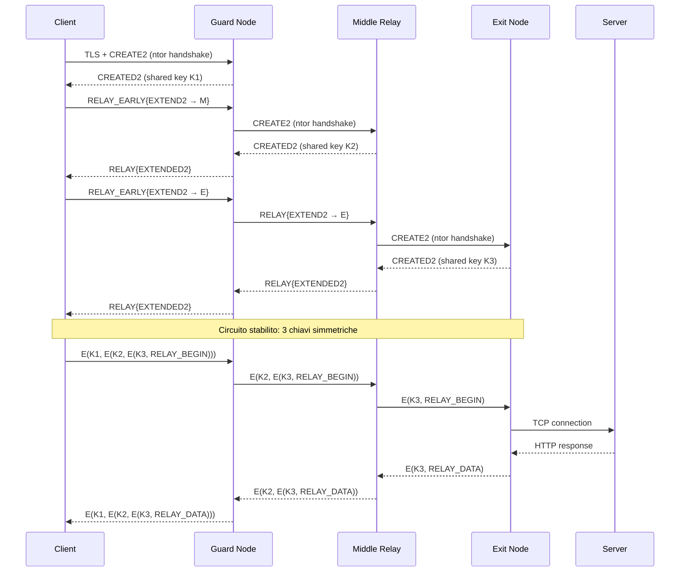

# Stream Isolation, Ciclo di Vita dei Circuiti e Modello di Minaccia

Stream isolation, dirty timeout, NEWNYM, e il modello di sicurezza di Tor:
cosa protegge, cosa NON protegge, e le implicazioni operative.

Estratto dalla sezione [Architettura di Tor](architettura-tor.md) per approfondimento.

---

## Indice

- [Stream Isolation - Separazione del traffico](#stream-isolation--separazione-del-traffico)
- [Il ciclo di vita di un circuito](#il-ciclo-di-vita-di-un-circuito)
- [Architettura di sicurezza - Il modello di minaccia di Tor](#architettura-di-sicurezza--il-modello-di-minaccia-di-tor)
- [Riepilogo dell'architettura](#riepilogo-dellarchitettura)

---

## Stream Isolation - Separazione del traffico

Tor implementa il concetto di **stream isolation**: stream diversi possono essere
instradati su circuiti diversi per evitare correlazioni.

### Tipi di isolamento

- **Per porta SOCKS di origine** (`IsolateSOCKSAuth`): stream provenienti da porte
  SOCKS diverse usano circuiti diversi.

- **Per credenziali SOCKS** (`IsolateSOCKSAuth`): se il client invia username/password
  diverse nella richiesta SOCKS5, Tor usa circuiti diversi. Tor Browser usa questo
  meccanismo: ogni tab in un dominio diverso usa credenziali SOCKS diverse.

- **Per indirizzo di destinazione** (`IsolateDestAddr`): stream verso destinazioni
  diverse usano circuiti diversi.

- **Per porta di destinazione** (`IsolateDestPort`): stream verso porte diverse
  usano circuiti diversi.

### Configurazione nel torrc

```ini
# Porta principale - isolamento di default
SocksPort 9050

# Porta dedicata per browser con isolamento massimo
SocksPort 9052 IsolateSOCKSAuth IsolateDestAddr IsolateDestPort

# Porta dedicata per CLI senza isolamento (condivide circuiti)
SocksPort 9053 SessionGroup=1
```

Nella mia esperienza, ho usato solo la porta 9050 di default. Ma per un setup avanzato
dove voglio separare il traffico del browser da quello di proxychains, configurare
porte SOCKS multiple con isolamento diverso è la soluzione corretta.

---

## Il ciclo di vita di un circuito

I circuiti Tor non sono permanenti. Ecco il loro ciclo di vita:

1. **Creazione**: il client costruisce il circuito come descritto sopra.

2. **Uso attivo**: gli stream vengono assegnati al circuito. Un circuito "pulito"
   (senza stream attivi) può essere riutilizzato per nuove connessioni.

3. **Dirty timeout**: quando un circuito ha trasportato almeno uno stream, diventa
   "dirty". Dopo 10 minuti dall'ultimo utilizzo, Tor non assegnerà nuovi stream
   a questo circuito (ma gli stream esistenti continuano).

4. **Max lifetime**: un circuito non può esistere per più di ~24 ore, anche se attivo.

5. **NEWNYM**: il segnale NEWNYM (inviato via ControlPort) marca tutti i circuiti
   esistenti come "dirty" immediatamente, forzando Tor a costruirne di nuovi per
   le prossime connessioni. I circuiti con stream attivi non vengono chiusi subito.

6. **Distruzione**: quando un circuito non è più necessario, viene distrutto con
   una cella DESTROY.

### Nella mia esperienza con NEWNYM

Il mio script `newnym`:
```bash
#!/bin/bash
COOKIE=$(xxd -p /run/tor/control.authcookie | tr -d '\n')
printf "AUTHENTICATE %s\r\nSIGNAL NEWNYM\r\nQUIT\r\n" "$COOKIE" | nc 127.0.0.1 9051
```

Quando lo eseguo:
```bash
> ~/scripts/newnym
250 OK
250 closing connection
```

Poi verifico:
```bash
> proxychains curl https://api.ipify.org
185.220.101.143    # primo IP

> ~/scripts/newnym
250 OK
250 closing connection

> proxychains curl https://api.ipify.org
104.244.76.13      # IP cambiato - nuovo circuito, nuovo exit
```

Il cooldown tra due NEWNYM è di circa 10 secondi. Se invio NEWNYM troppo presto,
Tor restituisce comunque `250 OK` ma ignora la richiesta internamente.

---

## Architettura di sicurezza - Il modello di minaccia di Tor

Tor è progettato per proteggere contro specifici avversari e scenari. È fondamentale
capire cosa protegge e cosa NON protegge:

### Cosa Tor protegge

| Scenario | Protezione |
|----------|-----------|
| ISP che monitora il traffico | Vede solo connessione cifrata al Guard/bridge, non la destinazione |
| Sito web che vuole identificarti | Vede solo l'IP dell'exit node, non il tuo |
| Nodo exit malevolo | Non può risalire al tuo IP (conosce solo il Middle) |
| Nodo guard malevolo | Conosce il tuo IP ma non la destinazione (vede solo il Middle) |
| Osservatore sulla rete locale | Vede traffico cifrato verso Guard/bridge |

### Cosa Tor NON protegge

| Scenario | Perché |
|----------|--------|
| Avversario che controlla Guard E Exit | Può correlare timing del traffico (attacco di correlazione) |
| Avversario globale (tipo NSA) | Può fare traffic analysis su larga scala |
| Malware sul tuo sistema | Legge prima che i dati entrino in Tor |
| Fingerprinting del browser | Se non usi Tor Browser, il browser ha un fingerprint unico |
| Errori dell'utente | Login con account personale su Tor, leak DNS, etc. |
| Metadata temporali | Il timing delle richieste può essere correlato |

### Implicazione pratica

La mia configurazione su Kali (proxychains + curl + Firefox con profilo tor-proxy) NON
offre la stessa protezione di Tor Browser. Firefox normale ha un fingerprint unico
(user-agent, font, canvas, WebGL, dimensioni finestra). Lo uso consapevolmente per
comodità e test, non per anonimato assoluto.

Per anonimato massimo: Tor Browser (o Whonix/Tails).

---


### Diagramma: flusso di un circuito Tor



## Riepilogo dell'architettura

```
                    ┌─────────────────────────────┐
                    │    Directory Authorities     │
                    │  (9 server, votano consenso) │
                    └──────────────┬──────────────┘
                                   │ consenso firmato
                    ┌──────────────▼──────────────┐
        ┌───────────│      Relay Network          │───────────┐
        │           │  (~7000 relay volontari)     │           │
        │           └─────────────────────────────┘           │
        │                                                      │
  ┌─────▼─────┐      ┌──────────┐      ┌──────────┐    ┌─────▼─────┐
  │   Guard    │◄────►│  Middle   │◄────►│   Exit   │───►│ Internet  │
  │   Node     │ TLS  │  Relay   │ TLS  │   Node   │    │ (sito web)│
  └─────▲─────┘      └──────────┘      └──────────┘    └───────────┘
        │ TLS (o obfs4)
  ┌─────┴─────┐
  │  Client   │
  │  (tor     │
  │  daemon)  │
  │           │
  │ SocksPort │◄──── proxychains, curl, Firefox
  │ DNSPort   │◄──── risoluzione DNS via Tor
  │ ControlPort│◄──── script NEWNYM, nyx
  └───────────┘
```

Questa architettura garantisce che **nessun singolo nodo conosca contemporaneamente
origine e destinazione del traffico**. Il Guard conosce il client ma non la destinazione.
L'Exit conosce la destinazione ma non il client. Il Middle non conosce nessuno dei due.

---

## Vedi anche

- [Circuiti, Crittografia e Celle](circuiti-crittografia-e-celle.md) - Celle 514 byte, crittografia strato per strato
- [Consenso e Directory Authorities](consenso-e-directory-authorities.md) - Votazione, flag, selezione relay
- [Guard Nodes](../03-nodi-e-rete/guard-nodes.md) - Primo hop del circuito, persistenza
- [torrc - Guida Completa](../02-installazione-e-configurazione/torrc-guida-completa.md) - Configurazione di tutte le componenti
- [Limitazioni del Protocollo](../07-limitazioni-e-attacchi/limitazioni-protocollo.md) - TCP-only, latenza, bandwidth