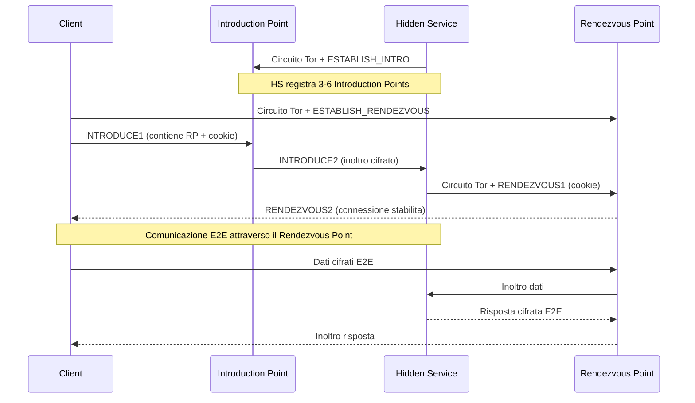

> **Lingua / Language**: Italiano | [English](../en/03-nodi-e-rete/onion-services-v3.md)

# Onion Services v3 - Servizi Nascosti sulla Rete Tor

Questo documento analizza il funzionamento degli Onion Services (precedentemente noti
come Hidden Services) nella versione 3 del protocollo. Copre l'architettura, il
protocollo di rendezvous, la crittografia, la configurazione, e le implicazioni
di sicurezza.

Non ho configurato un onion service nel mio setup, ma la comprensione del loro
funzionamento è fondamentale per capire l'architettura Tor nella sua interezza.

---
---

## Indice

- [Cos'è un Onion Service](#cosè-un-onion-service)
- [Architettura di un Onion Service](#architettura-di-un-onion-service)
- [Crittografia degli Onion Services v3](#crittografia-degli-onion-services-v3)
- [Configurazione di un Onion Service](#configurazione-di-un-onion-service)
- [Sicurezza degli Onion Services](#sicurezza-degli-onion-services)
- [Onion Services e il mondo reale](#onion-services-e-il-mondo-reale)


## Cos'è un Onion Service

Un Onion Service è un servizio di rete (web server, SSH, chat, etc.) accessibile
**solo tramite la rete Tor**, senza mai esporre il proprio IP pubblico.

```
Servizio normale:
Client → Internet → IP pubblico del server → Server
  (il server è identificabile dal suo IP)

Onion Service:
Client → Tor → Rendezvous Point → Tor → Onion Service
  (né il client né il server conoscono l'IP dell'altro)
```

### Indirizzo .onion v3

Gli indirizzi .onion v3 sono stringhe di 56 caratteri base32 derivate dalla chiave
pubblica Ed25519 del servizio:

```
http://expyuzz4wqqyqhjn76s4vqwqzjjnc5s5n7kv4ly7gcnfvdc5kqbzxid.onion
       ^^^^^^^^^^^^^^^^^^^^^^^^^^^^^^^^^^^^^^^^^^^^^^^^^^^^^^^^
       56 caratteri base32 = 35 byte = chiave pubblica codificata
```

La struttura dell'indirizzo v3:
```
indirizzo = base32(pubkey + checksum + version)
  pubkey   = 32 byte (chiave pubblica Ed25519)
  checksum = 2 byte (SHA3-256 di ".onion checksum" + pubkey + version)
  version  = 1 byte (0x03 per v3)
```

### Differenze v2 vs v3

| Caratteristica | v2 (deprecato) | v3 (attuale) |
|---------------|----------------|-------------|
| Lunghezza indirizzo | 16 char | 56 char |
| Crittografia chiave | RSA-1024 | Ed25519 |
| Hash | SHA-1 | SHA3 |
| Descriptor | Non cifrato completamente | Cifrato end-to-end |
| Autenticazione client | Opzionale, debole | Opzionale, robusta (x25519) |

v2 è stato **deprecato e rimosso** a partire da Tor 0.4.6. Solo v3 è supportato.

---

## Architettura di un Onion Service

### Componenti

1. **Onion Service (HS)**: il server che offre il servizio. Esegue Tor e ha una
   configurazione HiddenService nel torrc.

2. **Introduction Points (IP)**: relay Tor scelti dall'HS per "essere trovabili".
   L'HS mantiene circuiti persistenti verso 3-6 introduction points.

3. **HSDir (Hidden Service Directory)**: relay che memorizzano i descriptor
   dell'onion service. Determinati algoritmicamente dal consenso.

4. **Rendezvous Point (RP)**: un relay scelto dal **client** come punto di incontro.
   Né il client né l'HS lo controllano direttamente - il client sceglie il relay,
   l'HS ci si connette.

5. **Client**: l'utente che vuole raggiungere l'onion service.

### Il protocollo di connessione - Step by step

```
Fase 1: Pubblicazione (l'HS si rende "trovabile")
═══════════════════════════════════════════════════

1. L'HS genera una coppia di chiavi Ed25519 (identità permanente)
2. L'HS seleziona 3-6 relay come Introduction Points
3. L'HS costruisce circuiti verso ogni Introduction Point
4. L'HS crea un descriptor cifrato contenente:
   - Lista degli Introduction Points
   - Chiavi per l'handshake
   - Informazioni di routing
5. L'HS pubblica il descriptor sugli HSDir
   (determinati dal consenso tramite una funzione hash)

Fase 2: Richiesta di connessione (il client vuole connettersi)
═══════════════════════════════════════════════════════════════

1. Il client conosce l'indirizzo .onion (56 caratteri)
2. Dall'indirizzo, ricava la chiave pubblica dell'HS
3. Calcola quali HSDir contengono il descriptor
4. Scarica il descriptor dagli HSDir
5. Decifra il descriptor → ottiene la lista degli Introduction Points

Fase 3: Rendezvous (il punto di incontro)
═════════════════════════════════════════

1. Il CLIENT sceglie un relay come Rendezvous Point
2. Il CLIENT costruisce un circuito verso il Rendezvous Point
3. Il CLIENT invia un "rendezvous cookie" al Rendezvous Point
   (un token casuale di 20 byte)

Fase 4: Introduce (il client chiede all'HS di incontrarlo)
══════════════════════════════════════════════════════════

1. Il CLIENT costruisce un circuito verso un Introduction Point dell'HS
2. Il CLIENT invia un messaggio INTRODUCE1 all'Introduction Point:
   - cifrato con la chiave dell'HS
   - contiene: IP del Rendezvous Point + rendezvous cookie
3. L'Introduction Point inoltra INTRODUCE2 all'HS
   (senza poterlo decifrare - non ha la chiave)

Fase 5: L'HS si connette al Rendezvous Point
═════════════════════════════════════════════

1. L'HS decifra il messaggio INTRODUCE2
2. Ottiene: IP del Rendezvous Point + cookie
3. L'HS costruisce un circuito verso il Rendezvous Point
4. L'HS invia RENDEZVOUS1 con il cookie
5. Il Rendezvous Point abbina il cookie a quello del client
6. La connessione è stabilita: Client ←RP→ HS

Fase 6: Comunicazione
═════════════════════

Il traffico fluisce:
Client → circuito Tor → Rendezvous Point → circuito Tor → HS

Totale hop: 3 (client) + 1 (RP) + 3 (HS) = fino a 7 hop
```

### Diagramma di rete

```
                              ┌─── Introduction Point 1
                              │
Onion Service ────circuito───►├─── Introduction Point 2
     │                        │
     │                        └─── Introduction Point 3
     │
     │        ┌───────────────────────────┐
     └───────►│    Rendezvous Point       │◄───────┐
              └───────────────────────────┘         │
                                                    │
                                              Client ────circuito────►
```

---

## Crittografia degli Onion Services v3

### Chiavi dell'Onion Service

```
/var/lib/tor/hidden_service/
├── hostname              # Indirizzo .onion (derivato dalla chiave pubblica)
├── hs_ed25519_public_key # Chiave pubblica Ed25519 (identità del servizio)
├── hs_ed25519_secret_key # Chiave privata Ed25519 (CRITICA - non condividere)
└── authorized_clients/   # Chiavi di client autorizzati (se autenticazione attiva)
```

**La chiave privata è l'identità del servizio**. Chi possiede la chiave privata
controlla il servizio. Se viene compromessa, l'avversario può impersonare il servizio.

### Descriptor cifrato

Il descriptor dell'onion service è cifrato in due strati:

**Strato esterno**: cifrato con una chiave derivata dall'indirizzo .onion + il
time period corrente. Chiunque conosca l'indirizzo .onion può decifrarlo.

**Strato interno**: cifrato con la chiave pubblica dell'HS. Solo chi conosce
l'indirizzo può decifrarlo (ma in pratica, lo strato esterno già filtra).

Con **client authorization** attiva, lo strato interno è cifrato anche con le
chiavi dei client autorizzati. Solo i client con la chiave possono decifrare il
descriptor e scoprire gli Introduction Points.

---

## Configurazione di un Onion Service

### Configurazione base

```ini
# Nel torrc
HiddenServiceDir /var/lib/tor/hidden_service/
HiddenServicePort 80 127.0.0.1:8080
```

- `HiddenServiceDir`: directory dove Tor salva le chiavi e l'hostname
- `HiddenServicePort`: mapping porta .onion → servizio locale

Dopo il riavvio di Tor:
```bash
sudo systemctl restart tor@default.service
sudo cat /var/lib/tor/hidden_service/hostname
# Output: abc123...xyz.onion
```

### Configurazione con porte multiple

```ini
HiddenServiceDir /var/lib/tor/hidden_service/
HiddenServicePort 80 127.0.0.1:8080    # Web
HiddenServicePort 22 127.0.0.1:22      # SSH
HiddenServicePort 443 127.0.0.1:8443   # HTTPS
```

### Configurazione con autenticazione client

```ini
HiddenServiceDir /var/lib/tor/hidden_service/
HiddenServicePort 80 127.0.0.1:8080
HiddenServiceAuthorizeClient stealth client1,client2
```

Il client deve avere la chiave di autorizzazione nel suo `ClientOnionAuthDir`:
```ini
# torrc del client
ClientOnionAuthDir /var/lib/tor/onion_auth/
```

```bash
# File di autorizzazione
echo "abc123...xyz:descriptor:x25519:CHIAVE_BASE32" > /var/lib/tor/onion_auth/service.auth_private
```

---


### Diagramma: connessione a un Onion Service



## Sicurezza degli Onion Services

### Cosa protegge

- **Anonimato del server**: nessuno (neanche il client) conosce l'IP del server
- **Anonimato del client**: il server non conosce l'IP del client
- **Cifratura end-to-end**: il traffico tra client e HS è cifrato end-to-end
  all'interno della rete Tor (oltre a eventuali HTTPS)
- **Resistenza alla censura**: l'indirizzo .onion non può essere censurato tramite
  DNS (non usa DNS)

### Attacchi noti

**1. HSDir enumeration**: un avversario che controlla HSDir può vedere quali
descriptor vengono richiesti, scoprendo quali onion service sono popolari.

**Mitigazione v3**: i descriptor sono indirizzati con una funzione hash che include
il time period. Gli HSDir cambiano con ogni time period (ogni 24 ore).

**2. Introduction Point monitoring**: un avversario che controlla un Introduction
Point vede le richieste di connessione (cifrate, ma può contarle).

**Mitigazione**: l'HS usa 3-6 Introduction Points e li ruota periodicamente.

**3. Guard discovery tramite onion service**: un avversario si connette ripetutamente
all'onion service e monitora i relay intermedi per restringere il guard dell'HS.

**Mitigazione**: Vanguards (layer guard persistenti).

**4. Timing correlation**: un avversario che controlla un Introduction Point e un
relay sulla rete può correlare il timing delle richieste per restringere la
posizione dell'HS.

**Mitigazione**: circuiti lunghi (fino a 7 hop) e padding.

---

## Onion Services e il mondo reale

### Usi legittimi

- **Comunicazioni sicure**: giornalisti, attivisti, whistleblower
- **Servizi anonimi**: chat, email, forum privati
- **Self-hosting**: accedere al proprio server da remoto senza esporre porte
- **IoT sicuro**: raggiungere dispositivi dietro NAT senza port forwarding

### Usi nella mia esperienza

Non ho configurato un onion service nel mio setup, ma la comprensione del protocollo
è fondamentale per:
- Capire perché gli indirizzi .onion funzionano solo via Tor
- Comprendere il costo in latenza delle connessioni .onion (fino a 7 hop)
- Valutare la sicurezza quando accedo a servizi .onion
- Capire l'impatto di `AutomapHostsOnResolve` nella risoluzione degli .onion

### Performance degli Onion Services

A causa del numero di hop elevato (fino a 7), le connessioni .onion sono:
- Più lente delle connessioni Tor normali (che usano 3 hop)
- Con latenza più variabile (più nodi = più punti di possibile rallentamento)
- Più soggette a timeout (ogni hop è un possibile punto di fallimento)

La latenza tipica per una connessione .onion è 2-10 secondi per il setup iniziale,
poi il throughput dipende dal nodo più lento nella catena.

---

## Vedi anche

- [Circuiti, Crittografia e Celle](../01-fondamenti/circuiti-crittografia-e-celle.md) - Celle e crittografia nei circuiti HS
- [Tor e Localhost](../06-configurazioni-avanzate/tor-e-localhost.md) - Onion service per servizi locali
- [Comunicazione Sicura](../09-scenari-operativi/comunicazione-sicura.md) - Onion service per comunicazione anonima
- [Attacchi Noti](../07-limitazioni-e-attacchi/attacchi-noti.md) - HSDir enumeration, DoS su HS
- [Guard Nodes](guard-nodes.md) - Vanguards per protezione HS
