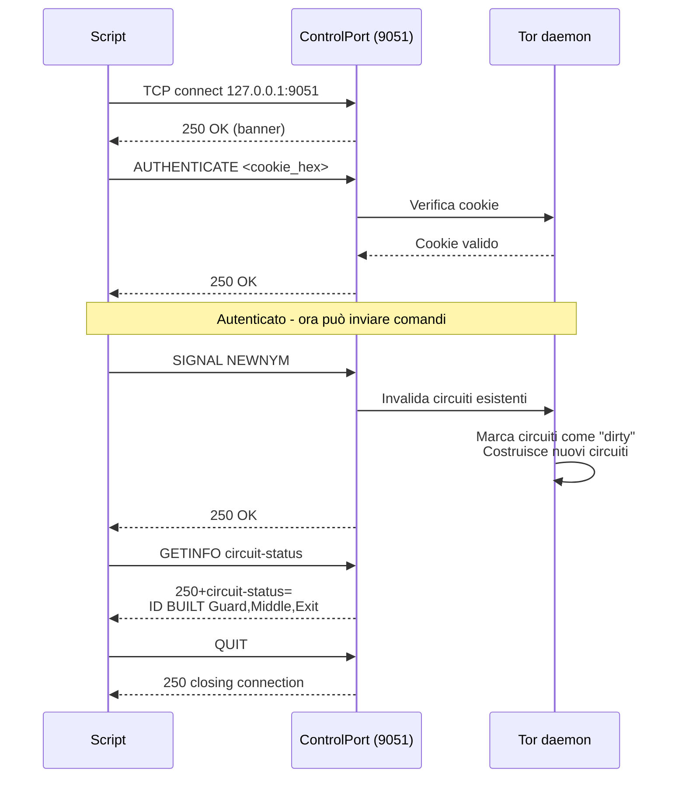

> **Lingua / Language**: Italiano | [English](../en/04-strumenti-operativi/controllo-circuiti-e-newnym.md)

# Controllo dei Circuiti e NEWNYM - Gestire Tor via ControlPort

Questo documento analizza in profondità il protocollo di controllo di Tor
(ControlPort 9051), il segnale NEWNYM per la rotazione IP, l'ispezione dei
circuiti, e l'automazione tramite script e librerie Python (Stem).

Basato sulla mia esperienza diretta nella creazione dello script `newnym`,
nel debug dell'autenticazione cookie, e nell'uso quotidiano della rotazione IP.

---
---

## Indice

- [Il protocollo ControlPort](#il-protocollo-controlport)
- [SIGNAL NEWNYM - Rotazione IP](#signal-newnym-rotazione-ip)
- [Comandi del ControlPort - Catalogo completo](#comandi-del-controlport-catalogo-completo)
- [Automazione con Python Stem](#automazione-con-python-stem)
- [Script avanzati](#script-avanzati)
- [Sicurezza del ControlPort](#sicurezza-del-controlport)


## Il protocollo ControlPort

### Cos'è

Il ControlPort è un'interfaccia testuale (simile a SMTP/FTP) che permette a
programmi esterni di comunicare con il daemon Tor. Ascolta su `127.0.0.1:9051`.

### Autenticazione

Ci sono due metodi:

**1. Cookie Authentication (il mio metodo)**:
```bash
# Il cookie è un file di 32 byte
> xxd /run/tor/control.authcookie
00000000: 7a3b 2e4f 8c01 d2a3 ... (32 byte binari)

# Converti in hex per l'autenticazione
> xxd -p /run/tor/control.authcookie | tr -d '\n'
7a3b2e4f8c01d2a3...  (64 caratteri hex)
```

Per autenticarsi:
```
AUTHENTICATE 7a3b2e4f8c01d2a3...\r\n
250 OK\r\n
```

**2. Password hashata**:
```bash
> tor --hash-password "MySecretPassword"
16:872860B76453A77D60CA2BB8C1A7042072093276A3D701AD684053EC4C
```

```
AUTHENTICATE "MySecretPassword"\r\n
250 OK\r\n
```

### Nella mia esperienza con l'autenticazione

Il mio primo tentativo di NEWNYM falliva con:
```
514 Authentication required
```

Il problema: il mio utente non aveva i permessi per leggere il cookie:
```bash
> ls -la /run/tor/control.authcookie
-rw-r----- 1 debian-tor debian-tor 32 ...
```

Soluzione:
```bash
sudo usermod -aG debian-tor $USER
pkill -KILL -u $USER   # riavvio sessione
```

Dopo il re-login, il cookie era leggibile e il mio script funzionava.

### Diagramma: protocollo ControlPort e NEWNYM



---

## SIGNAL NEWNYM - Rotazione IP

### Come funziona

`SIGNAL NEWNYM` dice a Tor:
1. Marca tutti i circuiti correnti come "dirty" (non usabili per nuovi stream)
2. I circuiti con stream attivi **continuano** (non vengono interrotti)
3. Le prossime connessioni useranno **nuovi circuiti** con nuovi exit node
4. Il nuovo circuito avrà (probabilmente) un exit node diverso → IP diverso

### Il mio script newnym

```bash
#!/bin/bash
COOKIE=$(xxd -p /run/tor/control.authcookie | tr -d '\n')
printf "AUTHENTICATE %s\r\nSIGNAL NEWNYM\r\nQUIT\r\n" "$COOKIE" | nc 127.0.0.1 9051
```

Analisi dettagliata:
- `xxd -p` → converte il file binario in hex
- `tr -d '\n'` → rimuove newline (il cookie deve essere su una riga)
- `printf ... | nc` → invia i comandi al ControlPort via netcat
- `\r\n` → il protocollo richiede CRLF (come HTTP/SMTP)

### Uso

```bash
> ~/scripts/newnym
250 OK                    # AUTHENTICATE riuscito
250 OK                    # SIGNAL NEWNYM accettato
250 closing connection    # QUIT

# Verificare il cambio IP
> proxychains curl -s https://api.ipify.org
185.220.101.143           # vecchio IP

> ~/scripts/newnym
250 OK
250 OK
250 closing connection

> proxychains curl -s https://api.ipify.org
104.244.76.13             # nuovo IP → circuito diverso, exit diverso
```

### Cooldown di NEWNYM

Tor impone un cooldown di **~10 secondi** tra due NEWNYM consecutive.

Se invio NEWNYM troppo presto:
```
250 OK                    # AUTHENTICATE ok
250 OK                    # Tor dice OK ma internamente ignora la richiesta
```

Il `250 OK` è fuorviante: Tor non restituisce errore, semplicemente non cambia circuito.
Per verificare, controllare se l'IP è effettivamente cambiato.

### NEWNYM vs restart

| Operazione | Effetto | Interruzione | Tempo |
|-----------|---------|-------------|-------|
| NEWNYM | Nuovi circuiti, stream attivi continuano | Nessuna | ~10s cooldown |
| systemctl restart | Processo riavviato, tutto resettato | Si, totale | ~15-30s bootstrap |
| systemctl reload | Rilegge torrc, circuiti mantenuti | Minima | Immediato |

---

## Comandi del ControlPort - Catalogo completo

### Segnali (SIGNAL)

```
SIGNAL NEWNYM       → Nuovi circuiti (rotazione IP)
SIGNAL CLEARDNSCACHE → Pulisci cache DNS di Tor
SIGNAL HEARTBEAT    → Emetti un heartbeat nei log
SIGNAL DORMANT      → Entra in modalità dormiente (riduce attività di rete)
SIGNAL ACTIVE       → Esci dalla modalità dormiente
SIGNAL DUMP         → Dump dello stato interno nei log
SIGNAL HALT         → Shutdown pulito del daemon
SIGNAL TERM         → Come HALT
SIGNAL SHUTDOWN     → Come HALT
```

### Query informative (GETINFO)

```bash
# Versione di Tor
GETINFO version

# Stato dei circuiti
GETINFO circuit-status

# Stato degli stream
GETINFO stream-status

# Stato degli entry guard
GETINFO entry-guards

# Informazioni sulla rete
GETINFO ns/all          # tutti i relay nel consenso
GETINFO ns/id/FINGERPRINT  # info su un relay specifico

# Traffic (byte inviati/ricevuti)
GETINFO traffic/read
GETINFO traffic/written

# Bootstrap status
GETINFO status/bootstrap-phase

# Indirizzo IP (se Tor lo conosce)
GETINFO address
```

### Esempio: ispezionare i circuiti

```bash
COOKIE=$(xxd -p /run/tor/control.authcookie | tr -d '\n')
printf "AUTHENTICATE %s\r\nGETINFO circuit-status\r\nQUIT\r\n" "$COOKIE" | nc 127.0.0.1 9051
```

Output:
```
250+circuit-status=
5 BUILT $AAAA~GuardNick,$BBBB~MiddleNick,$CCCC~ExitNick BUILD_FLAGS=NEED_CAPACITY PURPOSE=GENERAL TIME_CREATED=2025-01-15T12:00:00
7 BUILT $DDDD~Guard2,$EEEE~Middle2,$FFFF~Exit2 BUILD_FLAGS=IS_INTERNAL,NEED_CAPACITY PURPOSE=HS_SERVICE_INTRO
.
250 OK
```

Ogni riga:
- ID circuito (5, 7, ...)
- Stato (BUILT, LAUNCHED, EXTENDED, FAILED, CLOSED)
- Hop: `$FINGERPRINT~Nickname` separati da virgola
- BUILD_FLAGS: tipo di circuito
- PURPOSE: scopo (GENERAL, HS_SERVICE_INTRO, HS_SERVICE_REND, etc.)

### Esempio: monitorare eventi in tempo reale

```bash
printf "AUTHENTICATE %s\r\nSETEVENTS CIRC STREAM\r\n" "$COOKIE" | nc -q -1 127.0.0.1 9051
```

Questo tiene la connessione aperta e mostra eventi di circuito e stream in tempo reale:
```
650 CIRC 12 LAUNCHED
650 CIRC 12 EXTENDED $AAAA~Guard
650 CIRC 12 EXTENDED $BBBB~Middle
650 CIRC 12 BUILT $AAAA~Guard,$BBBB~Middle,$CCCC~Exit
650 STREAM 1 NEW 0 api.ipify.org:443
650 STREAM 1 SENTCONNECT 12 api.ipify.org:443
650 STREAM 1 SUCCEEDED 12 api.ipify.org:443
```

---

## Automazione con Python Stem

### Installazione

```bash
pip install stem
# oppure
sudo apt install python3-stem
```

### Esempio: NEWNYM in Python

```python
from stem import Signal
from stem.control import Controller

with Controller.from_port(port=9051) as ctrl:
    ctrl.authenticate()  # usa cookie authentication automaticamente
    ctrl.signal(Signal.NEWNYM)
    print("Nuovo circuito richiesto")
```

### Esempio: lista circuiti

```python
from stem.control import Controller

with Controller.from_port(port=9051) as ctrl:
    ctrl.authenticate()
    for circ in ctrl.get_circuits():
        if circ.status == 'BUILT':
            path = ' → '.join([f"{n.nickname}({n.fingerprint[:8]})" for n in circ.path])
            print(f"Circuito {circ.id}: {path}")
```

Output:
```
Circuito 5: GuardNick(AABBCCDD) → MiddleNick(EEFFGGHH) → ExitNick(11223344)
Circuito 7: Guard2(55667788) → Middle2(99AABBCC) → Exit2(DDEEFF00)
```

### Esempio: monitoraggio continuo con Stem

```python
from stem.control import Controller, EventType

def circuit_event(event):
    if event.status == 'BUILT':
        print(f"Circuito {event.id} costruito: {event.path}")
    elif event.status == 'CLOSED':
        print(f"Circuito {event.id} chiuso: {event.reason}")

with Controller.from_port(port=9051) as ctrl:
    ctrl.authenticate()
    ctrl.add_event_listener(circuit_event, EventType.CIRC)
    input("Premi Enter per terminare...\n")
```

### Esempio: NEWNYM con verifica IP

```python
import time
import requests
from stem import Signal
from stem.control import Controller

def get_tor_ip():
    proxies = {'http': 'socks5h://127.0.0.1:9050',
               'https': 'socks5h://127.0.0.1:9050'}
    return requests.get('https://api.ipify.org', proxies=proxies).text

with Controller.from_port(port=9051) as ctrl:
    ctrl.authenticate()
    
    old_ip = get_tor_ip()
    print(f"IP corrente: {old_ip}")
    
    ctrl.signal(Signal.NEWNYM)
    time.sleep(10)  # attendere il cooldown
    
    new_ip = get_tor_ip()
    print(f"Nuovo IP: {new_ip}")
    print(f"Cambio {'riuscito' if old_ip != new_ip else 'fallito (stesso IP)'}")
```

---

## Script avanzati

### Rotazione IP continua (con cautela)

```bash
#!/bin/bash
# ATTENZIONE: uso eccessivo può causare blocchi da parte dei siti

COOKIE=$(xxd -p /run/tor/control.authcookie | tr -d '\n')
INTERVAL=60  # secondi tra ogni rotazione

while true; do
    printf "AUTHENTICATE %s\r\nSIGNAL NEWNYM\r\nQUIT\r\n" "$COOKIE" | nc 127.0.0.1 9051
    NEW_IP=$(proxychains curl -s https://api.ipify.org 2>/dev/null)
    echo "[$(date)] IP: $NEW_IP"
    sleep $INTERVAL
done
```

Nella mia esperienza, **non ho implementato** la rotazione continua perché:
- Molti siti notano il cambio IP repentino e bloccano la connessione
- I CAPTCHA diventano più frequenti
- Riduce la qualità dei circuiti (Tor deve costruirne di nuovi continuamente)

Lo uso solo manualmente, quando ho bisogno di un nuovo IP per un test specifico.

---

## Sicurezza del ControlPort

### Rischi

Il ControlPort permette di:
- Vedere tutti i circuiti e gli stream (privacy)
- Inviare segnali (NEWNYM, SHUTDOWN)
- Leggere la configurazione
- Potenzialmente deanonimizzare l'utente (se accessibile da remoto)

### Mitigazioni

1. **Solo localhost**: `ControlPort 9051` ascolta solo su 127.0.0.1
2. **Cookie authentication**: il cookie è leggibile solo da debian-tor
3. **Non esporre MAI il ControlPort su rete**: `ControlListenAddress 127.0.0.1`
4. **Permessi del cookie**: `chmod 640 /run/tor/control.authcookie`

---

## Vedi anche

- [Nyx e Monitoraggio](nyx-e-monitoraggio.md) - Visualizzare circuiti in tempo reale
- [torrc - Guida Completa](../02-installazione-e-configurazione/torrc-guida-completa.md) - Configurazione ControlPort
- [Multi-Istanza e Stream Isolation](../06-configurazioni-avanzate/multi-istanza-e-stream-isolation.md) - NEWNYM per istanza
- [Guard Nodes](../03-nodi-e-rete/guard-nodes.md) - Perché NEWNYM non cambia il Guard
- [Incident Response](../09-scenari-operativi/incident-response.md) - NEWNYM come recovery dopo leak

---

## Cheat Sheet - Comandi ControlPort

| Comando ControlPort | Descrizione |
|--------------------|-------------|
| `AUTHENTICATE "password"` | Autenticazione con password |
| `AUTHENTICATE <cookie_hex>` | Autenticazione con cookie |
| `SIGNAL NEWNYM` | Nuova identità (nuovi circuiti) |
| `SIGNAL RELOAD` | Ricarica torrc |
| `SIGNAL SHUTDOWN` | Shutdown pulito |
| `GETINFO version` | Versione di Tor |
| `GETINFO circuit-status` | Lista circuiti attivi |
| `GETINFO stream-status` | Lista stream attivi |
| `GETINFO address` | IP esterno rilevato |
| `GETINFO traffic/read` | Byte letti totali |
| `GETINFO traffic/written` | Byte scritti totali |
| `GETINFO ns/all` | Tutti i relay nel consenso |
| `SETCONF MaxCircuitDirtiness=1800` | Modifica runtime del torrc |
| `CLOSECIRCUIT <id>` | Chiudi un circuito specifico |
| `EXTENDCIRCUIT 0` | Crea un nuovo circuito |
