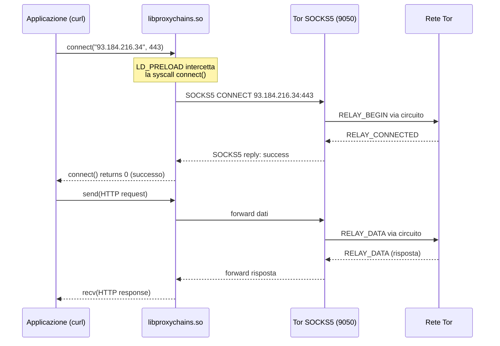

# ProxyChains - Guida Completa e Analisi a Basso Livello

Questo documento analizza ProxyChains in profondità: come funziona internamente
(LD_PRELOAD, hook delle syscall), tutte le modalità di chain, la configurazione DNS,
il debugging, e i limiti reali nell'uso con Tor.

Basato sulla mia esperienza diretta con `proxychains4` su Kali Linux, dove lo uso
quotidianamente per instradare `curl`, `firefox` e altri strumenti attraverso Tor.

---
---

## Indice

- [Cos'è ProxyChains e come funziona internamente](#cosè-proxychains-e-come-funziona-internamente)
- [Il file di configurazione - Analisi completa](#il-file-di-configurazione-analisi-completa)
- [Uso pratico - Comandi quotidiani](#uso-pratico-comandi-quotidiani)
- [Debugging di ProxyChains](#debugging-di-proxychains)
- [ProxyChains vs alternative](#proxychains-vs-alternative)
- [La mia configurazione proxychains4.conf](#la-mia-configurazione-proxychains4conf)


## Cos'è ProxyChains e come funziona internamente

### Il meccanismo LD_PRELOAD

ProxyChains **non è un proxy**. È un wrapper che intercetta le chiamate di rete delle
applicazioni tramite il meccanismo `LD_PRELOAD` di Linux:

```
Senza proxychains:
curl → connect("93.184.216.34", 443) → kernel → Internet → Server

Con proxychains:
curl → connect("93.184.216.34", 443) → libproxychains.so (intercetta!) →
  connect("127.0.0.1", 9050) → Tor → Internet → Server
```

Quando esegui `proxychains curl https://example.com`:

1. Il sistema carica `libproxychains.so.4` PRIMA delle librerie standard (LD_PRELOAD)
2. La libreria sovrascrive (hook) le funzioni:
   - `connect()` - redirezionata verso il proxy SOCKS
   - `getaddrinfo()` / `gethostbyname()` - intercettate per proxy DNS (se `proxy_dns`)
   - `close()` - per gestire cleanup
3. Quando curl chiama `connect()`, la chiamata finisce nella funzione di proxychains
4. ProxyChains apre una connessione SOCKS5 verso `127.0.0.1:9050`
5. Invia il comando SOCKS5 CONNECT con la destinazione originale
6. Tor riceve la richiesta SOCKS5 e la instrada attraverso il circuito

### Diagramma: flusso LD_PRELOAD



### Cosa significa nella pratica

```bash
> proxychains curl https://api.ipify.org
[proxychains] config file found: /etc/proxychains4.conf
[proxychains] preloading /usr/lib/x86_64-linux-gnu/libproxychains.so.4
[proxychains] DLL init: proxychains-ng 4.17
[proxychains] Dynamic chain  ...  127.0.0.1:9050  ...  api.ipify.org:443  ...  OK
185.220.101.143
```

Riga per riga:
- `config file found` → ha trovato e letto `/etc/proxychains4.conf`
- `preloading` → ha caricato la libreria di intercettazione
- `DLL init` → la libreria è stata inizializzata (versione proxychains-ng 4.17)
- `Dynamic chain ... OK` → la connessione SOCKS5 è stata stabilita con successo
- `185.220.101.143` → IP dell'exit node Tor (non il mio IP reale)

### Limitazioni del meccanismo LD_PRELOAD

**LD_PRELOAD non funziona con**:
- Binari staticamente linkati (non caricano librerie dinamiche)
- Binari setuid/setgid (LD_PRELOAD viene ignorato per sicurezza)
- Applicazioni che usano syscall dirette (bypass libc)
- Alcune applicazioni Go/Rust compilate staticamente

**LD_PRELOAD funziona con**:
- La maggior parte delle applicazioni C/C++ dinamicamente linkate
- Python, Ruby, Perl (interpretati, usano libc)
- Java (JVM usa libc per il networking)
- Node.js (V8 usa libc)

---

## Il file di configurazione - Analisi completa

### Percorso del file

```
/etc/proxychains4.conf         # Configurazione di sistema
~/.proxychains/proxychains.conf # Configurazione utente (priorità maggiore)
```

ProxyChains cerca nell'ordine: variabile `PROXYCHAINS_CONF_FILE`, poi home directory,
poi `/etc/`.

### Modalità di chain

#### dynamic_chain (la mia scelta)

```ini
dynamic_chain
```

- Se un proxy nella lista è offline, viene **saltato**
- Almeno un proxy deve funzionare
- I proxy vengono provati in ordine
- Se tutti falliscono → errore

**Perché la uso**: con un solo proxy (Tor su 9050), dynamic_chain è equivalente a
strict_chain. Ma se aggiungessi altri proxy come fallback, dynamic_chain li skipperebbe
automaticamente se offline.

#### strict_chain

```ini
strict_chain
```

- **Tutti** i proxy nella lista devono essere online
- Se uno fallisce → tutta la chain fallisce
- I proxy vengono usati in ordine esatto

**Quando usarla**: se hai una chain di proxy multipli e vuoi essere sicuro che il
traffico passi per tutti (es. SOCKS→HTTP→SOCKS).

#### round_robin_chain

```ini
round_robin_chain
chain_len = 2
```

- Seleziona `chain_len` proxy dalla lista in modo rotativo
- Ad ogni connessione, il punto di partenza nella lista avanza
- Utile per distribuire il carico su più proxy

#### random_chain

```ini
random_chain
chain_len = 1
```

- Seleziona `chain_len` proxy a caso dalla lista
- Ogni connessione usa proxy diversi
- Utile per testing IDS o per variare il percorso

### Configurazione DNS

#### proxy_dns (fondamentale per la privacy)

```ini
proxy_dns
```

**Cosa fa**: intercetta le chiamate `getaddrinfo()` e `gethostbyname()` e le ridireziona
attraverso il proxy. Senza questa opzione, il DNS viene risolto **localmente** prima
di passare al proxy → **DNS leak**.

```
Senza proxy_dns:
curl example.com → DNS query al resolver locale (ISP vede "example.com")
                 → ottiene IP → connect via proxy

Con proxy_dns:
curl example.com → proxychains intercetta la DNS query
                 → invia "example.com" come hostname al proxy SOCKS5
                 → Tor risolve il DNS attraverso la rete Tor (no leak)
```

**Come funziona internamente**: proxychains usa un thread DNS interno che assegna
IP fittizi dalla subnet `remote_dns_subnet` (default 224.x.x.x) e mantiene un
mapping hostname → IP fittizio. Quando l'applicazione si connette all'IP fittizio,
proxychains lo rimappa all'hostname originale e lo invia al proxy.

#### remote_dns_subnet

```ini
remote_dns_subnet 224
```

La subnet usata per gli IP fittizi del DNS proxy. Default 224 (range 224.0.0.0/8).
Questa range è normalmente riservata al multicast, quindi non dovrebbe conflittare
con traffico reale.

**Attenzione**: se l'applicazione verifica l'IP (es. rifiuta indirizzi multicast),
puoi cambiare la subnet:
```ini
remote_dns_subnet 10    # usa 10.x.x.x (range privato RFC1918)
```

### Timeout

```ini
tcp_read_time_out 15000      # 15 secondi per la lettura
tcp_connect_time_out 8000    # 8 secondi per la connessione
```

**Nella mia esperienza**, i timeout di default sono adeguati per Tor. Se i bridge
obfs4 sono lenti, potrei dover aumentarli:
```ini
tcp_read_time_out 30000
tcp_connect_time_out 15000
```

### Localnet - Esclusioni dal proxy

```ini
# Connessioni a queste range NON passano dal proxy
localnet 127.0.0.0/255.0.0.0      # localhost
localnet 192.168.0.0/255.255.0.0   # rete locale
```

**Quando abilitare**: se devi accedere a servizi locali (es. database su localhost,
Docker) attraverso la stessa shell dove usi proxychains. Senza localnet, anche le
connessioni locali verrebbero redirezionate a Tor (e fallirebbero, perché l'exit
node non può raggiungere il tuo localhost).

### ProxyList - I proxy da usare

```ini
[ProxyList]
socks5 127.0.0.1 9050
```

Formato: `<tipo> <IP> <porta> [username password]`

Tipi supportati:
- `http` - proxy HTTP CONNECT
- `socks4` - SOCKS4 (non supporta hostname, solo IP)
- `socks5` - SOCKS5 (supporta hostname → necessario per Tor)
- `raw` - forwarding diretto senza protocollo proxy

**Perché socks5 e non socks4**: SOCKS5 permette di inviare hostname come stringa
(DOMAINNAME). Questo è fondamentale per Tor: l'hostname viene risolto dall'exit node,
non localmente. SOCKS4 richiede un IP numerico → forza la risoluzione DNS locale → leak.

---

## Uso pratico - Comandi quotidiani

### Verificare IP

```bash
# IP reale (senza proxy)
curl https://api.ipify.org
# → xxx.xxx.xxx.xxx (il mio IP di Parma)

# IP via Tor
proxychains curl https://api.ipify.org
# → 185.220.101.143 (exit node Tor)
```

### Navigazione web anonima

```bash
# Creare un profilo Firefox dedicato (una tantum)
firefox -no-remote -CreateProfile tor-proxy

# Navigare via Tor
proxychains firefox -no-remote -P tor-proxy & disown
```

### Strumenti di rete via Tor

```bash
# wget via Tor
proxychains wget https://example.com/file.zip

# nmap via Tor (solo TCP connect scan, non SYN scan)
proxychains nmap -sT -Pn target.com

# ssh via Tor
proxychains ssh user@server.com

# git via Tor
proxychains git clone https://github.com/user/repo.git
```

### Nella mia esperienza

Gli strumenti che funzionano bene con proxychains:
- `curl` - perfetto, è il mio test principale
- `wget` - funziona bene per download
- `firefox` - funziona con profilo dedicato
- `git` - funziona per clone/pull/push HTTPS

Gli strumenti che funzionano male o non funzionano:
- `ping` - usa ICMP (non TCP), non funziona
- `nmap -sS` - SYN scan richiede raw socket, non intercettato da LD_PRELOAD
- `traceroute` - usa ICMP/UDP, non funziona
- Applicazioni staticamente compilate - bypassano LD_PRELOAD

---

## Debugging di ProxyChains

### quiet_mode

```ini
quiet_mode
```

Disabilita tutto l'output di proxychains. Utile per script dove non vuoi vedere
`[proxychains] ...` nell'output.

### Verbose output

Per default, proxychains mostra la chain e il risultato. Per più dettagli:

```bash
# Vedere le connessioni in dettaglio
PROXYCHAINS_CONF_FILE=/etc/proxychains4.conf proxychains -f /etc/proxychains4.conf curl https://api.ipify.org
```

### Errori comuni

**"need more proxies !!!"**:
```
[proxychains] Dynamic chain  ...  127.0.0.1:9050  ...  timeout
!!! need more proxies !!!
```

Causa: Tor non è in esecuzione o non ha completato il bootstrap.
Soluzione:
```bash
sudo systemctl start tor@default.service
# Attendere il bootstrap
sudo journalctl -u tor@default.service | grep "Bootstrapped 100%"
```

**"connection refused"**:
```
[proxychains] Dynamic chain  ...  127.0.0.1:9050  ...  connection refused
```

Causa: Tor è in esecuzione ma non accetta connessioni su 9050.
Verificare:
```bash
sudo ss -tlnp | grep 9050
grep SocksPort /etc/tor/torrc
```

**DNS leak nonostante proxy_dns**:
Se sospetti un DNS leak, verificare:
```bash
# Il DNS dovrebbe essere risolto da Tor, non localmente
proxychains curl https://dnsleaktest.com/
# O meglio:
proxychains curl -s https://ipleak.net/json/
```

---

## ProxyChains vs alternative

### ProxyChains vs torsocks

| Caratteristica | ProxyChains | torsocks |
|---------------|-------------|----------|
| Meccanismo | LD_PRELOAD | LD_PRELOAD |
| Chain multipli | Si | No (solo Tor) |
| DNS proxy | Si (proxy_dns) | Si (automatico) |
| UDP | No (solo TCP) | Rifiuta UDP attivamente |
| Configurabilità | Alta | Bassa (pensato per Tor) |
| Output | Verboso di default | Silenzioso |

### ProxyChains vs curl --socks5-hostname

Per comandi singoli, `curl --socks5-hostname 127.0.0.1:9050` è più diretto di
`proxychains curl`. Uso proxychains quando:
- Devo forzare applicazioni che non supportano SOCKS nativamente
- Voglio una soluzione "generale" per qualsiasi applicazione
- Devo usare Firefox o altri browser

---

## La mia configurazione proxychains4.conf

```ini
dynamic_chain
proxy_dns
remote_dns_subnet 224
tcp_read_time_out 15000
tcp_connect_time_out 8000

[ProxyList]
socks5 127.0.0.1 9050
```

Questa configurazione:
- Usa chain dinamico (skip proxy offline)
- Previene DNS leak (proxy_dns)
- Ha timeout ragionevoli per Tor
- Usa Tor come unico proxy SOCKS5

---

## Vedi anche

- [torsocks](torsocks.md) - Alternativa a proxychains con blocco UDP
- [DNS Leak](../05-sicurezza-operativa/dns-leak.md) - proxy_dns e prevenzione leak
- [Tor Browser e Applicazioni](tor-browser-e-applicazioni.md) - Matrice compatibilità applicazioni
- [Verifica IP, DNS e Leak](verifica-ip-dns-e-leak.md) - Test dopo configurazione proxychains
- [Limitazioni nelle Applicazioni](../07-limitazioni-e-attacchi/limitazioni-applicazioni.md) - Cosa funziona con proxychains

---

## Cheat Sheet - Comandi rapidi ProxyChains

| Comando | Descrizione |
|---------|-------------|
| `proxychains curl -s https://api.ipify.org` | Verifica IP via Tor |
| `proxychains curl --socks5-hostname 127.0.0.1:9050 URL` | curl diretto via SOCKS5 |
| `proxychains firefox -no-remote -P tor-proxy` | Firefox con profilo Tor |
| `proxychains nmap -sT -Pn -p 80,443 target` | Port scan TCP via Tor |
| `proxychains git clone https://url` | Git clone anonimo |
| `proxychains ssh user@host` | SSH via Tor |
| `proxychains wget https://url` | Download via Tor |
| `proxychains pip install pkg` | pip via Tor |
| `PROXYCHAINS_CONF_FILE=/path proxychains cmd` | Config file custom |
