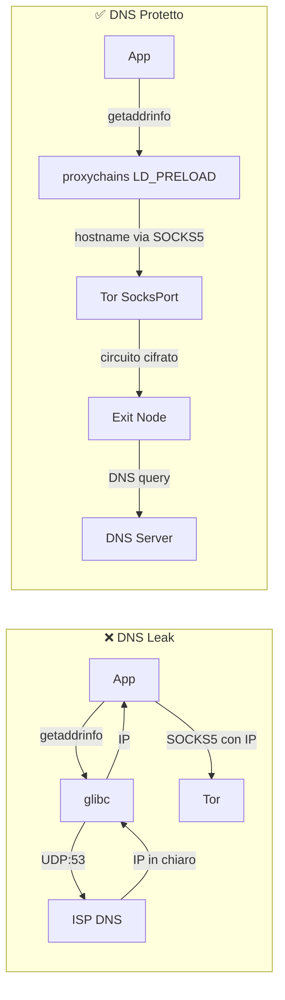

# DNS Leak — Come Avvengono e Come Prevenirli

Questo documento analizza i DNS leak in contesto Tor: come avvengono a livello tecnico,
tutti gli scenari che li causano, come testarli con tcpdump e script, le mitigazioni
complete multilivello, e la verifica forense dei leak.

I DNS leak sono probabilmente la vulnerabilità più comune nell'uso di Tor da CLI,
perché molte applicazioni risolvono i DNS localmente prima di passare il traffico
al proxy. Nella mia esperienza, la configurazione corretta di `proxy_dns` in
proxychains e `DNSPort` nel torrc è stata fondamentale.

---

## Indice

- [Cos'è un DNS leak](#cosè-un-dns-leak)
- [Anatomia tecnica di una query DNS](#anatomia-tecnica-di-una-query-dns)
- [Scenari che causano DNS leak](#scenari-che-causano-dns-leak)
- [Verifica pratica dei DNS leak](#verifica-pratica-dei-dns-leak)
- [Prevenzione completa multilivello](#prevenzione-completa-multilivello)
- [Hardening avanzato con iptables/nftables](#hardening-avanzato-con-iptablesnftables)
- [systemd-resolved e interazione con Tor](#systemd-resolved-e-interazione-con-tor)
- [DNS over HTTPS/TLS e implicazioni per Tor](#dns-over-httpstls-e-implicazioni-per-tor)
- [Rilevamento forense dei DNS leak](#rilevamento-forense-dei-dns-leak)
- [Nella mia esperienza](#nella-mia-esperienza)

---

## Cos'è un DNS leak

Un DNS leak avviene quando una query DNS esce dal tuo sistema **senza passare
attraverso Tor**, rivelando al tuo ISP (o al resolver DNS) quale sito stai per
visitare.

```
SCENARIO CORRETTO (no leak):
Browser → "example.com" → ProxyChains → SOCKS5 (hostname) → Tor → Exit (risolve DNS)
  L'ISP vede: traffico cifrato verso Guard/Bridge
  L'ISP NON vede: "example.com"

SCENARIO CON LEAK:
Browser → DNS query "example.com" → ISP DNS resolver → risposta IP
       → poi → ProxyChains → SOCKS5 (IP) → Tor → Exit → Server
  L'ISP vede: query DNS per "example.com" IN CHIARO
  Il traffico HTTPS è protetto, ma l'ISP sa che visiti example.com
```

### Perché è grave

Anche se il contenuto della connessione è cifrato (HTTPS via Tor), il DNS leak rivela:
- **Quali siti visiti** (il dominio è in chiaro nella query DNS)
- **Quando li visiti** (timestamp della query)
- **Quanto spesso** (frequenza delle query)
- **Pattern comportamentali** (orari, sequenze di siti, interessi)
- Questi metadata sono sufficienti per profilare il tuo comportamento

Un singolo DNS leak annulla completamente il beneficio di privacy offerto da Tor
per quella specifica connessione. Non importa che il traffico successivo sia cifrato
su 3 hop: l'ISP ha già visto il dominio.

### Cosa vede l'ISP con un DNS leak

```
# Query DNS in chiaro catturata dall'ISP (Comeser nel mio caso):
Frame 42: 74 bytes on wire
  Internet Protocol: 192.168.1.100 → 192.168.1.1
  User Datagram Protocol: Src Port: 53421, Dst Port: 53
  Domain Name System (query)
    Queries:
      example.com: type A, class IN
      
# L'ISP vede esattamente:
# - IP sorgente: il mio IP locale (192.168.1.100)
# - Destinazione: il router/DNS dell'ISP (192.168.1.1)
# - Dominio richiesto: example.com
# - Timestamp: esattamente quando ho fatto la richiesta
```

---

## Anatomia tecnica di una query DNS

Per capire dove avvengono i leak, bisogna capire il percorso di una query DNS
nel sistema Linux.

### Il percorso normale (senza Tor)

```
1. Applicazione chiama getaddrinfo("example.com")
2. glibc legge /etc/nsswitch.conf → "hosts: files dns"
3. Prima controlla /etc/hosts (nessun match)
4. Poi usa /etc/resolv.conf per trovare il nameserver
5. Invia query UDP porta 53 al nameserver configurato
6. Il nameserver (ISP o pubblico) risponde con l'IP
7. glibc restituisce l'IP all'applicazione
```

### Il percorso con proxychains (corretto)

```
1. Applicazione chiama getaddrinfo("example.com")
2. LD_PRELOAD di proxychains intercetta la chiamata
3. proxy_dns è attivo → NON risolve localmente
4. Assegna un IP fittizio (es. 224.x.x.x) temporaneo
5. Quando l'app si connette a quell'IP via SOCKS5:
   proxychains invia l'hostname originale al proxy
6. Tor risolve il DNS sull'exit node
7. Nessuna query DNS locale → nessun leak
```

### Il percorso con proxychains (leak)

```
1. Applicazione chiama getaddrinfo("example.com")
2. LD_PRELOAD di proxychains intercetta la chiamata
3. proxy_dns NON è attivo → risolve localmente
4. Query DNS UDP:53 esce verso il nameserver di sistema
   → LEAK! L'ISP vede la query
5. glibc restituisce l'IP reale
6. Proxychains invia l'IP (non l'hostname) via SOCKS5
7. Il traffico passa da Tor, ma il DNS è già uscito in chiaro
```

### Il punto critico: SOCKS4 vs SOCKS5

```
SOCKS4: supporta solo connessioni a IP
  → L'applicazione DEVE risolvere il DNS prima di connettersi
  → DNS leak inevitabile (a meno di AutomapHosts)

SOCKS5: supporta connessioni a hostname
  → L'applicazione PUÒ inviare l'hostname al proxy
  → Il proxy (Tor) risolve il DNS sull'exit
  → Ma l'applicazione deve usare SOCKS5 correttamente
  → curl --socks5 → risolve prima (leak)
  → curl --socks5-hostname → invia hostname (no leak)
```

---


### Diagramma: percorso DNS con e senza protezione



## Scenari che causano DNS leak

### 1. curl con --socks5 (senza hostname)

```bash
# LEAK! curl risolve localmente prima di inviare al proxy
curl --socks5 127.0.0.1:9050 https://example.com

# CORRETTO: hostname inviato al proxy, risolto da Tor
curl --socks5-hostname 127.0.0.1:9050 https://example.com

# ALTERNATIVA CORRETTA: protocollo socks5h (h = hostname resolution via proxy)
curl -x socks5h://127.0.0.1:9050 https://example.com
```

Verifica con tcpdump:
```bash
# Terminale 1: cattura DNS
sudo tcpdump -i eth0 port 53 -n

# Terminale 2: test con leak
curl --socks5 127.0.0.1:9050 https://check.torproject.org
# tcpdump mostra: 192.168.1.100.43521 > 192.168.1.1.53: A? check.torproject.org

# Terminale 2: test senza leak
curl --socks5-hostname 127.0.0.1:9050 https://check.torproject.org
# tcpdump: NESSUNA query DNS visibile
```

### 2. ProxyChains senza proxy_dns

Se `proxy_dns` non è attivo nel proxychains.conf, le chiamate `getaddrinfo()`
non vengono intercettate e il DNS esce in chiaro.

```ini
# /etc/proxychains4.conf

# CORRETTO:
proxy_dns
remote_dns_subnet 224

# SBAGLIATO (commentato o assente):
# proxy_dns
```

Verifica:
```bash
# Con proxy_dns disabilitato:
sudo tcpdump -i eth0 port 53 -n &
proxychains curl -s https://example.com
# Output tcpdump: query DNS visibile → LEAK

# Con proxy_dns abilitato:
sudo tcpdump -i eth0 port 53 -n &
proxychains curl -s https://example.com
# Output tcpdump: nessuna query DNS → OK
```

### 3. Applicazioni che bypassano il proxy

Applicazioni che non rispettano le impostazioni proxy del sistema o che usano
resolver DNS propri:

```
Chrome/Chromium:
  - Usa DNS-over-HTTPS (DoH) verso Google (8.8.8.8) per default
  - Bypassa completamente /etc/resolv.conf
  - Bypassa completamente proxychains per il DNS
  
Electron apps (Slack, VS Code, Discord):
  - Spesso ignorano LD_PRELOAD
  - Hanno il proprio stack di rete Node.js
  - Le chiamate DNS bypassano proxychains

systemd-resolved:
  - Può fare DNS prefetch/caching
  - Può inviare query in parallelo a più resolver
  - Può usare DNS-over-TLS verso server esterni
```

### 4. systemd-resolved che risponde prima del proxy

Su molti sistemi Linux moderni, `systemd-resolved` gestisce il DNS:

```bash
# Verifica se systemd-resolved è attivo
systemctl is-active systemd-resolved
# active → potenziale problema

# Il file /etc/resolv.conf punta al resolver locale:
cat /etc/resolv.conf
# nameserver 127.0.0.53   ← systemd-resolved
# nameserver 192.168.1.1  ← router ISP (fallback)
```

Il problema: `systemd-resolved` ha una cache DNS e può fare query
verso i resolver upstream (ISP) anche quando l'applicazione usa proxychains.

### 5. IPv6 DNS query

Se IPv6 è attivo, il sistema potrebbe inviare query DNS AAAA via IPv6,
bypassando la configurazione proxy IPv4:

```bash
# Verifica se IPv6 è attivo
cat /proc/sys/net/ipv6/conf/all/disable_ipv6
# 0 = IPv6 attivo (potenziale leak)
# 1 = IPv6 disabilitato (sicuro)

# Il problema specifico:
# 1. L'app chiede la risoluzione DNS
# 2. glibc invia CONTEMPORANEAMENTE:
#    - Query A (IPv4) → intercettata da proxychains
#    - Query AAAA (IPv6) → NON intercettata → leak
```

### 6. Applicazioni con DNS hardcoded

Alcune applicazioni hanno resolver DNS hardcoded che bypassano `/etc/resolv.conf`:

```
Google Chrome: 8.8.8.8, 8.8.4.4 (Google DNS)
Cloudflare WARP: 1.1.1.1, 1.0.0.1
Alcuni giochi/client: DNS hardcoded del publisher
Alcuni malware/adware: DNS propri per C2
```

Verifica:
```bash
# Cattura TUTTO il traffico DNS in uscita (non solo porta 53 locale)
sudo tcpdump -i eth0 '(udp port 53) or (tcp port 53) or (udp port 853) or (tcp port 853)' -n
```

### 7. DNS prefetch del browser

Firefox e Chrome pre-risolvono i DNS dei link nella pagina corrente:

```
# Stai visitando una pagina con 20 link
# Il browser pre-risolve i DNS di tutti i 20 domini
# → 20 query DNS che escono PRIMA che tu clicchi su qualcosa
# → L'ISP vede tutti i domini dei link nella pagina
```

Disabilitazione in Firefox:
```
network.dns.disablePrefetch = true
network.prefetch-next = false
network.predictor.enabled = false
```

### 8. DNS rebinding attack

Un sito malevolo può usare DNS rebinding per forzare il browser a connettersi
a indirizzi interni, bypassando Tor:

```
1. Il sito evil.com ha un DNS con TTL molto basso (1 secondo)
2. Prima risposta: evil.com → IP dell'exit Tor (connessione via Tor OK)
3. Il JavaScript nella pagina attende 2 secondi
4. Seconda risposta: evil.com → 127.0.0.1 (localhost!)
5. Il browser si connette a 127.0.0.1 (bypassa Tor)
6. Può accedere a servizi locali (ControlPort, server dev, etc.)
```

---

## Verifica pratica dei DNS leak

### Test 1: tcpdump in tempo reale

```bash
# Cattura DNS sulla interfaccia principale
sudo tcpdump -i eth0 port 53 -n -l 2>/dev/null &
TCPDUMP_PID=$!

# Esegui il comando da testare
proxychains curl -s https://check.torproject.org/api/ip

# Verifica: se tcpdump mostra query DNS → LEAK
# Se tcpdump non mostra nulla → OK

kill $TCPDUMP_PID 2>/dev/null
```

### Test 2: script automatico con conteggio

```bash
#!/bin/bash
# test-dns-leak.sh — Verifica DNS leak con conteggio preciso

IFACE="eth0"  # Adattare alla propria interfaccia
PCAP="/tmp/dns-leak-test.pcap"

echo "=== DNS Leak Test ==="

# Cattura DNS in background
sudo tcpdump -i "$IFACE" port 53 -w "$PCAP" -c 100 &
TCPDUMP_PID=$!
sleep 1

# Test 1: curl con --socks5-hostname (dovrebbe essere pulito)
echo "[TEST 1] curl --socks5-hostname (atteso: 0 leak)"
curl --socks5-hostname 127.0.0.1:9050 -s https://example.com > /dev/null 2>&1
sleep 2

# Test 2: proxychains curl (dovrebbe essere pulito con proxy_dns)
echo "[TEST 2] proxychains curl (atteso: 0 leak con proxy_dns)"
proxychains curl -s https://example.com > /dev/null 2>&1
sleep 2

# Ferma cattura
sudo kill $TCPDUMP_PID 2>/dev/null
sleep 1

# Analizza risultati
DNS_QUERIES=$(sudo tcpdump -r "$PCAP" -n 2>/dev/null | grep -c "A?")
echo ""
echo "Query DNS catturate: $DNS_QUERIES"
if [ "$DNS_QUERIES" -eq 0 ]; then
    echo "[OK] Nessun DNS leak rilevato"
else
    echo "[!!] DNS LEAK RILEVATO! $DNS_QUERIES query in chiaro"
    sudo tcpdump -r "$PCAP" -n 2>/dev/null | grep "A?"
fi

rm -f "$PCAP"
```

### Test 3: verifica con server DNS controllato

```bash
# Usa dig verso un dominio con un DNS che controlli (o un servizio di test)
# Se la query arriva al server → leak

# Metodo semplice con dnsleaktest.com:
proxychains curl -s https://bash.ws/dnsleak/test/$(proxychains curl -s https://bash.ws/dnsleak/id 2>/dev/null) 2>/dev/null

# Metodo con torproject:
proxychains curl -s https://check.torproject.org/api/ip 2>/dev/null
# {"IsTor":true,"IP":"185.220.101.x"} → OK
# {"IsTor":false,...} → problema (non necessariamente DNS, ma connessione non via Tor)
```

### Test 4: monitoraggio continuo

```bash
# Monitoraggio DNS durante una sessione di navigazione
sudo tcpdump -i eth0 port 53 -n -l 2>/dev/null | while read line; do
    echo "[$(date '+%H:%M:%S')] DNS LEAK DETECTED: $line"
done
# Lasciare attivo in un terminale mentre si naviga
# Se appaiono linee → c'è un leak
```

---

## Prevenzione completa multilivello

### Livello 1: Configurazione Tor (torrc)

```ini
# Tor come DNS resolver locale
DNSPort 5353                    # Tor risponde alle query DNS sulla porta 5353/UDP
AutomapHostsOnResolve 1         # Mapping automatico degli hostname a IP fittizi
VirtualAddrNetworkIPv4 10.192.0.0/10  # Range per gli IP fittizi del mapping
```

Come funziona:
```
1. Un'applicazione chiede di risolvere "example.com"
2. La query arriva a 127.0.0.1:5353 (Tor DNSPort)
3. Tor crea un circuito e risolve il DNS sull'exit node
4. Con AutomapHosts: Tor mappa "example.com" → 10.192.x.x
5. L'applicazione si connette a 10.192.x.x
6. Tor intercetta la connessione (TransPort) e la invia all'IP reale
```

### Livello 2: Configurazione ProxyChains

```ini
# /etc/proxychains4.conf
proxy_dns                       # Intercetta le chiamate DNS via LD_PRELOAD
remote_dns_subnet 224           # Subnet per IP fittizi del mapping DNS

# Come funziona proxy_dns:
# 1. proxychains intercetta getaddrinfo() via LD_PRELOAD
# 2. Invece di risolvere, assegna un IP nel range 224.x.x.x
# 3. Quando l'app si connette a 224.x.x.x:
#    proxychains invia l'hostname originale al proxy SOCKS5
# 4. Tor risolve il DNS sull'exit node
```

### Livello 3: Configurazione applicativa

```bash
# curl: SEMPRE --socks5-hostname, MAI --socks5
curl --socks5-hostname 127.0.0.1:9050 https://example.com
# Alternativa:
curl -x socks5h://127.0.0.1:9050 https://example.com

# wget: via proxychains (wget non supporta SOCKS nativamente)
proxychains wget https://example.com

# Firefox: "Proxy DNS when using SOCKS v5" attivo nelle impostazioni proxy
# about:config → network.proxy.socks_remote_dns = true

# git: usare socks5h (h = hostname resolution via proxy)
git config --global http.proxy socks5h://127.0.0.1:9050
git config --global https.proxy socks5h://127.0.0.1:9050

# pip: via proxychains
proxychains pip install package_name

# SSH: configurare in ~/.ssh/config
# Host *.onion
#     ProxyCommand nc -X 5 -x 127.0.0.1:9050 %h %p
```

### Livello 4: Configurazione di sistema

```bash
# 1. Disabilitare IPv6 (previene leak AAAA)
sudo sysctl -w net.ipv6.conf.all.disable_ipv6=1
sudo sysctl -w net.ipv6.conf.default.disable_ipv6=1
# Rendere persistente:
echo "net.ipv6.conf.all.disable_ipv6=1" | sudo tee -a /etc/sysctl.d/99-tor-hardening.conf
echo "net.ipv6.conf.default.disable_ipv6=1" | sudo tee -a /etc/sysctl.d/99-tor-hardening.conf

# 2. Configurare /etc/resolv.conf per usare solo Tor DNS
# ATTENZIONE: se Tor non è attivo, il DNS non funziona!
# Utile solo per setup system-wide
sudo bash -c 'echo "nameserver 127.0.0.1" > /etc/resolv.conf'
# E proteggere il file dalla sovrascrittura:
sudo chattr +i /etc/resolv.conf

# 3. Disabilitare systemd-resolved se non necessario
sudo systemctl stop systemd-resolved
sudo systemctl disable systemd-resolved
```

### Livello 5: Firewall (protezione massima)

Per impedire fisicamente che query DNS escano senza passare da Tor:

```bash
# Blocca tutto il DNS in uscita tranne quello di Tor
sudo iptables -A OUTPUT -p udp --dport 53 -m owner --uid-owner debian-tor -j ACCEPT
sudo iptables -A OUTPUT -p tcp --dport 53 -m owner --uid-owner debian-tor -j ACCEPT
sudo iptables -A OUTPUT -p udp --dport 53 -j DROP
sudo iptables -A OUTPUT -p tcp --dport 53 -j DROP

# Permetti anche DNS verso il DNSPort locale
sudo iptables -A OUTPUT -p udp -d 127.0.0.1 --dport 5353 -j ACCEPT
```

Questo blocca tutte le query DNS (porta 53) che non provengono dal processo Tor
(utente `debian-tor`). Qualsiasi applicazione che tenta di fare DNS diretto viene
bloccata silenziosamente.

---

## Hardening avanzato con iptables/nftables

### Regole iptables complete anti-DNS-leak

```bash
#!/bin/bash
# dns-leak-firewall.sh — Regole anti-DNS-leak complete

# Variabili
TOR_USER="debian-tor"
DNS_PORT=5353
TRANS_PORT=9040

# Flush regole esistenti per la catena DNS
sudo iptables -D OUTPUT -p udp --dport 53 -j DNS_LEAK_PROTECT 2>/dev/null
sudo iptables -F DNS_LEAK_PROTECT 2>/dev/null
sudo iptables -X DNS_LEAK_PROTECT 2>/dev/null

# Crea catena dedicata
sudo iptables -N DNS_LEAK_PROTECT

# Permetti DNS dal processo Tor
sudo iptables -A DNS_LEAK_PROTECT -m owner --uid-owner $TOR_USER -j ACCEPT

# Permetti DNS verso localhost (DNSPort)
sudo iptables -A DNS_LEAK_PROTECT -d 127.0.0.1 -j ACCEPT

# Log e blocca tutto il resto
sudo iptables -A DNS_LEAK_PROTECT -j LOG --log-prefix "DNS_LEAK_BLOCKED: " --log-level warning
sudo iptables -A DNS_LEAK_PROTECT -j DROP

# Applica la catena
sudo iptables -A OUTPUT -p udp --dport 53 -j DNS_LEAK_PROTECT
sudo iptables -A OUTPUT -p tcp --dport 53 -j DNS_LEAK_PROTECT

# Blocca anche DoH (DNS-over-HTTPS) verso resolver noti
# Questo previene che Chrome/app usino DoH per bypassare
for doh_ip in 8.8.8.8 8.8.4.4 1.1.1.1 1.0.0.1 9.9.9.9; do
    sudo iptables -A OUTPUT -d "$doh_ip" -p tcp --dport 443 \
        -m owner ! --uid-owner $TOR_USER -j DROP
done

echo "Regole anti-DNS-leak attivate"
echo "Verifica con: sudo iptables -L DNS_LEAK_PROTECT -v -n"
```

### Equivalente nftables

```
table inet dns_leak_protect {
    chain output {
        type filter hook output priority 0; policy accept;
        
        # Permetti DNS dal processo Tor
        meta skuid debian-tor udp dport 53 accept
        meta skuid debian-tor tcp dport 53 accept
        
        # Permetti DNS verso localhost
        ip daddr 127.0.0.1 udp dport 5353 accept
        
        # Log e blocca DNS diretto
        udp dport 53 log prefix "DNS_LEAK: " drop
        tcp dport 53 log prefix "DNS_LEAK: " drop
        
        # Blocca DoH verso resolver noti
        ip daddr { 8.8.8.8, 8.8.4.4, 1.1.1.1, 1.0.0.1 } tcp dport 443 \
            meta skuid != debian-tor drop
    }
}
```

### Verifica delle regole

```bash
# Verifica che le regole siano attive
sudo iptables -L DNS_LEAK_PROTECT -v -n

# Verifica i log dei blocchi
sudo journalctl -k | grep DNS_LEAK_BLOCKED

# Test: prova a fare DNS diretto (dovrebbe essere bloccato)
dig example.com @8.8.8.8
# → timeout (bloccato dal firewall)

# Test: prova via Tor (dovrebbe funzionare)
proxychains curl -s https://check.torproject.org/api/ip
# → {"IsTor":true,...} (DNS risolto via Tor)
```

---

## systemd-resolved e interazione con Tor

### Il problema

`systemd-resolved` è il resolver DNS predefinito su molte distribuzioni Linux.
Crea complicazioni con Tor:

```bash
# systemd-resolved ascolta su 127.0.0.53:53
# /etc/resolv.conf punta a 127.0.0.53
# Le applicazioni risolvono DNS tramite systemd-resolved
# systemd-resolved inoltra le query ai resolver upstream (ISP)

# Anche con proxychains, ci sono casi dove systemd-resolved
# risolve PRIMA che proxychains intercetti:
# - NSS (Name Service Switch) può usare systemd-resolved direttamente
# - Alcune librerie non usano getaddrinfo() standard
```

### Soluzione 1: Disabilitare systemd-resolved

```bash
sudo systemctl stop systemd-resolved
sudo systemctl disable systemd-resolved
sudo rm /etc/resolv.conf  # Rimuovi il symlink
echo "nameserver 127.0.0.1" | sudo tee /etc/resolv.conf
# Ora il DNS usa solo il resolver locale (Tor DNSPort se configurato)
```

### Soluzione 2: Configurare systemd-resolved per usare Tor

```ini
# /etc/systemd/resolved.conf
[Resolve]
DNS=127.0.0.1#5353     # Usa il DNSPort di Tor
FallbackDNS=            # NESSUN fallback (se Tor è giù, DNS non funziona)
DNSOverTLS=no           # Non usare DoT (Tor gestisce la crittografia)
DNSSEC=no               # Tor non supporta DNSSEC end-to-end
Cache=no                # Non cachare (le risposte cambiano con gli exit)
```

```bash
sudo systemctl restart systemd-resolved
# Verifica:
resolvectl status
# Dovrebbe mostrare: DNS Servers: 127.0.0.1#5353
```

### Soluzione 3: Configurazione ibrida (il mio approccio)

```bash
# Su Kali Linux, systemd-resolved non è attivo per default
# Verifico:
systemctl is-active systemd-resolved
# inactive → nessun problema

# Il mio /etc/resolv.conf usa il DNS del router ISP:
cat /etc/resolv.conf
# nameserver 192.168.1.1

# Questo significa:
# - Senza proxychains: DNS risolto dal router ISP (normale)
# - Con proxychains + proxy_dns: DNS risolto via Tor (protetto)
# - Il leak avviene SOLO se dimentico proxychains o uso --socks5 senza -hostname
```

---

## DNS over HTTPS/TLS e implicazioni per Tor

### DoH (DNS-over-HTTPS)

DoH cifra le query DNS dentro HTTPS (porta 443). Sembra buono per la privacy,
ma crea problemi con Tor:

```
Problema 1: DoH bypassa proxychains
  Firefox con DoH attivo → query DNS HTTPS verso Cloudflare (1.1.1.1:443)
  proxychains non intercetta questa connessione HTTPS
  → Le query DNS escono in chiaro (cifrate con TLS, ma non via Tor)
  → Il provider DoH (Cloudflare/Google) vede tutti i tuoi domini

Problema 2: DoH non passa da Tor
  La connessione DoH è una connessione HTTPS separata
  Se non è proxata, esce direttamente
  Anche se è proxata, aggiunge latenza (DoH + Tor = doppio overhead)

Soluzione: disabilitare DoH quando si usa Tor
  Firefox: about:config → network.trr.mode = 5 (disabilitato)
  Chrome: chrome://settings → Sicurezza → "Usa DNS sicuro" → OFF
```

### DoT (DNS-over-TLS)

DoT cifra le query DNS con TLS sulla porta 853. Stesso problema:

```
# Se systemd-resolved usa DoT:
[Resolve]
DNSOverTLS=yes
DNS=1.1.1.1#cloudflare-dns.com

# Le query vanno a Cloudflare via TLS sulla porta 853
# → Non passano da Tor
# → Cloudflare vede tutti i tuoi domini (anche se cifrati in transito)
```

### Raccomandazione

Quando si usa Tor, disabilitare DoH e DoT. Il DNS deve passare
attraverso Tor, che gestisce la propria crittografia. Aggiungere
DoH/DoT a Tor non aggiunge sicurezza e può causare leak.

---

## Rilevamento forense dei DNS leak

### Come un analista forense rileva DNS leak

Un investigatore che ha accesso ai log dell'ISP o a una cattura di rete
può identificare i DNS leak:

```
Evidenza 1: Query DNS in chiaro
  - pcap con query DNS UDP:53 verso il resolver ISP
  - Contengono i domini visitati, con timestamp

Evidenza 2: Correlazione temporale
  - t=0.00: query DNS per "sensitive-site.com" (in chiaro)
  - t=0.05: connessione TLS verso Guard Tor
  - Correlazione: l'utente ha visitato sensitive-site.com via Tor

Evidenza 3: Pattern di leak
  - Le prime query di una sessione sono spesso in chiaro
    (prima che proxychains si inizializzi)
  - Le query per domini interni (.local, .internal) leakano spesso
  - I browser prefetchano DNS prima che l'utente clicchi
```

### Self-audit per DNS leak

```bash
#!/bin/bash
# audit-dns-leak.sh — Verifica se ci sono stati DNS leak
# Analizza un file pcap catturato durante una sessione Tor

PCAP_FILE="${1:-/tmp/session-capture.pcap}"

echo "=== Audit DNS Leak ==="
echo "File: $PCAP_FILE"

# Conta query DNS in uscita (non da Tor)
TOTAL_DNS=$(tcpdump -r "$PCAP_FILE" -n 'udp port 53 and not src host 127.0.0.1' 2>/dev/null | wc -l)
echo "Query DNS in uscita (non-localhost): $TOTAL_DNS"

# Elenca i domini richiesti
echo ""
echo "Domini richiesti in chiaro:"
tcpdump -r "$PCAP_FILE" -n 'udp port 53' 2>/dev/null | \
    grep -oP '(?<=A\? )[^ ]+' | sort -u

# Verifica se ci sono query verso resolver noti (DoH)
echo ""
echo "Connessioni verso resolver DNS noti (possibile DoH):"
for ip in 8.8.8.8 8.8.4.4 1.1.1.1 1.0.0.1 9.9.9.9; do
    COUNT=$(tcpdump -r "$PCAP_FILE" -n "host $ip" 2>/dev/null | wc -l)
    [ "$COUNT" -gt 0 ] && echo "  $ip: $COUNT pacchetti"
done
```

---

## Nella mia esperienza

La mia configurazione previene i DNS leak a tre livelli:
1. **proxy_dns in proxychains** (intercetta DNS a livello applicativo)
2. **DNSPort 5353 nel torrc** (Tor come resolver DNS locale)
3. **IPv6 disabilitato** (previene leak via AAAA query)

Non ho implementato il firewall iptables perché uso Tor solo per applicazioni
specifiche (non system-wide). Ma per un setup dove voglio la massima protezione,
il firewall sarebbe il passo successivo.

Il test rapido che uso regolarmente:
```bash
# Test DNS leak rapido
sudo tcpdump -i eth0 port 53 -c 5 -n &
proxychains curl -s https://check.torproject.org/api/ip | grep IsTor
# Se tcpdump non cattura nulla e IsTor è true → nessun leak
```

Il leak più insidioso che ho incontrato: **Firefox con DNS prefetch attivo**.
Anche con proxychains, Firefox pre-risolveva i DNS dei link nella pagina.
La soluzione è stata `network.dns.disablePrefetch = true` nel profilo tor-proxy.

---

## Vedi anche

- [Tor e DNS — Risoluzione](../04-strumenti-operativi/tor-e-dns-risoluzione.md) — DNSPort, AutomapHosts, configurazione DNS completa
- [Verifica IP, DNS e Leak](../04-strumenti-operativi/verifica-ip-dns-e-leak.md) — Test IP, DNS leak, IPv6 leak, WebRTC leak
- [Hardening di Sistema](hardening-sistema.md) — sysctl, nftables, regole firewall
- [OPSEC e Errori Comuni](opsec-e-errori-comuni.md) — DNS leak come errore OPSEC
- [Transparent Proxy](../06-configurazioni-avanzate/transparent-proxy.md) — TransPort per forzare tutto il traffico via Tor
- [ProxyChains — Guida Completa](../04-strumenti-operativi/proxychains-guida-completa.md) — proxy_dns e configurazione
