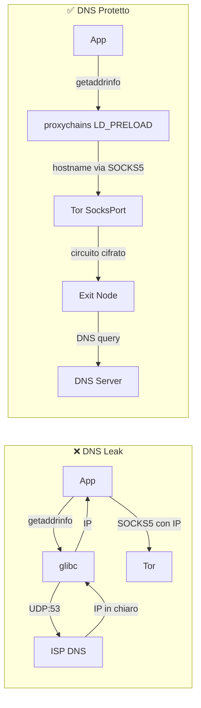

> **Lingua / Language**: Italiano | [English](../en/05-sicurezza-operativa/dns-leak.md)

# DNS Leak - Come Avvengono e Come Prevenirli

Questo documento analizza i DNS leak in contesto Tor: come avvengono a livello tecnico,
tutti gli scenari che li causano, come testarli con tcpdump e script, le mitigazioni
complete multilivello, e la verifica forense dei leak.

I DNS leak sono probabilmente la vulnerabilità più comune nell'uso di Tor da CLI,
perché molte applicazioni risolvono i DNS localmente prima di passare il traffico
al proxy. Nella mia esperienza, la configurazione corretta di `proxy_dns` in
proxychains e `DNSPort` nel torrc è stata fondamentale.

---

## Indice

- [Cos'è un DNS leak](#cosè-un-dns-leak)
- [Anatomia tecnica di una query DNS](#anatomia-tecnica-di-una-query-dns)
- [Scenari che causano DNS leak](#scenari-che-causano-dns-leak)
- [Verifica pratica dei DNS leak](#verifica-pratica-dei-dns-leak)
**Approfondimenti** (file dedicati):
- [DNS Leak - Prevenzione e Hardening](dns-leak-prevenzione-e-hardening.md) - Mitigazioni, firewall, systemd-resolved, DoH/DoT, forensics

---

## Cos'è un DNS leak

Un DNS leak avviene quando una query DNS esce dal tuo sistema **senza passare
attraverso Tor**, rivelando al tuo ISP (o al resolver DNS) quale sito stai per
visitare.

```
SCENARIO CORRETTO (no leak):
Browser → "example.com" → ProxyChains → SOCKS5 (hostname) → Tor → Exit (risolve DNS)
  L'ISP vede: traffico cifrato verso Guard/Bridge
  L'ISP NON vede: "example.com"

SCENARIO CON LEAK:
Browser → DNS query "example.com" → ISP DNS resolver → risposta IP
       → poi → ProxyChains → SOCKS5 (IP) → Tor → Exit → Server
  L'ISP vede: query DNS per "example.com" IN CHIARO
  Il traffico HTTPS è protetto, ma l'ISP sa che visiti example.com
```

### Perché è grave

Anche se il contenuto della connessione è cifrato (HTTPS via Tor), il DNS leak rivela:
- **Quali siti visiti** (il dominio è in chiaro nella query DNS)
- **Quando li visiti** (timestamp della query)
- **Quanto spesso** (frequenza delle query)
- **Pattern comportamentali** (orari, sequenze di siti, interessi)
- Questi metadata sono sufficienti per profilare il tuo comportamento

Un singolo DNS leak annulla completamente il beneficio di privacy offerto da Tor
per quella specifica connessione. Non importa che il traffico successivo sia cifrato
su 3 hop: l'ISP ha già visto il dominio.

### Cosa vede l'ISP con un DNS leak

```
# Query DNS in chiaro catturata dall'ISP (Comeser nel mio caso):
Frame 42: 74 bytes on wire
  Internet Protocol: 192.168.1.100 → 192.168.1.1
  User Datagram Protocol: Src Port: 53421, Dst Port: 53
  Domain Name System (query)
    Queries:
      example.com: type A, class IN
      
# L'ISP vede esattamente:
# - IP sorgente: il mio IP locale (192.168.1.100)
# - Destinazione: il router/DNS dell'ISP (192.168.1.1)
# - Dominio richiesto: example.com
# - Timestamp: esattamente quando ho fatto la richiesta
```

---

## Anatomia tecnica di una query DNS

Per capire dove avvengono i leak, bisogna capire il percorso di una query DNS
nel sistema Linux.

### Il percorso normale (senza Tor)

```
1. Applicazione chiama getaddrinfo("example.com")
2. glibc legge /etc/nsswitch.conf → "hosts: files dns"
3. Prima controlla /etc/hosts (nessun match)
4. Poi usa /etc/resolv.conf per trovare il nameserver
5. Invia query UDP porta 53 al nameserver configurato
6. Il nameserver (ISP o pubblico) risponde con l'IP
7. glibc restituisce l'IP all'applicazione
```

### Il percorso con proxychains (corretto)

```
1. Applicazione chiama getaddrinfo("example.com")
2. LD_PRELOAD di proxychains intercetta la chiamata
3. proxy_dns è attivo → NON risolve localmente
4. Assegna un IP fittizio (es. 224.x.x.x) temporaneo
5. Quando l'app si connette a quell'IP via SOCKS5:
   proxychains invia l'hostname originale al proxy
6. Tor risolve il DNS sull'exit node
7. Nessuna query DNS locale → nessun leak
```

### Il percorso con proxychains (leak)

```
1. Applicazione chiama getaddrinfo("example.com")
2. LD_PRELOAD di proxychains intercetta la chiamata
3. proxy_dns NON è attivo → risolve localmente
4. Query DNS UDP:53 esce verso il nameserver di sistema
   → LEAK! L'ISP vede la query
5. glibc restituisce l'IP reale
6. Proxychains invia l'IP (non l'hostname) via SOCKS5
7. Il traffico passa da Tor, ma il DNS è già uscito in chiaro
```

### Il punto critico: SOCKS4 vs SOCKS5

```
SOCKS4: supporta solo connessioni a IP
  → L'applicazione DEVE risolvere il DNS prima di connettersi
  → DNS leak inevitabile (a meno di AutomapHosts)

SOCKS5: supporta connessioni a hostname
  → L'applicazione PUÒ inviare l'hostname al proxy
  → Il proxy (Tor) risolve il DNS sull'exit
  → Ma l'applicazione deve usare SOCKS5 correttamente
  → curl --socks5 → risolve prima (leak)
  → curl --socks5-hostname → invia hostname (no leak)
```

---


### Diagramma: percorso DNS con e senza protezione



## Scenari che causano DNS leak

### 1. curl con --socks5 (senza hostname)

```bash
# LEAK! curl risolve localmente prima di inviare al proxy
curl --socks5 127.0.0.1:9050 https://example.com

# CORRETTO: hostname inviato al proxy, risolto da Tor
curl --socks5-hostname 127.0.0.1:9050 https://example.com

# ALTERNATIVA CORRETTA: protocollo socks5h (h = hostname resolution via proxy)
curl -x socks5h://127.0.0.1:9050 https://example.com
```

Verifica con tcpdump:
```bash
# Terminale 1: cattura DNS
sudo tcpdump -i eth0 port 53 -n

# Terminale 2: test con leak
curl --socks5 127.0.0.1:9050 https://check.torproject.org
# tcpdump mostra: 192.168.1.100.43521 > 192.168.1.1.53: A? check.torproject.org

# Terminale 2: test senza leak
curl --socks5-hostname 127.0.0.1:9050 https://check.torproject.org
# tcpdump: NESSUNA query DNS visibile
```

### 2. ProxyChains senza proxy_dns

Se `proxy_dns` non è attivo nel proxychains.conf, le chiamate `getaddrinfo()`
non vengono intercettate e il DNS esce in chiaro.

```ini
# /etc/proxychains4.conf

# CORRETTO:
proxy_dns
remote_dns_subnet 224

# SBAGLIATO (commentato o assente):
# proxy_dns
```

Verifica:
```bash
# Con proxy_dns disabilitato:
sudo tcpdump -i eth0 port 53 -n &
proxychains curl -s https://example.com
# Output tcpdump: query DNS visibile → LEAK

# Con proxy_dns abilitato:
sudo tcpdump -i eth0 port 53 -n &
proxychains curl -s https://example.com
# Output tcpdump: nessuna query DNS → OK
```

### 3. Applicazioni che bypassano il proxy

Applicazioni che non rispettano le impostazioni proxy del sistema o che usano
resolver DNS propri:

```
Chrome/Chromium:
  - Usa DNS-over-HTTPS (DoH) verso Google (8.8.8.8) per default
  - Bypassa completamente /etc/resolv.conf
  - Bypassa completamente proxychains per il DNS
  
Electron apps (Slack, VS Code, Discord):
  - Spesso ignorano LD_PRELOAD
  - Hanno il proprio stack di rete Node.js
  - Le chiamate DNS bypassano proxychains

systemd-resolved:
  - Può fare DNS prefetch/caching
  - Può inviare query in parallelo a più resolver
  - Può usare DNS-over-TLS verso server esterni
```

### 4. systemd-resolved che risponde prima del proxy

Su molti sistemi Linux moderni, `systemd-resolved` gestisce il DNS:

```bash
# Verifica se systemd-resolved è attivo
systemctl is-active systemd-resolved
# active → potenziale problema

# Il file /etc/resolv.conf punta al resolver locale:
cat /etc/resolv.conf
# nameserver 127.0.0.53   ← systemd-resolved
# nameserver 192.168.1.1  ← router ISP (fallback)
```

Il problema: `systemd-resolved` ha una cache DNS e può fare query
verso i resolver upstream (ISP) anche quando l'applicazione usa proxychains.

### 5. IPv6 DNS query

Se IPv6 è attivo, il sistema potrebbe inviare query DNS AAAA via IPv6,
bypassando la configurazione proxy IPv4:

```bash
# Verifica se IPv6 è attivo
cat /proc/sys/net/ipv6/conf/all/disable_ipv6
# 0 = IPv6 attivo (potenziale leak)
# 1 = IPv6 disabilitato (sicuro)

# Il problema specifico:
# 1. L'app chiede la risoluzione DNS
# 2. glibc invia CONTEMPORANEAMENTE:
#    - Query A (IPv4) → intercettata da proxychains
#    - Query AAAA (IPv6) → NON intercettata → leak
```

### 6. Applicazioni con DNS hardcoded

Alcune applicazioni hanno resolver DNS hardcoded che bypassano `/etc/resolv.conf`:

```
Google Chrome: 8.8.8.8, 8.8.4.4 (Google DNS)
Cloudflare WARP: 1.1.1.1, 1.0.0.1
Alcuni giochi/client: DNS hardcoded del publisher
Alcuni malware/adware: DNS propri per C2
```

Verifica:
```bash
# Cattura TUTTO il traffico DNS in uscita (non solo porta 53 locale)
sudo tcpdump -i eth0 '(udp port 53) or (tcp port 53) or (udp port 853) or (tcp port 853)' -n
```

### 7. DNS prefetch del browser

Firefox e Chrome pre-risolvono i DNS dei link nella pagina corrente:

```
# Stai visitando una pagina con 20 link
# Il browser pre-risolve i DNS di tutti i 20 domini
# → 20 query DNS che escono PRIMA che tu clicchi su qualcosa
# → L'ISP vede tutti i domini dei link nella pagina
```

Disabilitazione in Firefox:
```
network.dns.disablePrefetch = true
network.prefetch-next = false
network.predictor.enabled = false
```

### 8. DNS rebinding attack

Un sito malevolo può usare DNS rebinding per forzare il browser a connettersi
a indirizzi interni, bypassando Tor:

```
1. Il sito evil.com ha un DNS con TTL molto basso (1 secondo)
2. Prima risposta: evil.com → IP dell'exit Tor (connessione via Tor OK)
3. Il JavaScript nella pagina attende 2 secondi
4. Seconda risposta: evil.com → 127.0.0.1 (localhost!)
5. Il browser si connette a 127.0.0.1 (bypassa Tor)
6. Può accedere a servizi locali (ControlPort, server dev, etc.)
```

---

## Verifica pratica dei DNS leak

### Test 1: tcpdump in tempo reale

```bash
# Cattura DNS sulla interfaccia principale
sudo tcpdump -i eth0 port 53 -n -l 2>/dev/null &
TCPDUMP_PID=$!

# Esegui il comando da testare
proxychains curl -s https://check.torproject.org/api/ip

# Verifica: se tcpdump mostra query DNS → LEAK
# Se tcpdump non mostra nulla → OK

kill $TCPDUMP_PID 2>/dev/null
```

### Test 2: script automatico con conteggio

```bash
#!/bin/bash
# test-dns-leak.sh - Verifica DNS leak con conteggio preciso

IFACE="eth0"  # Adattare alla propria interfaccia
PCAP="/tmp/dns-leak-test.pcap"

echo "=== DNS Leak Test ==="

# Cattura DNS in background
sudo tcpdump -i "$IFACE" port 53 -w "$PCAP" -c 100 &
TCPDUMP_PID=$!
sleep 1

# Test 1: curl con --socks5-hostname (dovrebbe essere pulito)
echo "[TEST 1] curl --socks5-hostname (atteso: 0 leak)"
curl --socks5-hostname 127.0.0.1:9050 -s https://example.com > /dev/null 2>&1
sleep 2

# Test 2: proxychains curl (dovrebbe essere pulito con proxy_dns)
echo "[TEST 2] proxychains curl (atteso: 0 leak con proxy_dns)"
proxychains curl -s https://example.com > /dev/null 2>&1
sleep 2

# Ferma cattura
sudo kill $TCPDUMP_PID 2>/dev/null
sleep 1

# Analizza risultati
DNS_QUERIES=$(sudo tcpdump -r "$PCAP" -n 2>/dev/null | grep -c "A?")
echo ""
echo "Query DNS catturate: $DNS_QUERIES"
if [ "$DNS_QUERIES" -eq 0 ]; then
    echo "[OK] Nessun DNS leak rilevato"
else
    echo "[!!] DNS LEAK RILEVATO! $DNS_QUERIES query in chiaro"
    sudo tcpdump -r "$PCAP" -n 2>/dev/null | grep "A?"
fi

rm -f "$PCAP"
```

### Test 3: verifica con server DNS controllato

```bash
# Usa dig verso un dominio con un DNS che controlli (o un servizio di test)
# Se la query arriva al server → leak

# Metodo semplice con dnsleaktest.com:
proxychains curl -s https://bash.ws/dnsleak/test/$(proxychains curl -s https://bash.ws/dnsleak/id 2>/dev/null) 2>/dev/null

# Metodo con torproject:
proxychains curl -s https://check.torproject.org/api/ip 2>/dev/null
# {"IsTor":true,"IP":"185.220.101.x"} → OK
# {"IsTor":false,...} → problema (non necessariamente DNS, ma connessione non via Tor)
```

### Test 4: monitoraggio continuo

```bash
# Monitoraggio DNS durante una sessione di navigazione
sudo tcpdump -i eth0 port 53 -n -l 2>/dev/null | while read line; do
    echo "[$(date '+%H:%M:%S')] DNS LEAK DETECTED: $line"
done
# Lasciare attivo in un terminale mentre si naviga
# Se appaiono linee → c'è un leak
```

---

---

> **Continua in**: [DNS Leak - Prevenzione e Hardening](dns-leak-prevenzione-e-hardening.md)
> per la prevenzione multilivello, hardening iptables/nftables, systemd-resolved,
> DoH/DoT e rilevamento forense.

---

## Vedi anche

- [DNS Leak - Prevenzione e Hardening](dns-leak-prevenzione-e-hardening.md) - Mitigazioni, firewall, systemd-resolved, DoH/DoT
- [Tor e DNS - Risoluzione](../04-strumenti-operativi/tor-e-dns-risoluzione.md) - DNSPort, AutomapHosts, configurazione DNS
- [Verifica IP, DNS e Leak](../04-strumenti-operativi/verifica-ip-dns-e-leak.md) - Test IP, DNS leak, IPv6 leak
- [Hardening di Sistema](hardening-sistema.md) - sysctl, nftables, regole firewall
- [OPSEC e Errori Comuni](opsec-e-errori-comuni.md) - DNS leak come errore OPSEC
- [ProxyChains - Guida Completa](../04-strumenti-operativi/proxychains-guida-completa.md) - proxy_dns e configurazione
- [Scenari Reali](scenari-reali.md) - Casi operativi da pentester
