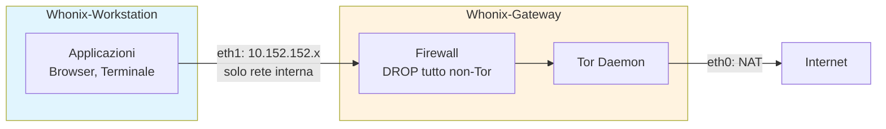

# Isolamento e Compartimentazione — Protezione a Livello di Sistema

Questo documento analizza le soluzioni per isolare completamente il traffico Tor
dal traffico normale a livello di sistema operativo: Whonix, Tails, Qubes OS,
network namespaces Linux, containerizzazione Docker, e configurazioni ibride.
Per ogni soluzione, fornisco architettura, setup pratico, e threat model.

---

## Indice

- [Perché l'isolamento è necessario](#perché-lisolamento-è-necessario)
- [Matrice comparativa delle soluzioni](#matrice-comparativa-delle-soluzioni)
- [Whonix — Isolamento a due VM](#whonix--isolamento-a-due-vm)
- [Tails — Sistema amnesico](#tails--sistema-amnesico)
- [Qubes OS — Compartimentazione estrema](#qubes-os--compartimentazione-estrema)
- [Network Namespaces Linux](#network-namespaces-linux)
- [Docker e containerizzazione](#docker-e-containerizzazione)
- [Transparent proxy con iptables](#transparent-proxy-con-iptables)
- [Confronto per threat model](#confronto-per-threat-model)
- [La mia posizione](#la-mia-posizione)

---

## Perché l'isolamento è necessario

Il mio setup (Tor daemon + proxychains su Kali) ha un problema fondamentale:
**il traffico non-Tor può ancora uscire**. Se un'applicazione non rispetta il proxy
o fa leak DNS, il mio IP reale viene esposto.

```
Senza isolamento:
[App] ─proxy→ [Tor] → Internet    (traffico intenzionale)
[App] ─diretto→ Internet           (leak!)
[OS services] ─diretto→ Internet   (NTP, updates, telemetry, etc.)
[Browser plugin] ─diretto→ Internet (WebRTC, DNS prefetch, etc.)

Con isolamento:
[App] → [firewall: DEVE passare da Tor] → [Tor] → Internet
[App] → [firewall: BLOCCATO] ✗ Internet   (leak impossibile)
[OS services] → [firewall: BLOCCATO] ✗ Internet (leak impossibile)
```

### Vettori di leak senza isolamento

```
1. DNS leak: query DNS escono in chiaro (vedi dns-leak.md)
2. WebRTC: rivela IP reale e locale
3. IPv6: traffico IPv6 bypassa proxy IPv4
4. UDP: applicazioni che usano UDP (non supportato da Tor)
5. NTP: sincronizzazione orario rivela timezone e rete
6. Aggiornamenti OS: connessioni dirette per update
7. systemd-resolved: cache e query DNS dirette
8. D-Bus: servizi di sistema che comunicano in rete
9. mDNS/Avahi: discovery sulla rete locale
10. File aperti: PDF, DOCX che caricano risorse remote
```

L'unica soluzione completa è impedire **a livello di rete** che qualsiasi
traffico esca senza passare da Tor.

---

## Matrice comparativa delle soluzioni

| Caratteristica | proxychains | iptables TP | Namespace | Docker | Whonix | Tails | Qubes+Whonix |
|---------------|-------------|-------------|-----------|--------|--------|-------|-------------|
| Leak prevention | Bassa | Alta | Alta | Media | Molto alta | Molto alta | Estrema |
| Amnesia (no tracce) | No | No | No | Parziale | No | **SI** | No |
| Facilità setup | Alta | Media | Bassa | Media | Media | Alta | Bassa |
| Performance | Buona | Buona | Buona | Buona | Media | Media | Bassa |
| Risorse HW | Minime | Minime | Minime | Basse | 4GB+ RAM | 2GB+ RAM | 16GB+ RAM |
| Flessibilità | Alta | Media | Alta | Alta | Media | Bassa | Alta |
| Protezione da exploit | Nessuna | Nessuna | Bassa | Bassa | Media | Alta | Molto alta |
| Adatto a uso quotidiano | **SI** | Parziale | No | Parziale | SI | Parziale | SI |

---

## Whonix — Isolamento a due VM

### Architettura

Whonix è un sistema a due macchine virtuali che garantisce l'isolamento
del traffico per design:

```
┌────────────────────────────────────────────────────┐
│                    Host OS (KVM/VirtualBox)          │
│                                                      │
│  ┌──────────────────────┐  ┌────────────────────┐  │
│  │  Whonix-Workstation   │  │  Whonix-Gateway    │  │
│  │                       │  │                    │  │
│  │  - Applicazioni       │  │  - Tor daemon      │  │
│  │  - Browser            │  │  - Firewall        │  │
│  │  - Terminale          │  │  - DNS via Tor     │  │
│  │                       │  │                    │  │
│  │  eth0: 10.152.152.11  │  │  eth1: 10.152.152.10│ │
│  │  (internal network)   │  │  (internal network) │  │
│  │                       │  │  eth0: NAT/bridge   │  │
│  │  Default GW:          │  │  (accesso Internet) │  │
│  │  10.152.152.10        │  │                    │  │
│  └──────────┬───────────┘  └─────────┬──────────┘  │
│              │     internal network    │              │
│              └────────────────────────┘              │
└──────────────────────────────────────────────────────┘
```


### Diagramma: architettura Whonix



### Perché è sicuro

```
La Workstation:
  - Ha SOLO una interfaccia di rete interna (10.152.152.0/24)
  - Il suo default gateway è il Gateway (10.152.152.10)
  - NON ha accesso diretto a Internet
  - Non conosce l'IP reale dell'host
  - Anche se un'applicazione è compromessa, non può bypassare Tor

Il Gateway:
  - Ha due interfacce: una interna, una esterna
  - Firewall: BLOCCA tutto il traffico dalla Workstation tranne via Tor
  - Tutto il DNS è forzato via Tor
  - Tutto il TCP è forzato via TransPort di Tor
  - UDP: completamente bloccato (impossibile leak)
```

### Setup pratico con KVM

```bash
# 1. Installare KVM/libvirt
sudo apt install qemu-kvm libvirt-daemon-system virt-manager

# 2. Scaricare le immagini Whonix
# Da: https://www.whonix.org/wiki/KVM
# Gateway: Whonix-Gateway.qcow2
# Workstation: Whonix-Workstation.qcow2

# 3. Importare le VM
sudo virsh define Whonix-Gateway.xml
sudo virsh define Whonix-Workstation.xml

# 4. Avviare (prima il Gateway, poi la Workstation)
sudo virsh start Whonix-Gateway
# Aspettare che Tor faccia bootstrap
sudo virsh start Whonix-Workstation

# 5. Nella Workstation, verificare:
curl https://check.torproject.org/api/ip
# {"IsTor":true,...}
```

### Setup con VirtualBox

```bash
# 1. Installare VirtualBox
sudo apt install virtualbox

# 2. Scaricare e importare le OVA
# File: Whonix-Gateway.ova, Whonix-Workstation.ova

# 3. Importare
VBoxManage import Whonix-Gateway.ova
VBoxManage import Whonix-Workstation.ova

# 4. La rete interna è già configurata nelle OVA
# 5. Avviare Gateway, poi Workstation
```

### Firewall del Gateway (regole chiave)

```bash
# Le regole del Gateway Whonix (semplificate):

# Politica default: DROP tutto
iptables -P INPUT DROP
iptables -P FORWARD DROP
iptables -P OUTPUT DROP

# Permetti traffico dalla Workstation SOLO verso Tor
iptables -A FORWARD -i eth1 -o eth0 -j DROP  # NO forwarding diretto

# Tutto il TCP dalla Workstation → TransPort di Tor
iptables -t nat -A PREROUTING -i eth1 -p tcp -j REDIRECT --to-ports 9040

# Tutto il DNS dalla Workstation → DNSPort di Tor
iptables -t nat -A PREROUTING -i eth1 -p udp --dport 53 -j REDIRECT --to-ports 5353

# Permetti al processo Tor di uscire
iptables -A OUTPUT -m owner --uid-owner debian-tor -j ACCEPT

# DROP tutto il resto
iptables -A OUTPUT -j DROP
```

### Quando usare Whonix

```
✓ Vuoi isolamento completo del traffico
✓ Puoi dedicare 4-8 GB di RAM
✓ Vuoi un sistema persistente (non amnesico)
✓ Vuoi installare software personalizzato nella Workstation
✓ Hai bisogno di protezione anche da exploit del browser

✗ Non hai risorse per la virtualizzazione
✗ Hai bisogno di amnesia (usa Tails)
✗ Vuoi compartimentazione multi-identità (usa Qubes)
```

---

## Tails — Sistema amnesico

### Architettura

Tails (The Amnesic Incognito Live System) è un sistema operativo live che:
- Si avvia da USB/DVD
- Instrada TUTTO il traffico attraverso Tor
- Non lascia tracce sul disco (amnesico)
- Si resetta completamente ad ogni riavvio

```
┌─────────────────────────────────────────────┐
│              Tails (live USB)                 │
│                                               │
│  ┌──────────┐  ┌────────┐  ┌──────────────┐ │
│  │Tor Browser│  │Thunderb│  │  Terminale   │ │
│  └─────┬─────┘  └───┬────┘  └──────┬───────┘ │
│        │             │              │          │
│  ┌─────▼─────────────▼──────────────▼───────┐ │
│  │          Firewall (iptables)              │ │
│  │  BLOCCA tutto il traffico non-Tor         │ │
│  └──────────────────┬───────────────────────┘ │
│                     │                          │
│              ┌──────▼──────┐                   │
│              │  Tor daemon  │                   │
│              └──────┬──────┘                   │
│                     │                          │
└─────────────────────┼──────────────────────────┘
                      │
                  Internet
```

### Caratteristiche chiave

```
Amnesia:
  - Il sistema gira interamente in RAM
  - Al riavvio, TUTTO viene cancellato
  - Nessun artefatto su disco (niente swap, niente temp)
  - MAC address randomizzato all'avvio

Isolamento di rete:
  - iptables blocca TUTTO il traffico non-Tor
  - DNS forzato via Tor (identico a Whonix Gateway)
  - IPv6 completamente disabilitato
  - ICMP/UDP bloccati

Software incluso:
  - Tor Browser (con tutte le protezioni)
  - Thunderbird (email con Enigmail/OpenPGP)
  - KeePassXC (password manager)
  - OnionShare (file sharing via Tor)
  - MAT2 (Metadata Anonymization Toolkit)
  - Electrum (wallet Bitcoin)
  - Pidgin (messaggistica con OTR)
```

### Setup pratico

```bash
# 1. Scaricare Tails
# Da: https://tails.net/install/
# Verificare la firma GPG!

# 2. Scrivere sulla USB (almeno 8 GB)
# Su Linux:
sudo dd if=tails-amd64-*.img of=/dev/sdX bs=16M status=progress

# Oppure usare Tails Installer (raccomandato):
# https://tails.net/install/linux/

# 3. Avviare dal BIOS/UEFI
# Selezionare la USB come dispositivo di boot
# Tails si avvia e connette automaticamente a Tor

# 4. Persistent Storage (opzionale)
# Tails può creare uno storage cifrato sulla USB per:
# - Chiavi GPG
# - Password KeePassXC
# - File personali
# - Configurazione WiFi
# Lo storage è cifrato con LUKS e richiede passphrase al boot
```

### Persistent Storage — cosa salvare

```
Attivabile in: Applications → Tails → Persistent Storage

Opzioni:
  ☑ Personal Data       → ~/Persistent/
  ☑ GnuPG keys         → ~/.gnupg/
  ☑ SSH keys            → ~/.ssh/
  ☑ Network Connections → WiFi passwords
  ☑ Browser Bookmarks   → Tor Browser bookmarks
  ☐ Dotfiles            → File di configurazione personalizzati
  ☐ Additional Software → Pacchetti aggiuntivi installati

IMPORTANTE: ogni dato persistente è un potenziale artefatto forense.
Lo storage è cifrato, ma se la passphrase è compromessa, i dati
sono accessibili. Usare persistent storage solo se necessario.
```

### Quando usare Tails

```
✓ Scenario ad alto rischio (giornalismo, whistleblowing, attivismo)
✓ Hai bisogno che NESSUNA traccia rimanga sul computer
✓ Usi computer condivisi o non fidati
✓ Vuoi il massimo livello di protezione "out of the box"
✓ Non hai bisogno di software personalizzato

✗ Hai bisogno di un sistema persistente completo
✗ Vuoi installare molto software aggiuntivo
✗ Hai bisogno di performance (Tails è lento)
✗ Non puoi riavviare il computer (Tails richiede boot da USB)
```

---

## Qubes OS — Compartimentazione estrema

### Architettura

Qubes OS usa la virtualizzazione Xen per compartimentare il sistema in "qubes"
(VM leggere) completamente isolate:

```
┌─────────────────────────────────────────────────────────────────┐
│                        Qubes OS (Xen hypervisor)                 │
│                                                                   │
│  ┌──────────┐  ┌──────────┐  ┌──────────┐  ┌──────────────────┐│
│  │  Personal │  │   Work   │  │  Vault   │  │  Disposable VM   ││
│  │  (green)  │  │  (blue)  │  │  (black) │  │  (red)           ││
│  │           │  │          │  │          │  │                  ││
│  │ Browser   │  │ Browser  │  │ KeePass  │  │ File sospetti   ││
│  │ Email     │  │ IDE      │  │ GPG keys │  │ Link non fidati ││
│  │ Social    │  │ Git      │  │ No rete  │  │ Autodistruzione ││
│  └─────┬─────┘  └────┬─────┘  └──────────┘  └────────┬─────────┘│
│        │              │                               │          │
│  ┌─────▼──────────────▼───────────────────────────────▼────────┐│
│  │                    sys-firewall                              ││
│  │            (regole firewall per ogni qube)                   ││
│  └─────────────────────────┬───────────────────────────────────┘│
│                            │                                     │
│  ┌─────────────────────────▼───────────────────────────────────┐│
│  │                      sys-net                                 ││
│  │              (driver di rete, WiFi, eth)                     ││
│  └─────────────────────────┬───────────────────────────────────┘│
└────────────────────────────┼─────────────────────────────────────┘
                             │
                         Internet


Per traffico Tor, aggiungi sys-whonix:
  [Qube Tor] → [sys-whonix (Whonix Gateway)] → [sys-firewall] → [sys-net]
  [Qube Personal] → [sys-firewall] → [sys-net]  (rete normale)
```

### Compartimentazione per identità

```
Scenario reale con Qubes:

Qube "personal":
  - Email personale, social, banking
  - Rete normale via sys-firewall

Qube "work":
  - Email lavoro, IDE, repository
  - Rete normale o VPN via sys-firewall

Qube "anon-browsing":
  - Tor Browser, navigazione anonima
  - Rete via sys-whonix (forzata via Tor)

Qube "anon-comm":
  - Comunicazione anonima (email, chat)
  - Rete via sys-whonix

Qube "vault":
  - Password, chiavi GPG, documenti sensibili
  - NESSUNA rete (completamente isolato)

Qube "untrusted":
  - Aprire file scaricati, link sospetti
  - Disposable: autodistruzione alla chiusura

Ogni qube è una VM Xen completamente isolata:
  - Se "untrusted" viene compromesso → gli altri qube sono intatti
  - Se "anon-browsing" è compromesso → non può accedere a "personal"
  - "vault" non ha rete → impossibile esfiltrare dati
```

### Requisiti hardware

```
Minimi:
  - CPU: 64-bit Intel/AMD con VT-x/AMD-V e VT-d/AMD-Vi (IOMMU)
  - RAM: 16 GB (minimo pratico per 4-5 qube)
  - Disco: 256 GB SSD (ogni qube occupa spazio)
  - GPU: Intel integrata (NVIDIA/AMD hanno problemi)

Raccomandati:
  - RAM: 32 GB (per 8+ qube contemporanei)
  - Disco: 512 GB SSD NVMe
  - TPM 2.0 per anti-evil-maid

Hardware certificato:
  - Purism Librem 14/15 (hardware open)
  - Lenovo ThinkPad T480/X1 Carbon (ben supportati)
  - Dell Latitude (vari modelli)
  - Vedi: https://www.qubes-os.org/hcl/
```

### Quando usare Qubes

```
✓ Hai bisogno di compartimentazione multi-identità
✓ Vuoi separare completamente lavoro, personale, anonimo
✓ Hai risorse hardware sufficienti (16+ GB RAM)
✓ Vuoi protezione anche da exploit del kernel
✓ Sei disposto a investire tempo nella curva di apprendimento

✗ Hai meno di 16 GB di RAM
✗ La tua CPU non supporta VT-d/IOMMU
✗ Hai bisogno di gaming o GPU passthrough
✗ Vuoi un sistema semplice da usare
```

---

## Network Namespaces Linux

### Architettura

I network namespaces di Linux permettono di creare ambienti di rete isolati
senza virtualizzazione. Sono un meccanismo del kernel nativo:

```
┌─────────────────────────────────────────────┐
│                  Host Linux                  │
│                                              │
│  Namespace "default" (host)                  │
│  ┌────────────────────────────────────────┐  │
│  │ eth0: 192.168.1.100 (rete reale)      │  │
│  │ veth0: 10.200.1.1 (ponte al namespace)│  │
│  │ Tor daemon (SocksPort 9050)           │  │
│  └───────────────┬────────────────────────┘  │
│                  │ veth pair                  │
│  Namespace "tor_ns" (isolato)                │
│  ┌───────────────┴────────────────────────┐  │
│  │ veth1: 10.200.1.2 (unica interfaccia) │  │
│  │ Default GW: 10.200.1.1                │  │
│  │                                        │  │
│  │ App → veth1 → veth0 → host            │  │
│  │       (tutto il traffico passa          │  │
│  │        dall'host, dove Tor lo cattura)  │  │
│  └────────────────────────────────────────┘  │
└──────────────────────────────────────────────┘
```

### Setup completo passo-passo

```bash
#!/bin/bash
# tor-namespace-setup.sh — Crea un namespace di rete isolato per Tor

# 1. Creare il namespace
sudo ip netns add tor_ns

# 2. Creare una coppia di interfacce veth
sudo ip link add veth-host type veth peer name veth-tor

# 3. Spostare un'estremità nel namespace
sudo ip link set veth-tor netns tor_ns

# 4. Configurare le interfacce
# Lato host:
sudo ip addr add 10.200.1.1/24 dev veth-host
sudo ip link set veth-host up

# Lato namespace:
sudo ip netns exec tor_ns ip addr add 10.200.1.2/24 dev veth-tor
sudo ip netns exec tor_ns ip link set veth-tor up
sudo ip netns exec tor_ns ip link set lo up

# 5. Configurare il routing nel namespace
sudo ip netns exec tor_ns ip route add default via 10.200.1.1

# 6. Abilitare IP forwarding sull'host
sudo sysctl -w net.ipv4.ip_forward=1

# 7. Configurare iptables sull'host per forzare via Tor
# Tutto il traffico dal namespace → TransPort di Tor
sudo iptables -t nat -A PREROUTING -s 10.200.1.0/24 -p tcp \
    -j REDIRECT --to-ports 9040
sudo iptables -t nat -A PREROUTING -s 10.200.1.0/24 -p udp --dport 53 \
    -j REDIRECT --to-ports 5353

# Blocca tutto il traffico diretto dal namespace
sudo iptables -A FORWARD -s 10.200.1.0/24 -j DROP

# 8. Configurare DNS nel namespace
sudo mkdir -p /etc/netns/tor_ns
echo "nameserver 10.200.1.1" | sudo tee /etc/netns/tor_ns/resolv.conf

# 9. Test: eseguire comandi nel namespace
sudo ip netns exec tor_ns curl --max-time 30 https://check.torproject.org/api/ip
# Dovrebbe mostrare {"IsTor":true,...}

# 10. Per eseguire un browser nel namespace:
sudo ip netns exec tor_ns sudo -u $USER firefox -no-remote -P tor-ns
```

### Script di cleanup

```bash
#!/bin/bash
# tor-namespace-cleanup.sh — Rimuove il namespace Tor

sudo ip netns exec tor_ns ip link set veth-tor down 2>/dev/null
sudo ip link set veth-host down 2>/dev/null
sudo ip link del veth-host 2>/dev/null
sudo ip netns del tor_ns 2>/dev/null

# Rimuovi regole iptables
sudo iptables -t nat -D PREROUTING -s 10.200.1.0/24 -p tcp \
    -j REDIRECT --to-ports 9040 2>/dev/null
sudo iptables -t nat -D PREROUTING -s 10.200.1.0/24 -p udp --dport 53 \
    -j REDIRECT --to-ports 5353 2>/dev/null
sudo iptables -D FORWARD -s 10.200.1.0/24 -j DROP 2>/dev/null

echo "Namespace tor_ns rimosso"
```

### Vantaggi e limiti

```
Vantaggi:
  + Nessuna virtualizzazione necessaria (zero overhead)
  + Nativo Linux (kernel feature)
  + Isolamento di rete completo
  + Combinabile con cgroups per limitare risorse
  + Leggero: creazione/distruzione in millisecondi

Limiti:
  - Configurazione manuale complessa
  - Se le regole iptables sono sbagliate → leak possibile
  - Non amnesico (disco e RAM dell'host sono accessibili)
  - Non protegge da exploit del kernel (condivide il kernel)
  - Richiede root per la configurazione
  - Non isola il filesystem (il namespace vede i file dell'host)
```

---

## Docker e containerizzazione

### Tor in Docker

```dockerfile
# Dockerfile per un container Tor isolato
FROM debian:bookworm-slim

RUN apt-get update && apt-get install -y --no-install-recommends \
    tor \
    proxychains4 \
    curl \
    ca-certificates \
    && rm -rf /var/lib/apt/lists/*

COPY torrc /etc/tor/torrc
COPY proxychains4.conf /etc/proxychains4.conf

# Tor gira come utente debian-tor
USER debian-tor
EXPOSE 9050

CMD ["tor", "-f", "/etc/tor/torrc"]
```

### Docker Compose con browser

```yaml
# docker-compose.yml
version: '3.8'

services:
  tor:
    build: .
    container_name: tor-proxy
    networks:
      - tor-net
    ports:
      - "127.0.0.1:9050:9050"  # SocksPort (solo localhost)
    restart: unless-stopped

  browser:
    image: jlesage/firefox:latest
    container_name: tor-browser
    networks:
      - tor-net
    environment:
      - http_proxy=socks5h://tor:9050
      - https_proxy=socks5h://tor:9050
    ports:
      - "127.0.0.1:5800:5800"  # Web UI
    depends_on:
      - tor
    # Nessun accesso diretto a Internet
    # Solo via la rete tor-net → tor container

networks:
  tor-net:
    driver: bridge
    internal: true  # NESSUN accesso a Internet diretto
    # I container possono comunicare tra loro
    # ma NON possono raggiungere Internet direttamente
```

### Limiti di Docker per l'anonimato

```
Docker NON è progettato per la sicurezza:
  - Il daemon Docker gira come root
  - Container escapes sono possibili (CVE multiple)
  - Le network policy di Docker non sono pensate per l'anonimato
  - I log Docker possono contenere informazioni sensibili
  - L'isolamento non è a livello hypervisor (condivide il kernel)

Docker è utile per:
  ✓ Ambienti riproducibili e portabili
  ✓ Isolamento leggero per test
  ✓ CI/CD con Tor
  ✓ Separazione delle applicazioni

Docker NON è sufficiente per:
  ✗ Anonimato ad alto rischio
  ✗ Protezione da exploit del kernel
  ✗ Protezione da avversari sofisticati
```

---

## Transparent proxy con iptables

### Setup rapido per uso system-wide

```bash
#!/bin/bash
# transparent-tor.sh — Forza tutto il traffico TCP via Tor

TOR_USER="debian-tor"
TRANS_PORT=9040
DNS_PORT=5353

# Permetti traffico di Tor
sudo iptables -t nat -A OUTPUT -m owner --uid-owner $TOR_USER -j RETURN

# DNS via Tor
sudo iptables -t nat -A OUTPUT -p udp --dport 53 -j REDIRECT --to-ports $DNS_PORT

# TCP via TransPort
sudo iptables -t nat -A OUTPUT -p tcp --syn -j REDIRECT --to-ports $TRANS_PORT

# Blocca traffico diretto (non-Tor)
sudo iptables -A OUTPUT -m state --state ESTABLISHED,RELATED -j ACCEPT
sudo iptables -A OUTPUT -m owner --uid-owner $TOR_USER -j ACCEPT
sudo iptables -A OUTPUT -o lo -j ACCEPT
sudo iptables -A OUTPUT -j DROP

echo "Transparent proxy attivo. Tutto il TCP passa da Tor."
echo "ATTENZIONE: UDP bloccato (niente NTP, QUIC, VoIP)"
```

### Vantaggi e limiti

```
Vantaggi:
  + Tutto il traffico TCP passa da Tor senza configurazione app
  + DNS forzato via Tor (no leak possibile)
  + Leak prevention a livello firewall

Limiti:
  - UDP completamente bloccato (NTP, DNS diretto, QUIC, VoIP)
  - Se Tor si blocca → tutta la rete è bloccata
  - Fragile: un errore nelle regole → leak
  - Performance degradate (tutto il traffico su 3 hop)
  - Non isola le applicazioni tra loro
```

Per una guida completa, vedi `docs/06-configurazioni-avanzate/transparent-proxy.md`.

---

## Confronto per threat model

### Avversario: Tracker web (Google, Facebook)

```
Protezione necessaria: nascondere IP, prevenire fingerprinting
Soluzione minima: Tor Browser
Soluzione raccomandata: Tor Browser
Note: l'isolamento di sistema non è necessario per questo threat model
```

### Avversario: ISP

```
Protezione necessaria: nascondere destinazioni e uso di Tor
Soluzione minima: Tor + bridge obfs4
Soluzione raccomandata: Tor + bridge obfs4 + proxy_dns
Note: il mio caso d'uso. proxychains è sufficiente.
```

### Avversario: rete locale ostile (WiFi pubblica, hotel)

```
Protezione necessaria: nascondere tutto il traffico, MAC spoofing
Soluzione minima: VPN + Tor Browser
Soluzione raccomandata: Tails (MAC randomizzato + tutto via Tor)
Note: Tails è ideale per reti non fidate
```

### Avversario: forze dell'ordine nazionali

```
Protezione necessaria: anonimato completo, amnesia, OPSEC rigoroso
Soluzione minima: Whonix
Soluzione raccomandata: Tails (amnesico) o Qubes+Whonix
Note: OPSEC umano è più importante della tecnologia
```

### Avversario: intelligence (NSA, GCHQ)

```
Protezione necessaria: tutto quanto sopra + difesa da correlazione globale
Soluzione minima: Qubes + Whonix + OPSEC perfetto
Soluzione raccomandata: Qubes + Whonix + Tails per sessioni specifiche
Note: contro un avversario globale, nessuna soluzione è garantita
```

| Scenario | Soluzione consigliata |
|----------|---------------------|
| Studio e test (il mio caso) | Tor + proxychains |
| Privacy dall'ISP | Tor + proxychains + bridge obfs4 |
| Navigazione anonima seria | Tor Browser |
| Alto rischio (giornalismo, attivismo) | Tails o Whonix |
| Compartimentazione multi-identità | Qubes OS + Whonix |
| Protezione system-wide leggera | iptables transparent proxy |
| Ambienti di test riproducibili | Docker + Tor |
| Rete locale non fidata | Tails (USB live) |

---

## La mia posizione

Per il mio caso d'uso (studio, test, privacy dall'ISP), il setup attuale
(Tor daemon + proxychains su Kali) è sufficiente. Le soluzioni di isolamento
sono per scenari dove l'anonimato è critico.

La scelta dipende dal modello di minaccia. Non esiste una soluzione "migliore"
in assoluto — esiste la soluzione adatta al rischio specifico.

Se dovessi scalare il mio setup per un rischio maggiore, la progressione sarebbe:
1. **Attuale**: proxychains + bridge obfs4 (privacy dall'ISP)
2. **Intermedio**: transparent proxy con iptables (leak prevention)
3. **Alto**: Whonix su KVM (isolamento completo)
4. **Critico**: Tails da USB (amnesia + isolamento)
5. **Massimo**: Qubes + Whonix (compartimentazione + isolamento)

---

## Vedi anche

- [Transparent Proxy](../06-configurazioni-avanzate/transparent-proxy.md) — Setup completo iptables/nftables
- [Hardening di Sistema](hardening-sistema.md) — sysctl, AppArmor, nftables
- [DNS Leak](dns-leak.md) — Prevenzione DNS leak a tutti i livelli
- [OPSEC e Errori Comuni](opsec-e-errori-comuni.md) — L'isolamento non sostituisce l'OPSEC
- [Analisi Forense e Artefatti](analisi-forense-e-artefatti.md) — Cosa lascia tracce su disco e RAM
- [Multi-Istanza e Stream Isolation](../06-configurazioni-avanzate/multi-istanza-e-stream-isolation.md) — Isolamento dei circuiti
