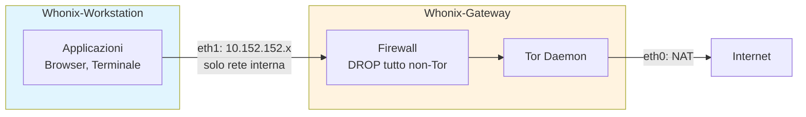

# Isolamento e Compartimentazione - Protezione a Livello di Sistema

Questo documento analizza le soluzioni per isolare completamente il traffico Tor
dal traffico normale a livello di sistema operativo: Whonix, Tails, Qubes OS,
network namespaces Linux, containerizzazione Docker, e configurazioni ibride.
Per ogni soluzione, fornisco architettura, setup pratico, e threat model.

---

## Indice

- [Perché l'isolamento è necessario](#perché-lisolamento-è-necessario)
- [Matrice comparativa delle soluzioni](#matrice-comparativa-delle-soluzioni)
- [Whonix - Isolamento a due VM](#whonix--isolamento-a-due-vm)
- [Tails - Sistema amnesico](#tails--sistema-amnesico)
**Approfondimenti** (file dedicati):
- [Isolamento Avanzato](isolamento-avanzato.md) - Qubes, namespaces, Docker, transparent proxy, confronto threat model

---

## Perché l'isolamento è necessario

Il mio setup (Tor daemon + proxychains su Kali) ha un problema fondamentale:
**il traffico non-Tor può ancora uscire**. Se un'applicazione non rispetta il proxy
o fa leak DNS, il mio IP reale viene esposto.

```
Senza isolamento:
[App] ─proxy→ [Tor] → Internet    (traffico intenzionale)
[App] ─diretto→ Internet           (leak!)
[OS services] ─diretto→ Internet   (NTP, updates, telemetry, etc.)
[Browser plugin] ─diretto→ Internet (WebRTC, DNS prefetch, etc.)

Con isolamento:
[App] → [firewall: DEVE passare da Tor] → [Tor] → Internet
[App] → [firewall: BLOCCATO] ✗ Internet   (leak impossibile)
[OS services] → [firewall: BLOCCATO] ✗ Internet (leak impossibile)
```

### Vettori di leak senza isolamento

```
1. DNS leak: query DNS escono in chiaro (vedi dns-leak.md)
2. WebRTC: rivela IP reale e locale
3. IPv6: traffico IPv6 bypassa proxy IPv4
4. UDP: applicazioni che usano UDP (non supportato da Tor)
5. NTP: sincronizzazione orario rivela timezone e rete
6. Aggiornamenti OS: connessioni dirette per update
7. systemd-resolved: cache e query DNS dirette
8. D-Bus: servizi di sistema che comunicano in rete
9. mDNS/Avahi: discovery sulla rete locale
10. File aperti: PDF, DOCX che caricano risorse remote
```

L'unica soluzione completa è impedire **a livello di rete** che qualsiasi
traffico esca senza passare da Tor.

---

## Matrice comparativa delle soluzioni

| Caratteristica | proxychains | iptables TP | Namespace | Docker | Whonix | Tails | Qubes+Whonix |
|---------------|-------------|-------------|-----------|--------|--------|-------|-------------|
| Leak prevention | Bassa | Alta | Alta | Media | Molto alta | Molto alta | Estrema |
| Amnesia (no tracce) | No | No | No | Parziale | No | **SI** | No |
| Facilità setup | Alta | Media | Bassa | Media | Media | Alta | Bassa |
| Performance | Buona | Buona | Buona | Buona | Media | Media | Bassa |
| Risorse HW | Minime | Minime | Minime | Basse | 4GB+ RAM | 2GB+ RAM | 16GB+ RAM |
| Flessibilità | Alta | Media | Alta | Alta | Media | Bassa | Alta |
| Protezione da exploit | Nessuna | Nessuna | Bassa | Bassa | Media | Alta | Molto alta |
| Adatto a uso quotidiano | **SI** | Parziale | No | Parziale | SI | Parziale | SI |

---

## Whonix - Isolamento a due VM

### Architettura

Whonix è un sistema a due macchine virtuali che garantisce l'isolamento
del traffico per design:

```
┌────────────────────────────────────────────────────┐
│                    Host OS (KVM/VirtualBox)          │
│                                                      │
│  ┌──────────────────────┐  ┌────────────────────┐  │
│  │  Whonix-Workstation   │  │  Whonix-Gateway    │  │
│  │                       │  │                    │  │
│  │  - Applicazioni       │  │  - Tor daemon      │  │
│  │  - Browser            │  │  - Firewall        │  │
│  │  - Terminale          │  │  - DNS via Tor     │  │
│  │                       │  │                    │  │
│  │  eth0: 10.152.152.11  │  │  eth1: 10.152.152.10│ │
│  │  (internal network)   │  │  (internal network) │  │
│  │                       │  │  eth0: NAT/bridge   │  │
│  │  Default GW:          │  │  (accesso Internet) │  │
│  │  10.152.152.10        │  │                    │  │
│  └──────────┬───────────┘  └─────────┬──────────┘  │
│              │     internal network    │              │
│              └────────────────────────┘              │
└──────────────────────────────────────────────────────┘
```


### Diagramma: architettura Whonix



### Perché è sicuro

```
La Workstation:
  - Ha SOLO una interfaccia di rete interna (10.152.152.0/24)
  - Il suo default gateway è il Gateway (10.152.152.10)
  - NON ha accesso diretto a Internet
  - Non conosce l'IP reale dell'host
  - Anche se un'applicazione è compromessa, non può bypassare Tor

Il Gateway:
  - Ha due interfacce: una interna, una esterna
  - Firewall: BLOCCA tutto il traffico dalla Workstation tranne via Tor
  - Tutto il DNS è forzato via Tor
  - Tutto il TCP è forzato via TransPort di Tor
  - UDP: completamente bloccato (impossibile leak)
```

### Setup pratico con KVM

```bash
# 1. Installare KVM/libvirt
sudo apt install qemu-kvm libvirt-daemon-system virt-manager

# 2. Scaricare le immagini Whonix
# Da: https://www.whonix.org/wiki/KVM
# Gateway: Whonix-Gateway.qcow2
# Workstation: Whonix-Workstation.qcow2

# 3. Importare le VM
sudo virsh define Whonix-Gateway.xml
sudo virsh define Whonix-Workstation.xml

# 4. Avviare (prima il Gateway, poi la Workstation)
sudo virsh start Whonix-Gateway
# Aspettare che Tor faccia bootstrap
sudo virsh start Whonix-Workstation

# 5. Nella Workstation, verificare:
curl https://check.torproject.org/api/ip
# {"IsTor":true,...}
```

### Setup con VirtualBox

```bash
# 1. Installare VirtualBox
sudo apt install virtualbox

# 2. Scaricare e importare le OVA
# File: Whonix-Gateway.ova, Whonix-Workstation.ova

# 3. Importare
VBoxManage import Whonix-Gateway.ova
VBoxManage import Whonix-Workstation.ova

# 4. La rete interna è già configurata nelle OVA
# 5. Avviare Gateway, poi Workstation
```

### Firewall del Gateway (regole chiave)

```bash
# Le regole del Gateway Whonix (semplificate):

# Politica default: DROP tutto
iptables -P INPUT DROP
iptables -P FORWARD DROP
iptables -P OUTPUT DROP

# Permetti traffico dalla Workstation SOLO verso Tor
iptables -A FORWARD -i eth1 -o eth0 -j DROP  # NO forwarding diretto

# Tutto il TCP dalla Workstation → TransPort di Tor
iptables -t nat -A PREROUTING -i eth1 -p tcp -j REDIRECT --to-ports 9040

# Tutto il DNS dalla Workstation → DNSPort di Tor
iptables -t nat -A PREROUTING -i eth1 -p udp --dport 53 -j REDIRECT --to-ports 5353

# Permetti al processo Tor di uscire
iptables -A OUTPUT -m owner --uid-owner debian-tor -j ACCEPT

# DROP tutto il resto
iptables -A OUTPUT -j DROP
```

### Quando usare Whonix

```
✓ Vuoi isolamento completo del traffico
✓ Puoi dedicare 4-8 GB di RAM
✓ Vuoi un sistema persistente (non amnesico)
✓ Vuoi installare software personalizzato nella Workstation
✓ Hai bisogno di protezione anche da exploit del browser

✗ Non hai risorse per la virtualizzazione
✗ Hai bisogno di amnesia (usa Tails)
✗ Vuoi compartimentazione multi-identità (usa Qubes)
```

---

## Tails - Sistema amnesico

### Architettura

Tails (The Amnesic Incognito Live System) è un sistema operativo live che:
- Si avvia da USB/DVD
- Instrada TUTTO il traffico attraverso Tor
- Non lascia tracce sul disco (amnesico)
- Si resetta completamente ad ogni riavvio

```
┌─────────────────────────────────────────────┐
│              Tails (live USB)                 │
│                                               │
│  ┌──────────┐  ┌────────┐  ┌──────────────┐ │
│  │Tor Browser│  │Thunderb│  │  Terminale   │ │
│  └─────┬─────┘  └───┬────┘  └──────┬───────┘ │
│        │             │              │          │
│  ┌─────▼─────────────▼──────────────▼───────┐ │
│  │          Firewall (iptables)              │ │
│  │  BLOCCA tutto il traffico non-Tor         │ │
│  └──────────────────┬───────────────────────┘ │
│                     │                          │
│              ┌──────▼──────┐                   │
│              │  Tor daemon  │                   │
│              └──────┬──────┘                   │
│                     │                          │
└─────────────────────┼──────────────────────────┘
                      │
                  Internet
```

### Caratteristiche chiave

```
Amnesia:
  - Il sistema gira interamente in RAM
  - Al riavvio, TUTTO viene cancellato
  - Nessun artefatto su disco (niente swap, niente temp)
  - MAC address randomizzato all'avvio

Isolamento di rete:
  - iptables blocca TUTTO il traffico non-Tor
  - DNS forzato via Tor (identico a Whonix Gateway)
  - IPv6 completamente disabilitato
  - ICMP/UDP bloccati

Software incluso:
  - Tor Browser (con tutte le protezioni)
  - Thunderbird (email con Enigmail/OpenPGP)
  - KeePassXC (password manager)
  - OnionShare (file sharing via Tor)
  - MAT2 (Metadata Anonymization Toolkit)
  - Electrum (wallet Bitcoin)
  - Pidgin (messaggistica con OTR)
```

### Setup pratico

```bash
# 1. Scaricare Tails
# Da: https://tails.net/install/
# Verificare la firma GPG!

# 2. Scrivere sulla USB (almeno 8 GB)
# Su Linux:
sudo dd if=tails-amd64-*.img of=/dev/sdX bs=16M status=progress

# Oppure usare Tails Installer (raccomandato):
# https://tails.net/install/linux/

# 3. Avviare dal BIOS/UEFI
# Selezionare la USB come dispositivo di boot
# Tails si avvia e connette automaticamente a Tor

# 4. Persistent Storage (opzionale)
# Tails può creare uno storage cifrato sulla USB per:
# - Chiavi GPG
# - Password KeePassXC
# - File personali
# - Configurazione WiFi
# Lo storage è cifrato con LUKS e richiede passphrase al boot
```

### Persistent Storage - cosa salvare

```
Attivabile in: Applications → Tails → Persistent Storage

Opzioni:
  ☑ Personal Data       → ~/Persistent/
  ☑ GnuPG keys         → ~/.gnupg/
  ☑ SSH keys            → ~/.ssh/
  ☑ Network Connections → WiFi passwords
  ☑ Browser Bookmarks   → Tor Browser bookmarks
  ☐ Dotfiles            → File di configurazione personalizzati
  ☐ Additional Software → Pacchetti aggiuntivi installati

IMPORTANTE: ogni dato persistente è un potenziale artefatto forense.
Lo storage è cifrato, ma se la passphrase è compromessa, i dati
sono accessibili. Usare persistent storage solo se necessario.
```

### Quando usare Tails

```
✓ Scenario ad alto rischio (giornalismo, whistleblowing, attivismo)
✓ Hai bisogno che NESSUNA traccia rimanga sul computer
✓ Usi computer condivisi o non fidati
✓ Vuoi il massimo livello di protezione "out of the box"
✓ Non hai bisogno di software personalizzato

✗ Hai bisogno di un sistema persistente completo
✗ Vuoi installare molto software aggiuntivo
✗ Hai bisogno di performance (Tails è lento)
✗ Non puoi riavviare il computer (Tails richiede boot da USB)
```


---

> **Continua in**: [Isolamento Avanzato](isolamento-avanzato.md) per Qubes OS,
> network namespaces Linux, Docker, transparent proxy e confronto per threat model.

---

## Vedi anche

- [Isolamento Avanzato](isolamento-avanzato.md) - Qubes, namespaces, Docker, confronto threat model
- [Transparent Proxy](../06-configurazioni-avanzate/transparent-proxy.md) - Setup completo iptables/nftables
- [Hardening di Sistema](hardening-sistema.md) - sysctl, AppArmor, nftables
- [DNS Leak](dns-leak.md) - Prevenzione DNS leak a tutti i livelli
- [OPSEC e Errori Comuni](opsec-e-errori-comuni.md) - L'isolamento non sostituisce l'OPSEC
- [Analisi Forense e Artefatti](analisi-forense-e-artefatti.md) - Cosa lascia tracce su disco e RAM
- [Scenari Reali](scenari-reali.md) - Casi operativi da pentester
