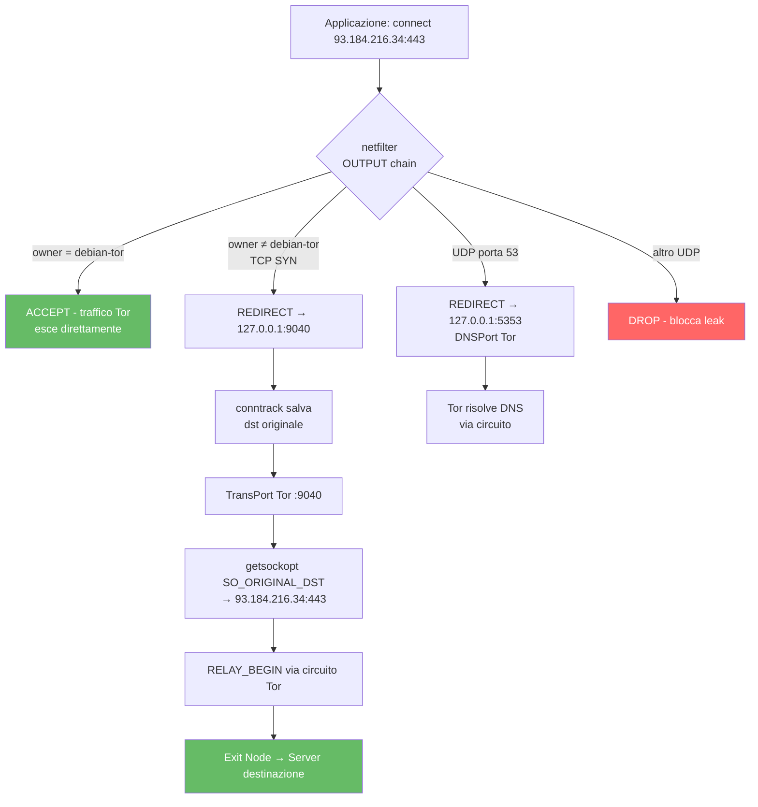

# Transparent Proxy - Forzare Tutto il Traffico via Tor con iptables/nftables

Questo documento analizza come configurare un transparent proxy Tor usando iptables
e nftables, che instrada tutto il traffico TCP del sistema attraverso Tor senza
richiedere configurazione per-applicazione.

> **Vedi anche**: [VPN e Tor Ibrido](./vpn-e-tor-ibrido.md) per routing selettivo,
> [DNS Leak](../05-sicurezza-operativa/dns-leak.md) per prevenzione leak DNS,
> [Isolamento e Compartimentazione](../05-sicurezza-operativa/isolamento-e-compartimentazione.md)
> per Whonix/Tails, [torrc Guida Completa](../02-installazione-e-configurazione/torrc-guida-completa.md)
> per TransPort.

---

## Indice

- [Cos'è un Transparent Proxy](#cosè-un-transparent-proxy)
- [Come funziona TransPort a livello kernel](#come-funziona-transport-a-livello-kernel)
- [Configurazione torrc](#configurazione-torrc)
- [Regole iptables - analisi riga per riga](#regole-iptables--analisi-riga-per-riga)
- [nftables - equivalente moderno](#nftables--equivalente-moderno)
- [IPv6 e transparent proxy](#ipv6-e-transparent-proxy)
**Approfondimenti** (file dedicati):
- [Transparent Proxy Avanzato](transparent-proxy-avanzato.md) - LAN, troubleshooting, hardening, script, confronto

---

## Cos'è un Transparent Proxy

Un transparent proxy intercetta il traffico a livello di kernel (netfilter) e lo
ridireziona verso Tor, senza che le applicazioni ne siano consapevoli:

```
Senza transparent proxy:
[App] → connect(93.184.216.34:443) → Internet (diretto, il tuo IP reale)

Con transparent proxy:
[App] → connect(93.184.216.34:443)
  → netfilter intercetta (REDIRECT rule)
  → ridireziona a 127.0.0.1:9040 (TransPort Tor)
  → Tor costruisce circuito
  → Exit node si connette a 93.184.216.34:443
  → IP visibile: exit node, non il tuo
```

Il vantaggio: **nessuna configurazione per-applicazione**. Ogni processo sul
sistema è forzato attraverso Tor. Lo svantaggio: **tutto o niente** - non puoi
escludere selettivamente applicazioni (tranne con eccezioni iptables per UID).

---

## Come funziona TransPort a livello kernel

### Il meccanismo REDIRECT

Quando iptables esegue `REDIRECT --to-ports 9040` su un pacchetto TCP:

1. **Intercettazione**: netfilter cattura il pacchetto nella catena OUTPUT
2. **Modifica destinazione**: il kernel riscrive `dst_addr:dst_port` a `127.0.0.1:9040`
3. **Conntrack**: il kernel memorizza la destinazione originale nella tabella conntrack:
   ```
   conntrack entry:
     src=127.0.0.1:45678 dst=93.184.216.34:443 → redirect to 127.0.0.1:9040
   ```
4. **Consegna a Tor**: il pacchetto arriva al socket TransPort di Tor
5. **SO_ORIGINAL_DST**: Tor chiama `getsockopt(SO_ORIGINAL_DST)` per recuperare
   la destinazione originale (93.184.216.34:443) dalla tabella conntrack
6. **Connessione via circuito**: Tor costruisce un circuito e fa `RELAY_BEGIN`
   verso la destinazione originale

```
Kernel flow:
[App: connect(93.184.216.34:443)]
  ↓
[netfilter OUTPUT chain]
  ↓ match: -p tcp --syn
  ↓ target: REDIRECT --to-ports 9040
  ↓
[conntrack: salva original dst = 93.184.216.34:443]
  ↓
[pacchetto arriva a 127.0.0.1:9040 (TransPort Tor)]
  ↓
[Tor: getsockopt(fd, SOL_IP, SO_ORIGINAL_DST) → 93.184.216.34:443]
  ↓
[Tor: RELAY_BEGIN "93.184.216.34:443" via circuito]
```

### Diagramma: flusso netfilter/iptables



### Differenza con SocksPort

| Aspetto | SocksPort | TransPort |
|---------|-----------|-----------|
| Protocollo | SOCKS5 (applicazione consapevole) | TCP nativo (trasparente) |
| DNS | Hostname via SOCKS5 (ATYP=0x03) | IP solo (hostname perso) |
| Configurazione app | Necessaria (proxy setting) | Non necessaria |
| Isolamento | Per-stream (IsolateSOCKSAuth) | No (tutti sullo stesso circuito) |
| Overhead | SOCKS5 handshake | Nessuno (redirect kernel) |

**Problema critico**: TransPort riceve solo l'IP di destinazione, non l'hostname.
Tor non sa quale sito stai visitando (solo l'IP). Questo può causare problemi con
hosting condiviso (più siti sullo stesso IP). Per questo il DNS deve essere risolto
separatamente via DNSPort.

---

## Configurazione torrc

```ini
# Porte standard
SocksPort 9050
DNSPort 5353
ControlPort 9051
CookieAuthentication 1

# TransPort per transparent proxy
TransPort 9040

# AutomapHosts per mapping DNS
AutomapHostsOnResolve 1
VirtualAddrNetworkIPv4 10.192.0.0/10

# Sicurezza
ClientUseIPv6 0
```

### Dettaglio direttive

| Direttiva | Valore | Perché |
|-----------|--------|--------|
| `TransPort 9040` | Porta TCP per connessioni redirect | Accetta TCP nativo (non SOCKS) |
| `DNSPort 5353` | Porta UDP per DNS | Risolve DNS via Tor |
| `AutomapHostsOnResolve 1` | Mappa hostname → IP fittizi | Necessario per mapping DNS→TransPort |
| `VirtualAddrNetworkIPv4` | Range IP fittizi | Per AutomapHosts |
| `ClientUseIPv6 0` | Disabilita IPv6 | Previene leak IPv6 |

---

## Regole iptables - analisi riga per riga

### Script completo annotato

```bash
#!/bin/bash
TOR_UID=$(id -u debian-tor)
TRANS_PORT=9040
DNS_PORT=5353

# --- NAT table: ridirezionamento ---

# Regola 1: Non toccare il traffico di Tor stesso
iptables -t nat -A OUTPUT -m owner --uid-owner $TOR_UID -j RETURN
# -m owner: match basato sull'UID del processo
# --uid-owner $TOR_UID: solo il processo Tor (utente debian-tor)
# -j RETURN: non applicare altre regole NAT → traffico Tor esce diretto
# SENZA QUESTA REGOLA: il traffico di Tor verrebbe ridirezionato a se stesso → loop infinito

# Regola 2: Ridireziona DNS al DNSPort di Tor
iptables -t nat -A OUTPUT -p udp --dport 53 -j REDIRECT --to-ports $DNS_PORT
# -p udp --dport 53: cattura tutte le query DNS (UDP porta 53)
# -j REDIRECT: riscrive la destinazione a 127.0.0.1:DNS_PORT
# Effetto: ogni query DNS del sistema viene risolta via Tor

# Regola 3: Non ridirezionare localhost
iptables -t nat -A OUTPUT -d 127.0.0.0/8 -j RETURN
# -d 127.0.0.0/8: traffico diretto a localhost
# RETURN: lascia passare senza redirect
# Necessario per: ControlPort, SocksPort, comunicazione interna

# Regola 4: Non ridirezionare rete locale
iptables -t nat -A OUTPUT -d 192.168.0.0/16 -j RETURN
iptables -t nat -A OUTPUT -d 10.0.0.0/8 -j RETURN
# Necessario per: DHCP, servizi LAN, stampanti, NAS

# Regola 5: Ridireziona TUTTO il TCP rimanente al TransPort
iptables -t nat -A OUTPUT -p tcp --syn -j REDIRECT --to-ports $TRANS_PORT
# --syn: solo pacchetti SYN (nuove connessioni)
# PERCHÉ --syn: le connessioni già stabilite continuano normalmente
# senza --syn, ogni pacchetto TCP verrebbe processato → overhead enorme

# --- FILTER table: blocco leak ---

# Regola 6: Permetti traffico di Tor
iptables -A OUTPUT -m owner --uid-owner $TOR_UID -j ACCEPT

# Regola 7: Permetti traffico locale
iptables -A OUTPUT -d 127.0.0.0/8 -j ACCEPT

# Regola 8: Permetti DNS verso DNSPort
iptables -A OUTPUT -p udp -d 127.0.0.1 --dport $DNS_PORT -j ACCEPT

# Regola 9: BLOCCA TUTTO IL RESTO
iptables -A OUTPUT -j DROP
# Questa è la regola di sicurezza: se qualcosa sfugge al NAT redirect,
# viene droppato qui. Previene qualsiasi leak.
```

### L'ordine delle regole è critico

Le regole vengono valutate in ordine. Se invertissimo le regole 1 e 5:
- Il traffico TCP di Tor verrebbe ridirezionato a TransPort
- TransPort manderebbe il traffico a Tor → che viene ridirezionato → loop
- **Risultato: nessuna connettività, possibile crash di Tor**

---

## nftables - equivalente moderno

Kali Linux e Debian stanno migrando da iptables a nftables. Ecco l'equivalente:

### Conversione completa

```nft
#!/usr/sbin/nft -f

# Flush regole esistenti
flush ruleset

# Variabili
define TOR_UID = debian-tor
define TRANS_PORT = 9040
define DNS_PORT = 5353

table ip tor_proxy {
    
    chain output_nat {
        type nat hook output priority -100; policy accept;
        
        # Non toccare il traffico di Tor stesso
        meta skuid $TOR_UID return
        
        # Ridireziona DNS al DNSPort di Tor
        udp dport 53 redirect to :$DNS_PORT
        
        # Non ridirezionare localhost e LAN
        ip daddr 127.0.0.0/8 return
        ip daddr 192.168.0.0/16 return
        ip daddr 10.0.0.0/8 return
        
        # Ridireziona tutto il TCP al TransPort
        tcp flags syn / syn,ack redirect to :$TRANS_PORT
    }
    
    chain output_filter {
        type filter hook output priority 0; policy drop;
        
        # Permetti traffico di Tor
        meta skuid $TOR_UID accept
        
        # Permetti traffico locale
        ip daddr 127.0.0.0/8 accept
        
        # Permetti DNS verso DNSPort
        udp dport $DNS_PORT ip daddr 127.0.0.1 accept
        
        # Tutto il resto: DROP (policy)
    }
}
```

### Tabella di conversione iptables → nftables

| iptables | nftables |
|----------|----------|
| `-t nat -A OUTPUT` | `chain output_nat { type nat hook output ... }` |
| `-m owner --uid-owner` | `meta skuid` |
| `-p tcp --syn` | `tcp flags syn / syn,ack` |
| `-j REDIRECT --to-ports` | `redirect to :PORT` |
| `-j RETURN` | `return` |
| `-j ACCEPT` | `accept` |
| `-j DROP` | `drop` (o policy drop) |
| `-d 127.0.0.0/8` | `ip daddr 127.0.0.0/8` |
| `iptables -F` | `flush ruleset` |

### Vantaggi di nftables

- **Sintassi unificata**: IPv4 e IPv6 in un singolo file (con `inet` family)
- **Performance**: single-pass evaluation, meno overhead
- **Atomicità**: tutto il ruleset viene caricato atomicamente
- **Set e map**: strutture dati per regole complesse

### Rollback nftables

```bash
# Rimuovere tutte le regole
nft flush ruleset

# Verificare che sia vuoto
nft list ruleset
```

---

## IPv6 e transparent proxy

### Il problema IPv6

IPv6 è gestito separatamente dal kernel Linux:
- `iptables` → solo IPv4
- `ip6tables` → solo IPv6
- `nftables` con family `inet` → entrambi

Se configuri solo iptables per il transparent proxy, il traffico IPv6 esce
direttamente → **leak completo**.

### Blocco completo IPv6

```bash
# Metodo 1: sysctl (disabilita IPv6 a livello kernel)
sudo sysctl -w net.ipv6.conf.all.disable_ipv6=1
sudo sysctl -w net.ipv6.conf.default.disable_ipv6=1
sudo sysctl -w net.ipv6.conf.lo.disable_ipv6=1

# Persistente in /etc/sysctl.d/99-disable-ipv6.conf:
net.ipv6.conf.all.disable_ipv6 = 1
net.ipv6.conf.default.disable_ipv6 = 1
net.ipv6.conf.lo.disable_ipv6 = 1

# Metodo 2: ip6tables DROP all (se non puoi disabilitare IPv6)
ip6tables -A OUTPUT -j DROP
ip6tables -A INPUT -j DROP
ip6tables -A FORWARD -j DROP
```

### nftables con IPv6

Con nftables family `inet`, puoi gestire entrambi:

```nft
table inet tor_proxy {
    chain output_filter {
        type filter hook output priority 0; policy drop;
        
        # Permetti traffico Tor (solo IPv4)
        meta skuid debian-tor accept
        
        # Permetti localhost IPv4
        ip daddr 127.0.0.0/8 accept
        
        # Blocca TUTTO IPv6 (policy drop lo fa automaticamente)
        # Non serve regola esplicita: senza accept per IPv6, viene droppato
    }
}
```

---

> **Continua in**: [Transparent Proxy Avanzato](transparent-proxy-avanzato.md) per
> gateway LAN, troubleshooting, hardening, script production-ready e confronto Whonix/Tails.

---

## Vedi anche

- [Transparent Proxy Avanzato](transparent-proxy-avanzato.md) - LAN, troubleshooting, script, confronto
- [VPN e Tor Ibrido](vpn-e-tor-ibrido.md) - TransPort come alternativa quasi-VPN
- [DNS Leak](../05-sicurezza-operativa/dns-leak.md) - Prevenzione DNS leak con TransPort
- [Multi-Istanza e Stream Isolation](multi-istanza-e-stream-isolation.md) - Isolamento circuiti
- [Hardening di Sistema](../05-sicurezza-operativa/hardening-sistema.md) - nftables e regole firewall
- [Scenari Reali](scenari-reali.md) - Casi operativi da pentester
