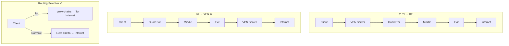

# VPN e Tor — Configurazioni Ibride

Questo documento analizza in profondità perché Tor non è una VPN, le configurazioni
ibride VPN+Tor, i compromessi di ciascun approccio, la gestione DNS in ogni scenario,
kill switch, split tunneling, e quale configurazione è effettivamente utile nel mondo
reale.

Basato sulla mia esperienza nel tentare di usare Tor come VPN, nel configurare
bridge per aggirare blocchi, e nel capire perché un approccio ibrido è la soluzione
più pratica.

---

## Indice

- [Perché Tor non è una VPN](#perché-tor-non-è-e-non-può-essere-una-vpn)
- [Configurazioni ibride](#configurazioni-ibride)
- [VPN → Tor in dettaglio](#vpn--tor-in-dettaglio)
- [Tor → VPN e perché evitarla](#tor--vpn-e-perché-evitarla)
- [TransPort + iptables (quasi-VPN)](#transparent-proxy-quasi-vpn)
- [Routing selettivo per applicazione](#routing-selettivo-per-applicazione)
- [Gestione DNS nelle configurazioni ibride](#gestione-dns-nelle-configurazioni-ibride)
- [Kill switch e protezione dai leak](#kill-switch-e-protezione-dai-leak)
- [WireGuard vs OpenVPN con Tor](#wireguard-vs-openvpn-con-tor)
- [ExitNodes e geolocalizzazione forzata](#exitnodes-e-geolocalizzazione-forzata)
- [Tabella comparativa](#tabella-comparativa)
- [Nella mia esperienza](#nella-mia-esperienza)

---

## Perché Tor non è (e non può essere) una VPN

### Differenze architetturali fondamentali

| Caratteristica | VPN | Tor |
|---------------|-----|-----|
| Livello OSI | Layer 3/4 (IP/TCP) | Layer 7 (applicativo, SOCKS5) |
| Interfaccia di rete | Crea `tun0`/`tap0` | Nessuna interfaccia (proxy) |
| Routing | `ip route` gestisce tutto il traffico | Solo traffico applicativo configurato |
| Protocolli supportati | TCP, UDP, ICMP — tutto | Solo TCP |
| IP di uscita | Un IP fisso (server VPN) | IP variabile (exit node diversi) |
| Numero di hop | 1 (client→server VPN) | 3 (guard→middle→exit) |
| Controllo del server | Di un'azienda/privato | Volontari anonimi |
| Latenza | Bassa (1 hop, ~10-30ms) | Alta (3+ hop, ~200-500ms) |
| Bandwidth | Alta (100+ Mbps) | Limitata (1-10 Mbps tipici) |
| Privacy da chi? | ISP, rete locale | ISP, siti web, sorveglianza |
| Trust model | Fiducia nel provider VPN | Zero trust (nessun relay vede tutto) |

### Cosa significa "non crea interfaccia di rete"

Con una VPN:
```bash
# Dopo la connessione VPN:
> ip route
default via 10.8.0.1 dev tun0    # TUTTO il traffico va via VPN
10.8.0.0/24 dev tun0 scope link
192.168.1.0/24 dev eth0 scope link

> ip addr show tun0
tun0: flags=4305<UP,POINTOPOINT,RUNNING,NOARP,MULTICAST>
    inet 10.8.0.2/24 scope global tun0

# Il kernel Linux vede tun0 come interfaccia di rete
# Ogni pacchetto IP viene automaticamente instradato via VPN
# Applicazioni, servizi, DNS — TUTTO passa dalla VPN
```

Con Tor:
```bash
# Dopo l'avvio di Tor:
> ip route
default via 192.168.1.1 dev eth0  # Il routing di sistema NON è cambiato
192.168.1.0/24 dev eth0 scope link

> ip addr
# NESSUNA nuova interfaccia

# Tor non modifica il routing. Solo le applicazioni che si connettono
# esplicitamente al SocksPort (9050) passano da Tor.
# Tutto il resto esce normalmente: DNS, NTP, aggiornamenti, etc.
```

### Il gap fondamentale

```
VPN:
  [Kernel] → [tun0] → [Tunnel VPN] → [Server VPN] → Internet
  TUTTO il traffico IP è catturato a livello kernel
  Le applicazioni non devono fare nulla di speciale

Tor:
  [App] → [SOCKS5 proxy] → [Tor] → [Guard] → [Middle] → [Exit] → Internet
  SOLO le app che parlano SOCKS5 passano da Tor
  Il kernel non sa niente di Tor
  DNS, UDP, ICMP bypassano Tor completamente
```

### Nella mia esperienza

Ho provato a rendere Tor "system-wide" con diversi approcci:
- `proxychains` su ogni applicazione → scomodo, non copre i servizi di sistema
- `torsocks` come wrapper globale → non copre processi già in esecuzione
- TransPort + iptables → quasi-VPN ma senza UDP, fragile
- Network namespace → funziona ma configurazione complessa

La conclusione: Tor non può sostituire una VPN. Risolvono problemi diversi.
La VPN è per routing universale; Tor è per anonimato applicativo.

---

## Configurazioni ibride

### Panoramica delle opzioni

```
1. VPN → Tor:     Tu → [VPN] → [Tor] → Internet
2. Tor → VPN:     Tu → [Tor] → [VPN] → Internet (SCONSIGLIATO)
3. TransPort:     Tu → [iptables] → [Tor TransPort] → Internet
4. Selettivo:     App specifiche → [Tor], resto → [VPN o diretto]
```

---


### Diagramma: confronto delle configurazioni



## VPN → Tor in dettaglio

### Architettura

```
Tu (192.168.1.100)
  │
  ├──[VPN tunnel]──→ Server VPN (85.x.x.x)
  │                    │
  │                    ├──→ Guard Tor (relay1)
  │                    │      │
  │                    │      ├──→ Middle (relay2)
  │                    │      │      │
  │                    │      │      ├──→ Exit (relay3)
  │                    │      │      │      │
  │                    │      │      │      └──→ Internet
```

### Chi vede cosa

```
Il tuo ISP vede:
  ✓ Connessione verso il server VPN
  ✗ NON vede Tor
  ✗ NON vede la destinazione finale

Il provider VPN vede:
  ✓ Il tuo IP reale
  ✓ Connessione verso il Guard Tor (sa che usi Tor)
  ✗ NON vede la destinazione finale (cifrata da Tor)

Il Guard Tor vede:
  ✓ L'IP del server VPN (NON il tuo IP reale)
  ✗ NON vede la destinazione

L'Exit Tor vede:
  ✓ La destinazione finale
  ✗ NON vede il tuo IP (vede il Guard)
  ✗ NON sa che usi una VPN
```

### Setup pratico con WireGuard

```bash
# 1. Connetti la VPN (esempio WireGuard)
sudo wg-quick up wg0

# 2. Verifica che il traffico passi dalla VPN
curl https://api.ipify.org
# Deve mostrare l'IP del server VPN

# 3. Avvia Tor (passerà dalla VPN)
sudo systemctl start tor@default.service

# 4. Verifica che Tor funzioni attraverso la VPN
curl --socks5-hostname 127.0.0.1:9050 https://check.torproject.org/api/ip
# {"IsTor":true,"IP":"exit-ip-diverso-dalla-vpn"}

# L'ordine è importante:
# VPN prima, poi Tor → VPN → Tor
# Se Tor è già attivo e poi connetti la VPN, i circuiti esistenti
# potrebbero avere problemi. Meglio riavviare Tor dopo la VPN.
```

### Setup con OpenVPN

```bash
# 1. Connetti OpenVPN
sudo openvpn --config provider.ovpn --daemon

# 2. Attendi che tun0 sia attivo
while ! ip link show tun0 &>/dev/null; do sleep 1; done

# 3. Avvia Tor
sudo systemctl start tor@default.service

# 4. Il torrc non richiede modifiche:
# Tor si connette al Guard via tun0 (VPN) automaticamente
# perché il routing di sistema instrada tutto via tun0
```

### Vantaggi

- L'ISP non sa che usi Tor (il traffico sembra VPN normale)
- Se Tor è bloccato nella tua rete, la VPN può aggirare il blocco
- L'exit node non vede il tuo IP reale (vede il guard)
- Doppio livello di cifratura (VPN + Tor) sul primo tratto

### Svantaggi

- Il provider VPN conosce il tuo IP reale E sa che usi Tor
- Aggiunge latenza (VPN + 3 hop Tor = 300-600ms)
- Se la VPN logga, la tua connessione a Tor è loggata
- Se la VPN cade senza kill switch → Tor si connette direttamente (leak)
- Costo economico della VPN
- Punto di centralizzazione (il provider VPN)

### Quando usarla

- La rete blocca Tor (alternativa ai bridge quando i bridge non funzionano)
- Vuoi nascondere l'uso di Tor all'ISP senza bridge obfs4
- In reti aziendali che permettono VPN ma bloccano Tor

**Nella mia esperienza**: i bridge obfs4 sono una soluzione migliore per nascondere
Tor all'ISP, perché non richiedono di fidarsi di un provider VPN. La VPN→Tor ha
senso solo se i bridge non funzionano (es. in Cina o Russia).

---

## Tor → VPN e perché evitarla

### Architettura

```
Tu → [Guard] → [Middle] → [Exit] → [VPN Server] → Internet
```

### Problemi critici

```
1. La VPN diventa l'unico punto di uscita
   → Tutti i circuiti Tor convergono verso un singolo IP (la VPN)
   → Fingerprint enorme: "tutto il traffico da exit Tor verso IP VPN"
   → La VPN diventa un collo di bottiglia identificabile

2. La VPN conosce la destinazione E il traffico
   → Anche se non il tuo IP (vede l'exit Tor)
   → Può correlare sessioni (stesso account VPN)
   → Può essere costretta a loggare (ordine giudiziario)

3. Rompe l'anonimato di Tor
   → L'exit invia a un singolo IP (la VPN)
   → Il circuito Tor è "pinned" a un endpoint
   → NEWNYM cambia circuito ma non endpoint

4. Pochissimi provider VPN accettano connessioni da exit Tor
   → Molti bloccano IP Tor per policy anti-abuso
   → Account VPN deve essere pagato (tracciamento finanziario)

5. DNS leak aggiuntivo
   → La VPN usa i propri DNS
   → Se la VPN fa DNS push → i DNS bypassano Tor
```

**Non usare questa configurazione.** Non aggiunge sicurezza e crea
vulnerabilità aggiuntive rispetto a Tor da solo.

---

## Transparent proxy (quasi-VPN)

### Come funziona

Instrada tutto il traffico TCP del sistema attraverso Tor usando iptables,
senza richiedere che le applicazioni siano configurate per SOCKS5:

```ini
# Nel torrc
TransPort 9040
DNSPort 5353
VirtualAddrNetworkIPv4 10.192.0.0/10
AutomapHostsOnResolve 1
```

```bash
#!/bin/bash
# transparent-tor-proxy.sh

TOR_USER="debian-tor"

# 1. Permetti traffico di Tor stesso
sudo iptables -t nat -A OUTPUT -m owner --uid-owner $TOR_USER -j RETURN

# 2. Redireziona DNS → DNSPort di Tor
sudo iptables -t nat -A OUTPUT -p udp --dport 53 -j REDIRECT --to-ports 5353

# 3. Redireziona TCP → TransPort di Tor
sudo iptables -t nat -A OUTPUT -p tcp --syn -j REDIRECT --to-ports 9040

# 4. Permetti solo traffico Tor in uscita
sudo iptables -A OUTPUT -m state --state ESTABLISHED,RELATED -j ACCEPT
sudo iptables -A OUTPUT -m owner --uid-owner $TOR_USER -j ACCEPT
sudo iptables -A OUTPUT -o lo -j ACCEPT

# 5. Blocca tutto il resto
sudo iptables -A OUTPUT -j REJECT
```

### Vantaggi

- Effetto quasi-VPN: tutto il traffico TCP passa da Tor
- DNS forzato via Tor (no leak possibile)
- Le applicazioni non devono essere configurate singolarmente
- Leak prevention a livello firewall

### Svantaggi

- **UDP non supportato** → niente NTP, QUIC, VoIP, gaming, DNS diretto
- Se Tor si blocca, tutta la rete è bloccata
- Fragile: un errore nelle regole iptables può causare leak
- Performance scarse (tutto il traffico su 3 hop)
- Non isola i circuiti per applicazione (tutto condivide un circuito)
- Se un'applicazione invia dati identificativi → tutti i circuiti correlati

Per una guida completa, vedi `docs/06-configurazioni-avanzate/transparent-proxy.md`.

---

## Routing selettivo per applicazione

### Il mio approccio

```
Browser (navigazione anonima) → proxychains → Tor → Internet
Terminale (test, curl)        → proxychains → Tor → Internet
Aggiornamenti sistema         → rete normale            → Internet
Streaming/video               → VPN (opzionale)         → Internet
App sensibili                 → rete normale             → Internet
Banking                       → rete normale (MAI Tor)   → Internet
Gaming                        → rete normale             → Internet
```

### Implementazione pratica

```bash
# ~/.zshrc o ~/.bashrc

# Alias per Tor
alias curltor='curl --socks5-hostname 127.0.0.1:9050'
alias pcurl='proxychains curl -s'
alias pfirefox='proxychains firefox -no-remote -P tor-proxy &>/dev/null & disown'

# Funzione per verificare lo stato
torcheck() {
    echo -n "IP Tor: "
    curl --socks5-hostname 127.0.0.1:9050 -s --max-time 10 https://api.ipify.org
    echo ""
    echo -n "IsTor: "
    curl --socks5-hostname 127.0.0.1:9050 -s --max-time 10 \
        https://check.torproject.org/api/ip | grep -o '"IsTor":[a-z]*'
}

# Git via Tor (solo per repository specifici)
alias gittor='git -c http.proxy=socks5h://127.0.0.1:9050 -c https.proxy=socks5h://127.0.0.1:9050'
```

### Vantaggi

- Flessibilità massima: ogni app usa il canale migliore
- Non sovraccarica Tor con traffico non necessario
- Non rompe applicazioni che necessitano UDP
- Performance ottimali per ogni tipo di traffico
- Controllo granulare su cosa è anonimo e cosa no

### Svantaggi

- Richiede disciplina (ricordarsi di usare proxychains)
- Possibili leak se dimentico di proxare un'applicazione
- Non automatico: errore umano è il rischio principale
- Non adatto a scenari ad alto rischio (meglio Whonix/Tails)

---

## Gestione DNS nelle configurazioni ibride

### DNS in VPN → Tor

```
Problema:
  La VPN configura i propri DNS (es. via DHCP push)
  Tor usa il suo DNSPort per risolvere
  Chi risolve prima?

Flusso corretto:
  App → proxychains → SOCKS5 hostname → Tor → Exit (risolve DNS)
  La VPN e i suoi DNS non sono coinvolti per il traffico Tor

Flusso problematico:
  App → DNS della VPN → risposta in chiaro alla VPN
  → poi → connessione via Tor
  La VPN ha visto il dominio! Privacy parzialmente compromessa

Soluzione:
  1. Usare sempre --socks5-hostname (non --socks5)
  2. Attivare proxy_dns in proxychains
  3. In Firefox: network.proxy.socks_remote_dns = true
  4. Non usare i DNS push della VPN per il traffico Tor
```

### DNS in TransPort

```
Flusso:
  App → query DNS locale → iptables REDIRECT → DNSPort Tor
  → Tor risolve via circuito → risposta all'app
  → App si connette → iptables REDIRECT → TransPort Tor
  → Connessione via Tor

Tutto il DNS è forzato via Tor. Nessun leak possibile
(a meno di bug nelle regole iptables).
```

### DNS in routing selettivo

```
Il mio setup:
  Con proxychains: DNS risolto via Tor (proxy_dns)
  Senza proxychains: DNS risolto dal router ISP (192.168.1.1)

Rischio: se dimentico proxychains, il DNS esce in chiaro
Mitigazione: iptables che blocca DNS diretto (porta 53) per il mio utente
```

---

## Kill switch e protezione dai leak

### Kill switch per VPN → Tor

Se la VPN si disconnette, Tor si connetterebbe direttamente → l'ISP vede Tor.

```bash
#!/bin/bash
# vpn-killswitch.sh — Blocca traffico se la VPN cade

VPN_IFACE="wg0"  # o tun0 per OpenVPN
VPN_SERVER="85.x.x.x"  # IP del server VPN

# Permetti solo traffico verso il server VPN (per mantenere la connessione)
sudo iptables -A OUTPUT -d $VPN_SERVER -j ACCEPT

# Permetti traffico sulla VPN
sudo iptables -A OUTPUT -o $VPN_IFACE -j ACCEPT

# Permetti localhost
sudo iptables -A OUTPUT -o lo -j ACCEPT

# Permetti traffico locale
sudo iptables -A OUTPUT -d 192.168.0.0/16 -j ACCEPT

# Blocca TUTTO il resto (kill switch)
sudo iptables -A OUTPUT -j DROP

# Se la VPN cade → tun0/wg0 scompare → traffico droppato → nessun leak
```

### Kill switch per Tor da solo

```bash
#!/bin/bash
# tor-killswitch.sh — Blocca traffico non-Tor

TOR_USER="debian-tor"

# Permetti traffico dal processo Tor
sudo iptables -A OUTPUT -m owner --uid-owner $TOR_USER -j ACCEPT

# Permetti localhost
sudo iptables -A OUTPUT -o lo -j ACCEPT

# Permetti LAN
sudo iptables -A OUTPUT -d 192.168.0.0/16 -j ACCEPT

# Blocca tutto il resto
sudo iptables -A OUTPUT -j REJECT --reject-with icmp-port-unreachable

# Se Tor si blocca → applicazioni non possono uscire → nessun leak
# Ma anche: niente aggiornamenti, NTP, etc.
```

---

## WireGuard vs OpenVPN con Tor

### WireGuard

```
Vantaggi con Tor:
  + Connessione veloce (handshake in 1 RTT)
  + Overhead basso (meno latenza aggiunta a Tor)
  + Configurazione semplice
  + Rimane connesso anche dopo sleep/resume

Svantaggi:
  - UDP-only (può essere bloccato da firewall)
  - Assegna IP fisso al peer (fingerprint se il provider logga)
  - Meno offuscamento (WireGuard è facilmente identificabile da DPI)
```

### OpenVPN

```
Vantaggi con Tor:
  + TCP mode disponibile (bypassa firewall che bloccano UDP)
  + Supporta offuscamento (obfsproxy, stunnel)
  + Più flessibile nella configurazione

Svantaggi:
  - Handshake più lento (multi-RTT)
  - Overhead maggiore
  - Riconnessione più lenta dopo disconnessione
```

### Raccomandazione

```
Per uso generale (VPN → Tor): WireGuard (più veloce, meno overhead)
Per reti restrittive: OpenVPN TCP (bypassa firewall)
Per massimo offuscamento: OpenVPN + obfsproxy (sembra HTTPS)
```

---

## ExitNodes e geolocalizzazione forzata

### Il problema

Ho provato a forzare l'uscita da un paese specifico:
```ini
ExitNodes {it}
StrictNodes 1
```

Risultati:
- Pochissimi exit italiani disponibili (~10-20 su ~2000 totali)
- Circuiti saturi e lenti (tutti gli utenti con {it} condividono pochi exit)
- IP che cambiava comunque ad ogni rinnovo del circuito
- Fingerprinting facile ("questo utente esce SEMPRE dall'Italia")

### Perché non funziona

Tor è progettato per la **randomizzazione**. Forzare un paese:
- Riduce il pool di exit (meno privacy, meno bandwidth)
- Rende il traffico più riconoscibile
- Non garantisce lo stesso IP nel tempo (circuiti vengono rinnovati)
- Crea un set di anonimato ridotto (solo utenti con ExitNodes {it})

### Alternative

```
Per geolocalizzazione:
  → VPN con server nel paese desiderato (IP fisso, veloce)

Per anonimato + paese specifico (raro):
  → Tor → VPN nel paese desiderato (ma vedi problemi sopra)

Per test da paesi specifici:
  → ExitNodes {cc} temporaneamente, poi rimuovere
  → Non usare per navigazione quotidiana
```

---

## Tabella comparativa

| Configurazione | Privacy | Anonimato | Velocità | Affidabilità | Complessità | DNS sicuro |
|---------------|---------|-----------|----------|-------------|-------------|-----------|
| Solo Tor | Alta | Molto alta | Bassa | Media | Bassa | Con config |
| Solo VPN | Media | Bassa | Alta | Alta | Bassa | Dipende |
| VPN → Tor | Alta | Alta | Molto bassa | Media | Media | Con config |
| Tor → VPN | Bassa | Bassa | Bassa | Bassa | Alta | Problematico |
| TransPort+iptables | Alta | Alta | Bassa | Bassa | Alta | Forzato |
| Routing selettivo | Alta | Alta (per app proxate) | Variabile | Alta | Media | Con config |

---

## Nella mia esperienza

**La mia scelta**: routing selettivo. È il compromesso migliore tra sicurezza,
usabilità e praticità quotidiana.

```
Il mio workflow:
1. Tor daemon sempre attivo (systemd)
2. Bridge obfs4 configurato (nasconde Tor all'ISP Comeser)
3. proxychains per navigazione e test
4. Rete normale per tutto il resto
5. Nessuna VPN (non ne ho bisogno per il mio threat model)
```

Se dovessi aggiungere una VPN, la userei per:
- Streaming geolocalizzato (Netflix, etc.)
- WiFi pubblici (protezione generica, non anonimato)
- Fallback se Tor è troppo lento per un'operazione specifica

NON la userei per:
- Aggiungere "sicurezza" a Tor (non aggiunge nulla di significativo)
- Sostituire bridge obfs4 (i bridge sono migliori per nascondere Tor)

---

## Vedi anche

- [Transparent Proxy](transparent-proxy.md) — Setup completo iptables/nftables TransPort
- [Multi-Istanza e Stream Isolation](multi-istanza-e-stream-isolation.md) — Isolamento circuiti per app
- [DNS Leak](../05-sicurezza-operativa/dns-leak.md) — Prevenzione DNS leak in ogni configurazione
- [Bridges e Pluggable Transports](../03-nodi-e-rete/bridges-e-pluggable-transports.md) — Alternativa a VPN per nascondere Tor
- [Isolamento e Compartimentazione](../05-sicurezza-operativa/isolamento-e-compartimentazione.md) — Whonix, Tails, Qubes
- [Limitazioni del Protocollo](../07-limitazioni-e-attacchi/limitazioni-protocollo.md) — Perché Tor non supporta UDP
