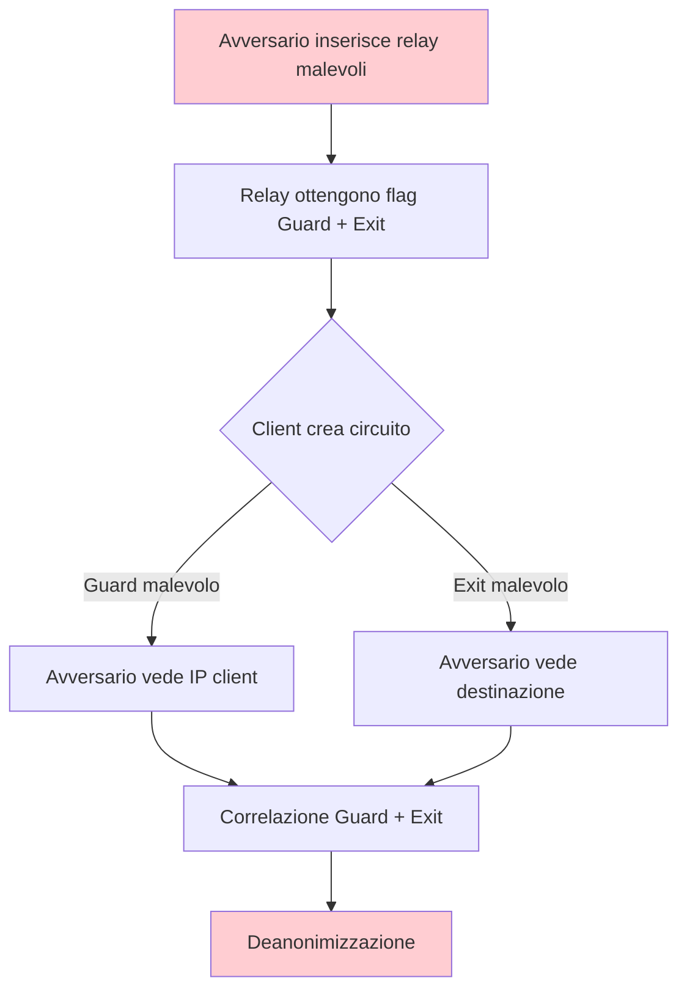

> **Lingua / Language**: Italiano | [English](../en/07-limitazioni-e-attacchi/attacchi-noti.md)

# Attacchi Noti alla Rete Tor - Cronologia e Analisi Tecnica

Questo documento cataloga gli attacchi documentati contro la rete Tor: attacchi
di correlazione, Sybil, relay early tagging, HSDir enumeration, website fingerprinting,
DoS, exploit del browser, supply chain, e attacchi al routing BGP. Per ogni attacco,
analizzo la tecnica, il caso reale, le conseguenze per Tor, e le contromisure adottate.

---

## Indice

- [Timeline degli attacchi principali](#timeline-degli-attacchi-principali)
- [Sybil Attack](#1-sybil-attack)
- [Relay Early Tagging Attack](#2-relay-early-tagging-attack)
- [Attacco di correlazione end-to-end](#3-attacco-di-correlazione-end-to-end)
- [Website Fingerprinting](#4-website-fingerprinting)
- **Approfondimenti** (file dedicati)
  - [HSDir, DoS, Browser Exploit e Contromisure](attacchi-noti-avanzati.md)

---

## Timeline degli attacchi principali

```
2007  |  Egerstad: exit node sniffing (password in chiaro)
2011  |  Primo paper su website fingerprinting (Panchenko et al.)
2013  |  Freedom Hosting: FBI exploit nel browser (CVE-2013-1690)
2013  |  Eldo Kim: deanonimizzazione per correlazione temporale (Harvard)
2014  |  CMU/FBI: Sybil + relay early tagging (Silk Road 2, etc.)
2014  |  Operation Onymous: sequestro di decine di hidden services
2015  |  RAPTOR: BGP routing attacks (paper accademico)
2015  |  Sniper Attack: DoS mirato ai relay (paper)
2016  |  HSDir probing: enumerazione hidden services
2018  |  DeepCorr: correlazione con deep learning (96%+ accuracy)
2020  |  KAX17: gruppo di relay malevoli scoperto (~10% della rete)
2021  |  DoS su rete Tor (onion service flooding)
2023  |  Rimozione massiva di relay malevoli (KAX17 e altri)
2024  |  PoW anti-DoS implementato per onion services
```

---

## 1. Sybil Attack

### Come funziona

Un avversario gestisce un gran numero di relay nella rete Tor per aumentare
la probabilità di controllare sia il Guard che l'Exit di un circuito:

```
Scenario base:
  Rete Tor: 7000 relay legittimi
  Avversario aggiunge: 700 relay malevoli (10% della rete)
  
  Probabilità di controllare Guard E Exit di un circuito:
  P(Guard malevolo) × P(Exit malevolo) = 0.1 × 0.1 = 1%
  
  Ma la selezione è pesata per bandwidth:
  Se i relay malevoli hanno alta bandwidth:
  P(Guard) ≈ 15%, P(Exit) ≈ 15% → P(entrambi) ≈ 2.25%
  
  Con migliaia di circuiti creati dall'utente nel tempo:
  P(almeno un circuito compromesso) = 1 - (1 - 0.0225)^n
  Dopo 100 circuiti: ~90% di probabilità
  → Deanonimizzazione quasi certa per utenti attivi
```


### Diagramma: Sybil attack



### Caso reale: CMU/FBI (2014)

Ricercatori della Carnegie Mellon University hanno inserito ~115 relay nella rete
Tor tra gennaio e luglio 2014. Questi relay:

```
Caratteristiche dei relay CMU:
  - Avevano flag HSDir (per intercettare descriptor di hidden service)
  - Avevano flag Guard (per essere scelti come primo hop)
  - Usavano la tecnica "relay early tagging" per marcare i circuiti
  - Operavano da IP in range della CMU (128.2.0.0/16)
  - Alta bandwidth → selezione frequente

Obiettivi:
  - Raccogliere informazioni su utenti di hidden services specifici
  - Identificare la posizione degli hidden services
  - Le informazioni sono state condivise con l'FBI

Risultato:
  - Deanonimizzazione di utenti e operatori di mercati darknet
  - Arresti collegati a Silk Road 2.0, Agora, e altri
  - Il Tor Project ha scoperto e rimosso i relay a luglio 2014
```

### Contromisure adottate dopo CMU/FBI

```
1. Monitoring delle Directory Authorities:
   - Allarme per aggiunta di molti relay dalla stessa subnet
   - Controllo manuale di relay sospetti
   - Analisi delle proprietà dei relay (uptime, bandwidth)

2. Regola della /16 subnet:
   - Relay nella stessa /16 non vengono usati nello stesso circuito
   - Es: 128.2.1.1 e 128.2.2.1 non saranno Guard+Exit insieme

3. MyFamily:
   - Relay co-gestiti DEVONO dichiararsi nella stessa "family"
   - Relay della stessa family non usati nello stesso circuito
   - Se non si dichiarano → rilevamento e rimozione

4. Bandwidth Authorities:
   - Limitano l'influenza di relay nuovi (rampa graduale)
   - Un relay appena aggiunto non ottiene subito alta bandwidth weight
   - Periodo di "warm-up" prima di essere scelto frequentemente

5. Celle RELAY_EARLY:
   - Monitorate e limitate (vedi sezione successiva)
```

### KAX17 (2020-2023)

```
Un gruppo sconosciuto (identificato come "KAX17") ha operato
centinaia di relay per anni:
  - ~900 relay a un certo punto (~10% della rete)
  - Prevalentemente middle relay (non exit)
  - Distribuiti su molti AS diversi (difficili da rilevare)
  - Nessun MyFamily dichiarato

Scopo sospetto:
  - Deanonimizzazione tramite correlazione
  - Raccolta di metadati di traffico
  - Possibile operazione di un'agenzia di intelligence

Il Tor Project ha rimosso i relay KAX17 nel 2021-2023
dopo analisi approfondite della rete.
```

---

## 2. Relay Early Tagging Attack

### Come funziona

Un relay malevolo (middle) inserisce informazioni in celle `RELAY_EARLY`
che normalmente non dovrebbero contenere dati utente:

```
Protocollo normale:
  Le celle RELAY_EARLY sono usate SOLO durante la creazione del circuito
  Limite: max 8 celle RELAY_EARLY per circuito
  Dopo la creazione: solo celle RELAY normali

Attacco:
  1. Client → Guard → Middle malevolo → Exit malevolo
  2. Il Middle codifica informazioni nel campo delle celle RELAY_EARLY:
     - IP del Guard da cui proviene il circuito
     - Timestamp
     - Identificatore del circuito
  3. L'Exit (controllato dallo stesso avversario) decodifica il tag
  4. L'Exit ora sa:
     - Da quale Guard proviene il circuito
     - Quale destinazione sta raggiungendo
     → Se l'avversario conosce l'IP del Guard, può restringere
       l'insieme di possibili utenti

Per hidden services:
  1. Client → Guard → Middle malevolo → Introduction Point
  2. Il Middle taga il circuito
  3. L'avversario (che controlla anche HSDir o Rend Point)
     vede il tag nell'altro punto del circuito
  → Correlazione: questo client sta accedendo a questo hidden service
```

### Caso reale: CMU/FBI (2014)

Questo è lo stesso attacco del caso Sybil sopra. I relay CMU usavano
relay early tagging per marcare circuiti verso hidden services specifici.

```
Tecnica dettagliata:
  1. I relay CMU erano posizionati come Guard e HSDir
  2. Quando un client si connetteva a un HS monitorato:
     a. Il Guard malevolo vedeva la connessione dal client
     b. L'HSDir malevolo vedeva la richiesta del descriptor
     c. Il relay early tagging correlava i due punti
  3. Risultato: l'IP del client collegato all'HS visitato
```

### Contromisure adottate (Tor 0.2.4.23+)

```
1. I client contano le celle RELAY_EARLY:
   - Massimo 8 per circuito (durante la creazione)
   - Se un relay invia più di 8 → circuito chiuso + relay segnalato

2. I relay che inviano RELAY_EARLY anomali:
   - Segnalati alle Directory Authorities
   - Rimossi dal consenso

3. Conversione RELAY_EARLY → RELAY:
   - Il Guard non inoltra celle RELAY_EARLY verso il middle/exit
   - Le converte in celle RELAY normali
   - Il middle non può più usare RELAY_EARLY per tagging

4. Monitoring continuo:
   - Il Tor Project analizza il traffico per pattern anomali
   - Alert automatici per relay con comportamento sospetto
```

---

## 3. Attacco di correlazione end-to-end

### Come funziona

Se l'avversario controlla (o osserva) sia il primo hop (guard o link client→guard)
che l'ultimo hop (exit o link exit→destinazione), può correlare il timing del
traffico per deanonimizzare l'utente.

```
Osservazione lato ingresso:        Osservazione lato uscita:
t=0.00 [burst 5 celle]            t=0.15 [burst 5 celle]
t=0.50 [pausa]                    t=0.65 [pausa]
t=0.55 [burst 3 celle]            t=0.70 [burst 3 celle]

Correlazione statistica → stesso flusso con ~95% di confidenza
```

### Efficacia documentata

```
Ricerca accademica (evoluzione nel tempo):

2004 - Levine et al.: "Timing Attacks in Low-Latency Mix Systems"
  - >80% true positive con osservazione passiva
  - Padding a livello di celle insufficiente

2005 - Murdoch & Danezis: primi attacchi pratici
  - ~50% true positive in pochi minuti

2013 - Johnson et al.: "Users Get Routed"
  - Simulazione su rete Tor reale con dati AS
  - >80% utenti deanonimizzati in 6 mesi di uso
  - Il Guard persistente aiuta ma non elimina il rischio

2018 - Nasr et al.: "DeepCorr"
  - Deep learning (CNN) per correlazione
  - >96% true positive con <0.1% false positive
  - Funziona con soli 25 secondi di osservazione
  - Resiste a Tor circuit padding

2020+ - Continuano miglioramenti con transformer e attention
```

### Chi può fare questo attacco

```
1. Agenzie di intelligence con capacità di sorveglianza globale
   - NSA (XKeyscore, PRISM)
   - GCHQ (Tempora)
   - Cooperazione Five Eyes

2. ISP che collaborano
   - L'ISP del client + l'ISP della destinazione
   - Possibile con ordine giudiziario

3. Organizzazioni che controllano relay guard + exit
   - Attacco Sybil (vedi sopra)
   - Richiede risorse significative

4. CDN con ampia visibilità
   - Cloudflare vede ~15-20% del traffico web
   - Se il tuo ISP collabora E il sito usa Cloudflare → correlazione

5. Internet Exchange Points (IXP)
   - Un IXP grande può osservare traffico di molti ISP
   - Punto di osservazione privilegiato
```

### Limitazione fondamentale

Tor **non è progettato** per resistere a un avversario che controlla entrambi
gli endpoint. Questa è una limitazione dichiarata nel threat model di Tor.

Le contromisure (padding, connection padding) rendono l'attacco più costoso
ma non lo prevengono. È una limitazione intrinseca delle reti a bassa latenza.

---

## 4. Website Fingerprinting

### Come funziona

Un avversario locale (es. ISP) osserva solo il traffico client→guard e
determina quale sito sta visitando l'utente analizzando i pattern:

```
Training phase:
  L'avversario visita migliaia di siti via Tor
  Registra per ogni sito: sequenza di (direzione, dimensione, timing) per pacchetto
  Allena un classificatore ML

Attack phase:
  Osserva il traffico della vittima
  Estrae le stesse feature
  Il classificatore restituisce: "Sito X con probabilità Y%"
```

### Stato dell'arte

```
Evoluzione dei classificatori:

2011 - Panchenko et al.: SVM
  - ~90% accuracy, 100 siti monitorati (mondo chiuso)

2016 - Panchenko et al.: "Website Fingerprinting at Internet Scale"
  - Random Forest + feature engineering
  - 90%+ su 100 siti

2018 - Sirinam et al.: "Deep Fingerprinting"
  - CNN (deep learning)
  - >98% accuracy (mondo chiuso, 95 siti)
  - ~95% con multi-tab browsing

2019 - Bhat et al.: "Var-CNN"
  - Variational CNN
  - Performance migliorate in mondo aperto

2020 - Rahman et al.: "Tik-Tok"
  - Include timing features
  - >96% accuracy

2022+ - Transformer-based models
  - Attention mechanisms per catturare dipendenze a lungo raggio
  - Performance state-of-the-art
```

### Condizioni che degradano l'attacco

```
In condizioni reali, l'accuracy degrada significativamente:

1. Multi-tab browsing: traffico da tab diversi si mescola → rumore
2. Background traffic: download, aggiornamenti → alterano il pattern
3. CDN e cache: la stessa pagina servita diversamente → variabilità
4. A/B testing: versioni diverse della pagina → fingerprint diversi
5. Contenuti dinamici: pubblicità, contenuti personalizzati
6. HTTP/2 multiplexing: richieste mescolate in un singolo stream
7. Variabilità di rete: jitter, loss, congestion

Accuracy in mondo aperto realistico:
  - 60-80% true positive
  - 5-15% false positive
  - Costo computazionale alto per monitoraggio su larga scala
```

### Contromisure in Tor

```
1. Circuit padding framework:
   - Macchine a stati che aggiungono padding
   - Attualmente proteggono HS rendezvous
   - In sviluppo per circuiti generali

2. Connection padding:
   - Celle dummy periodiche sulle connessioni TLS tra relay
   - Overhead ~5%

3. Ricerca in corso:
   - WTF-PAD: padding adattivo (~30% riduzione accuracy)
   - FRONT: padding solo nella parte iniziale (~40% riduzione)
   - TrafficSliver: splitting del traffico su circuiti paralleli
```

---

> **Continua in** [Attacchi Noti - HSDir, DoS, BGP e Contromisure](attacchi-noti-avanzati.md)
> - HSDir enumeration, DoS sulla rete, browser exploit (Freedom Hosting, Playpen),
> supply chain, BGP/RAPTOR, Sniper Attack, attacchi agli Onion Services, matrice
> completa e cronologia contromisure.

---

## Vedi anche

- [Traffic Analysis](../05-sicurezza-operativa/traffic-analysis.md) - Correlazione end-to-end, website fingerprinting
- [OPSEC e Errori Comuni](../05-sicurezza-operativa/opsec-e-errori-comuni.md) - Errori umani che causano deanonimizzazione
- [Limitazioni del Protocollo](limitazioni-protocollo.md) - Limiti architetturali di Tor
- [Onion Services v3](../03-nodi-e-rete/onion-services-v3.md) - Protezioni v3 contro HSDir attacks
