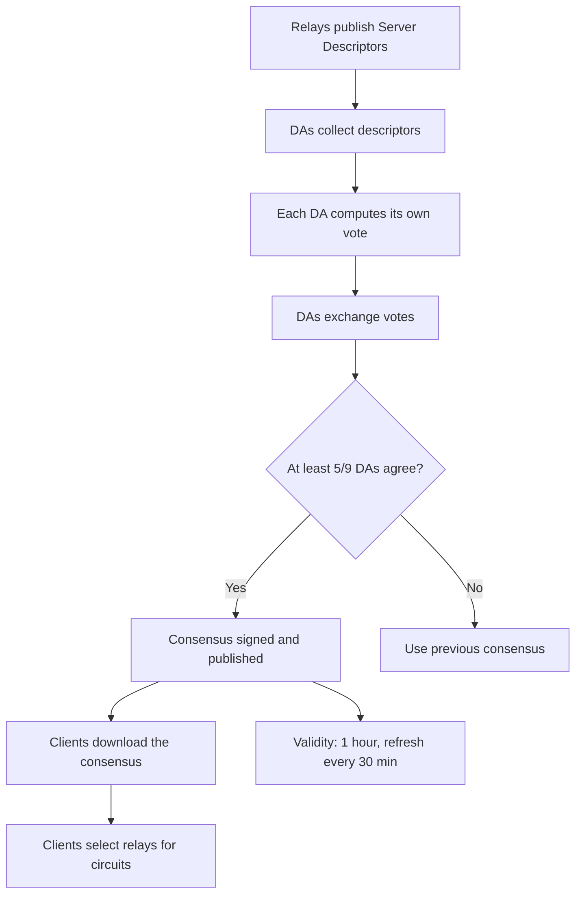

> **Lingua / Language**: [Italiano](../../01-fondamenti/descriptor-cache-e-attacchi.md) | English

# Descriptors, Cache and Attacks on the Consensus System

Server descriptors, microdescriptors, local consensus cache, and analysis
of possible attacks on the Directory Authorities voting mechanism.

Extracted from [Consensus and Directory Authorities](consenso-e-directory-authorities.md).

---

## Table of Contents

- [Server Descriptors - A relay's identity](#server-descriptors--a-relays-identity)
- [Microdescriptor vs Server Descriptor](#microdescriptor-vs-server-descriptor)
- [Consensus cache and persistence](#consensus-cache-and-persistence)
- [Attacks on the consensus system](#attacks-on-the-consensus-system)
- [Querying the consensus manually](#querying-the-consensus-manually)

---

## Server Descriptors - A relay's identity

Each relay periodically publishes a **server descriptor** containing all the information
needed to connect and negotiate keys:

```
@type server-descriptor 1.0
router ExampleRelay 198.51.100.42 9001 0 0
identity-ed25519
-----BEGIN ED25519 CERT-----
...
-----END ED25519 CERT-----
master-key-ed25519 BASE64KEY...
platform Tor 0.4.8.10 on Linux
proto Cons=1-2 Desc=1-2 DirCache=2 FlowCtrl=1-2 HSDir=2 HSIntro=4-5 ...
published 2025-01-15 11:45:33
fingerprint ABCD EFGH IJKL MNOP QRST UVWX YZ01 2345 6789 ABCD
uptime 1234567
bandwidth 10485760 20971520 15728640
extra-info-digest SHA1HASH SHA256HASH
onion-key
-----BEGIN RSA PUBLIC KEY-----
...
-----END RSA PUBLIC KEY-----
signing-key
-----BEGIN RSA PUBLIC KEY-----
...
-----END RSA PUBLIC KEY-----
onion-key-crosscert
-----BEGIN CROSSCERT-----
...
-----END CROSSCERT-----
ntor-onion-key CURVE25519_BASE64_KEY
ntor-onion-key-crosscert 0
-----BEGIN ED25519 CERT-----
...
-----END ED25519 CERT-----
accept *:80
accept *:443
reject *:*
router-sig-ed25519 SIGNATURE...
router-signature
-----BEGIN SIGNATURE-----
...
-----END SIGNATURE-----
```

### Key fields

| Field | Description |
|-------|-------------|
| `router` | Nickname, IP, ORPort |
| `identity-ed25519` | Ed25519 identity key (long-term) |
| `ntor-onion-key` | Curve25519 public key for ntor handshake |
| `bandwidth` | Bandwidth: average, burst, observed (in bytes/s) |
| `accept/reject` | Detailed exit policy |
| `uptime` | Current uptime in seconds |
| `platform` | Tor version and OS |
| `proto` | Supported protocols |

### Key rotation

- **Ed25519 identity key**: permanent (identifies the relay for its entire lifetime)
- **Curve25519 onion key**: rotated periodically (typically every week)
- **TLS key**: rotated frequently
- **Signing key**: intermediary between identity and descriptor

Onion key rotation is important: it guarantees long-term forward secrecy. Even if an
adversary obtains the current onion key, they cannot decrypt circuits negotiated with
previous onion keys (which have been destroyed).

---

## Microdescriptor vs Server Descriptor

To reduce bandwidth required by clients, Tor supports two descriptor formats:

### Server Descriptor (complete)

Contains all relay information, including the detailed exit policy. Used by relays and
services that need complete information.

### Microdescriptor (compact)

Reduced version containing only the information needed to build circuits:

```
@type microdescriptor 1.0
onion-key
-----BEGIN RSA PUBLIC KEY-----
...
-----END RSA PUBLIC KEY-----
ntor-onion-key CURVE25519_BASE64_KEY
id ed25519 ED25519_KEY_BASE64
```

The client downloads:
1. The **microdescriptor consensus** (compact consensus version, ~1 MB)
2. The **microdescriptors** of each listed relay (~1-2 MB total)

This significantly reduces the bandwidth needed for initial bootstrap.

### In my experience

The initial download of the consensus and descriptors is the slowest bootstrap phase.
On slow connections (or when using obfs4 bridges with limited bandwidth), bootstrap can
take 30-60 seconds. I see it in the logs:

```
Bootstrapped 75% (enough_dirinfo): Loaded enough directory info to build circuits
```

This line indicates that Tor has downloaded enough descriptors to start building circuits,
even if it doesn't have all the network's descriptors yet.

---

## Consensus cache and persistence

Tor saves the consensus and descriptors in `/var/lib/tor/`:

```
/var/lib/tor/
├── cached-certs              # DA certificates
├── cached-microdesc          # relay microdescriptors
├── cached-microdesc.new      # updated microdescriptors (periodic merge)
├── cached-microdescs.new     # buffer of new microdescriptors
├── cached-consensus          # last downloaded consensus
├── state                     # persistent state (guard selection, etc.)
├── lock                      # lock file (only one Tor process at a time)
└── keys/                     # relay keys (if operating as a relay)
```

### The `state` file

The `state` file is particularly important because it contains:

```
EntryGuard ExampleGuard FINGERPRINT DirCache
EntryGuardDownloadedBy 0.4.8.10
EntryGuardUnlistedSince (date, if the guard is no longer in the consensus)
EntryGuardAddedBy FINGERPRINT 0.4.8.10 (date)
EntryGuardPathBias 100 0 0 0 100 0
...
```

This file preserves guard selection across Tor restarts. It's fundamental because
persistent guards are a protection against long-term attacks.

### In my experience

After reinstalling Tor, the first bootstrap is slower because there's no cache.
Subsequent bootstraps are much faster because Tor uses cached descriptors and updates
them incrementally.

If I delete `/var/lib/tor/state`, Tor selects new guards on the next start. This is
**normally undesirable** because:
- You lose the protection of persistent guards
- You open a window where an adversary could be selected as guard

The only case where it's reasonable is if I suspect the selected guard is compromised
or if I'm completely reconfiguring the installation.

---

## Attacks on the consensus system

### 1. Directory Authority compromise

If an adversary compromises 5+ DAs, they can:
- Insert malicious relays in the consensus with Guard + Exit flags
- Remove legitimate relays from the consensus
- Manipulate bandwidth weights to concentrate traffic

**Mitigation**: the DAs are operated by independent organizations in different
jurisdictions. The source code is open source and auditable.

### 2. Malicious relays with inflated bandwidth

An adversary operates relays that declare very high bandwidth to be selected more often.

**Mitigation**: bandwidth authorities measure actual bandwidth and override declared
values.

### 3. Sybil attack

An adversary operates hundreds of relays to increase the probability of controlling
both the guard and exit of a circuit.

**Mitigation**:
- The DAs verify that relays are reachable
- Relays in the same /16 subnet are not used in the same circuit
- `MyFamily` declares co-operated relays to prevent them being in the same circuit
- Bandwidth authorities limit effective bandwidth

### 4. Denial of service on the DAs

If the DAs are made unreachable, clients cannot update the consensus.

**Mitigation**: the consensus has a 3-hour validity period. Fallback directories
distribute the load. Clients can operate with a slightly dated consensus.

---

## Querying the consensus manually

### Download the current consensus

```bash
# Via Tor (anonymous)
proxychains curl -s https://consensus-health.torproject.org/consensus-health.html

# The raw consensus (large, ~2 MB)
proxychains curl -s http://128.31.0.34:9131/tor/status-vote/current/consensus > /tmp/consensus.txt
```

### Analyze relays in the consensus

```bash
# Count relays in the consensus
grep "^r " /tmp/consensus.txt | wc -l

# Find relays with Guard flag
grep -B1 "^s.*Guard" /tmp/consensus.txt | grep "^r "

# Find Exit relays in a specific country (requires GeoIP)
# Tor includes a GeoIP database in /usr/share/tor/geoip

# Check bandwidth weights
grep "^bandwidth-weights" /tmp/consensus.txt
```

### In my experience

I don't query the consensus often, but it was useful for understanding:
- How many exits actually exist for a certain country (when I tried `ExitNodes {it}`)
- Why certain circuits were slow (the selected relay had low bandwidth)
- How guard rotation works (by observing the `state` file)

---


### Diagram: consensus voting process



## Summary

| Component | Role | Update frequency |
|-----------|------|-----------------|
| Directory Authorities | Vote on the consensus | Every hour |
| Consensus | Network state (all relays) | Every hour, valid 3 hours |
| Server Descriptors | Details of each relay | Every 18 hours (or when changed) |
| Microdescriptors | Compact descriptor version | When changed |
| Bandwidth Authorities | Measure actual bandwidth | Continuously |
| Local cache | Saved consensus + descriptors | At each update |
| State file | Persistent guard selection | At each change |

---

## See also

- [Consensus and Directory Authorities](consenso-e-directory-authorities.md) - Why consensus, DAs, voting
- [Consensus Structure and Flags](struttura-consenso-e-flag.md) - Document format, flags, bandwidth auth
- [Tor Architecture](architettura-tor.md) - How components use the consensus
- [Guard Nodes](../03-nodi-e-rete/guard-nodes.md) - Guard flag and selection
- [Relay Monitoring and Metrics](../03-nodi-e-rete/relay-monitoring-e-metriche.md) - Tor Metrics, bandwidth authorities
- [Known Attacks](../07-limitazioni-e-attacchi/attacchi-noti.md) - Sybil attack, DA compromise
- [Real-World Scenarios](scenari-reali.md) - Operational pentesting cases
