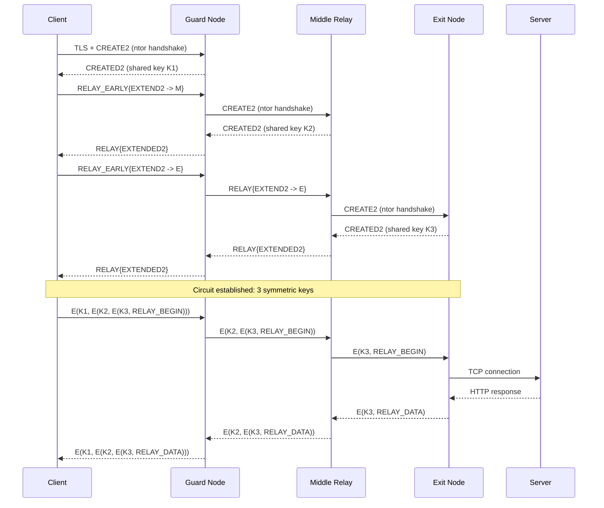

> **Lingua / Language**: [Italiano](../../01-fondamenti/isolamento-e-modello-minaccia.md) | English

# Stream Isolation, Circuit Lifecycle and Threat Model

Stream isolation, dirty timeout, NEWNYM, and Tor's security model:
what it protects, what it does NOT protect, and the operational implications.

Extracted from the [Tor Architecture](architettura-tor.md) section for in-depth analysis.

---

## Table of Contents

- [Stream Isolation - Traffic separation](#stream-isolation--traffic-separation)
- [Circuit lifecycle](#circuit-lifecycle)
- [Security architecture - Tor's threat model](#security-architecture--tors-threat-model)
- [Architecture summary](#architecture-summary)

---

## Stream Isolation - Traffic separation

Tor implements the concept of **stream isolation**: different streams can be routed
through different circuits to avoid correlations.

### Isolation types

- **By SOCKS source port** (`IsolateSOCKSAuth`): streams coming from different SOCKS
  ports use different circuits.

- **By SOCKS credentials** (`IsolateSOCKSAuth`): if the client sends different
  username/password in the SOCKS5 request, Tor uses different circuits. Tor Browser uses
  this mechanism: each tab on a different domain uses different SOCKS credentials.

- **By destination address** (`IsolateDestAddr`): streams to different destinations
  use different circuits.

- **By destination port** (`IsolateDestPort`): streams to different ports use different
  circuits.

### torrc configuration

```ini
# Main port - default isolation
SocksPort 9050

# Dedicated port for browser with maximum isolation
SocksPort 9052 IsolateSOCKSAuth IsolateDestAddr IsolateDestPort

# Dedicated port for CLI without isolation (shares circuits)
SocksPort 9053 SessionGroup=1
```

In my experience, I've only used the default port 9050. But for an advanced setup where
I want to separate browser traffic from proxychains traffic, configuring multiple SOCKS
ports with different isolation is the correct solution.

---

## Circuit lifecycle

Tor circuits are not permanent. Here is their lifecycle:

1. **Creation**: the client builds the circuit as described above.

2. **Active use**: streams are assigned to the circuit. A "clean" circuit (with no active
   streams) can be reused for new connections.

3. **Dirty timeout**: when a circuit has carried at least one stream, it becomes "dirty".
   After 10 minutes from the last use, Tor will not assign new streams to this circuit
   (but existing streams continue).

4. **Max lifetime**: a circuit cannot exist for more than ~24 hours, even if active.

5. **NEWNYM**: the NEWNYM signal (sent via ControlPort) marks all existing circuits as
   "dirty" immediately, forcing Tor to build new ones for subsequent connections.
   Circuits with active streams are not closed immediately.

6. **Destruction**: when a circuit is no longer needed, it is destroyed with a
   DESTROY cell.

### In my experience with NEWNYM

My `newnym` script:
```bash
#!/bin/bash
COOKIE=$(xxd -p /run/tor/control.authcookie | tr -d '\n')
printf "AUTHENTICATE %s\r\nSIGNAL NEWNYM\r\nQUIT\r\n" "$COOKIE" | nc 127.0.0.1 9051
```

When I run it:
```bash
> ~/scripts/newnym
250 OK
250 closing connection
```

Then I verify:
```bash
> proxychains curl https://api.ipify.org
185.220.101.143    # first IP

> ~/scripts/newnym
250 OK
250 closing connection

> proxychains curl https://api.ipify.org
104.244.76.13      # IP changed - new circuit, new exit
```

The cooldown between two NEWNYMs is approximately 10 seconds. If I send NEWNYM too soon,
Tor still returns `250 OK` but ignores the request internally.

---

## Security architecture - Tor's threat model

Tor is designed to protect against specific adversaries and scenarios. It's essential to
understand what it protects and what it does NOT protect:

### What Tor protects

| Scenario | Protection |
|----------|-----------|
| ISP monitoring traffic | Only sees encrypted connection to Guard/bridge, not the destination |
| Website trying to identify you | Only sees the exit node's IP, not yours |
| Malicious exit node | Cannot trace back to your IP (only knows the Middle) |
| Malicious guard node | Knows your IP but not the destination (only sees the Middle) |
| Observer on the local network | Sees encrypted traffic to Guard/bridge |

### What Tor does NOT protect

| Scenario | Why |
|----------|-----|
| Adversary controlling Guard AND Exit | Can correlate traffic timing (correlation attack) |
| Global adversary (e.g., NSA) | Can perform large-scale traffic analysis |
| Malware on your system | Reads data before it enters Tor |
| Browser fingerprinting | If you don't use Tor Browser, your browser has a unique fingerprint |
| User errors | Logging in with personal account over Tor, DNS leaks, etc. |
| Temporal metadata | Request timing can be correlated |

### Practical implication

My setup on Kali (proxychains + curl + Firefox with tor-proxy profile) does NOT offer
the same protection as Tor Browser. Standard Firefox has a unique fingerprint (user-agent,
fonts, canvas, WebGL, window dimensions). I use it knowingly for convenience and testing,
not for absolute anonymity.

For maximum anonymity: Tor Browser (or Whonix/Tails).

---


### Diagram: Tor circuit flow



## Architecture summary

```
                    +-----------------------------+
                    |    Directory Authorities     |
                    |  (9 servers, vote consensus) |
                    +--------------+--------------+
                                   | signed consensus
                    +--------------v--------------+
        +-----------+      Relay Network          +-----------+
        |           |  (~7000 volunteer relays)    |           |
        |           +-----------------------------+           |
        |                                                      |
  +-----v-----+      +----------+      +----------+    +-----v-----+
  |   Guard    |<---->|  Middle   |<---->|   Exit   |--->| Internet  |
  |   Node     | TLS  |  Relay   | TLS  |   Node   |    | (website) |
  +-----^-----+      +----------+      +----------+    +-----------+
        | TLS (or obfs4)
  +-----+-----+
  |  Client   |
  |  (tor     |
  |  daemon)  |
  |           |
  | SocksPort |<---- proxychains, curl, Firefox
  | DNSPort   |<---- DNS resolution via Tor
  | ControlPort|<---- NEWNYM scripts, nyx
  +-----------+
```

This architecture ensures that **no single node simultaneously knows both the origin
and destination of the traffic**. The Guard knows the client but not the destination.
The Exit knows the destination but not the client. The Middle knows neither.

---

## See also

- [Circuits, Cryptography and Cells](circuiti-crittografia-e-celle.md) - 514-byte cells, layered encryption
- [Consensus and Directory Authorities](consenso-e-directory-authorities.md) - Voting, flags, relay selection
- [Guard Nodes](../03-nodi-e-rete/guard-nodes.md) - First circuit hop, persistence
- [torrc - Complete Guide](../02-installazione-e-configurazione/torrc-guida-completa.md) - Configuration of all components
- [Protocol Limitations](../07-limitazioni-e-attacchi/limitazioni-protocollo.md) - TCP-only, latency, bandwidth
