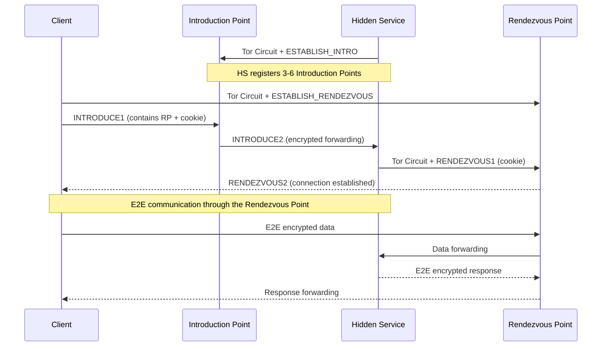

> **Lingua / Language**: [Italiano](../../03-nodi-e-rete/onion-services-v3.md) | English

# Onion Services v3 - Hidden Services on the Tor Network

This document analyzes how Onion Services (previously known as Hidden Services)
work in version 3 of the protocol. It covers the architecture, the rendezvous
protocol, cryptography, configuration, and security implications.

I have not configured an onion service in my setup, but understanding how they
work is fundamental to grasping the Tor architecture in its entirety.

---
---

## Table of Contents

- [What is an Onion Service](#what-is-an-onion-service)
- [Architecture of an Onion Service](#architecture-of-an-onion-service)
- [Onion Services v3 cryptography](#onion-services-v3-cryptography)
- [Configuring an Onion Service](#configuring-an-onion-service)
- [Onion Service security](#onion-service-security)
- [Onion Services and the real world](#onion-services-and-the-real-world)


## What is an Onion Service

An Onion Service is a network service (web server, SSH, chat, etc.) accessible
**only through the Tor network**, without ever exposing its public IP.

```
Normal service:
Client → Internet → Server's public IP → Server
  (the server is identifiable by its IP)

Onion Service:
Client → Tor → Rendezvous Point → Tor → Onion Service
  (neither the client nor the server knows the other's IP)
```

### .onion v3 address

The .onion v3 addresses are 56-character base32 strings derived from the service's
Ed25519 public key:

```
http://expyuzz4wqqyqhjn76s4vqwqzjjnc5s5n7kv4ly7gcnfvdc5kqbzxid.onion
       ^^^^^^^^^^^^^^^^^^^^^^^^^^^^^^^^^^^^^^^^^^^^^^^^^^^^^^^^
       56 base32 characters = 35 bytes = encoded public key
```

The v3 address structure:
```
address = base32(pubkey + checksum + version)
  pubkey   = 32 bytes (Ed25519 public key)
  checksum = 2 bytes (SHA3-256 of ".onion checksum" + pubkey + version)
  version  = 1 byte (0x03 for v3)
```

### Differences v2 vs v3

| Characteristic | v2 (deprecated) | v3 (current) |
|---------------|----------------|-------------|
| Address length | 16 chars | 56 chars |
| Key cryptography | RSA-1024 | Ed25519 |
| Hash | SHA-1 | SHA3 |
| Descriptor | Not fully encrypted | End-to-end encrypted |
| Client authentication | Optional, weak | Optional, robust (x25519) |

v2 has been **deprecated and removed** starting with Tor 0.4.6. Only v3 is supported.

---

## Architecture of an Onion Service

### Components

1. **Onion Service (HS)**: the server offering the service. It runs Tor and has a
   HiddenService configuration in the torrc.

2. **Introduction Points (IP)**: Tor relays chosen by the HS to "be discoverable".
   The HS maintains persistent circuits to 3-6 introduction points.

3. **HSDir (Hidden Service Directory)**: relays that store the onion service's
   descriptors. Determined algorithmically from the consensus.

4. **Rendezvous Point (RP)**: a relay chosen by the **client** as a meeting point.
   Neither the client nor the HS controls it directly - the client picks the relay,
   the HS connects to it.

5. **Client**: the user who wants to reach the onion service.

### The connection protocol - Step by step

```
Phase 1: Publication (the HS makes itself "discoverable")
═════════════════════════════════════════════════════════

1. The HS generates an Ed25519 key pair (permanent identity)
2. The HS selects 3-6 relays as Introduction Points
3. The HS builds circuits to each Introduction Point
4. The HS creates an encrypted descriptor containing:
   - List of Introduction Points
   - Keys for the handshake
   - Routing information
5. The HS publishes the descriptor on the HSDirs
   (determined from the consensus via a hash function)

Phase 2: Connection request (the client wants to connect)
═════════════════════════════════════════════════════════

1. The client knows the .onion address (56 characters)
2. From the address, it derives the HS's public key
3. It calculates which HSDirs contain the descriptor
4. It downloads the descriptor from the HSDirs
5. It decrypts the descriptor → obtains the list of Introduction Points

Phase 3: Rendezvous (the meeting point)
═══════════════════════════════════════

1. The CLIENT chooses a relay as Rendezvous Point
2. The CLIENT builds a circuit to the Rendezvous Point
3. The CLIENT sends a "rendezvous cookie" to the Rendezvous Point
   (a random 20-byte token)

Phase 4: Introduce (the client asks the HS to meet)
════════════════════════════════════════════════════

1. The CLIENT builds a circuit to one of the HS's Introduction Points
2. The CLIENT sends an INTRODUCE1 message to the Introduction Point:
   - encrypted with the HS's key
   - contains: Rendezvous Point IP + rendezvous cookie
3. The Introduction Point forwards INTRODUCE2 to the HS
   (without being able to decrypt it - it does not have the key)

Phase 5: The HS connects to the Rendezvous Point
═════════════════════════════════════════════════

1. The HS decrypts the INTRODUCE2 message
2. It obtains: Rendezvous Point IP + cookie
3. The HS builds a circuit to the Rendezvous Point
4. The HS sends RENDEZVOUS1 with the cookie
5. The Rendezvous Point matches the cookie to the client's
6. The connection is established: Client ←RP→ HS

Phase 6: Communication
═════════════════════

Traffic flows:
Client → Tor circuit → Rendezvous Point → Tor circuit → HS

Total hops: 3 (client) + 1 (RP) + 3 (HS) = up to 7 hops
```

### Network diagram

```
                              ┌─── Introduction Point 1
                              │
Onion Service ────circuit────►├─── Introduction Point 2
     │                        │
     │                        └─── Introduction Point 3
     │
     │        ┌───────────────────────────┐
     └───────►│    Rendezvous Point       │◄───────┐
              └───────────────────────────┘         │
                                                    │
                                              Client ────circuit────►
```

---

## Onion Services v3 cryptography

### Onion Service keys

```
/var/lib/tor/hidden_service/
├── hostname              # .onion address (derived from the public key)
├── hs_ed25519_public_key # Ed25519 public key (service identity)
├── hs_ed25519_secret_key # Ed25519 private key (CRITICAL - do not share)
└── authorized_clients/   # Authorized client keys (if authentication is active)
```

**The private key is the service's identity**. Whoever possesses the private key
controls the service. If it is compromised, the adversary can impersonate the service.

### Encrypted descriptor

The onion service descriptor is encrypted in two layers:

**Outer layer**: encrypted with a key derived from the .onion address + the current
time period. Anyone who knows the .onion address can decrypt it.

**Inner layer**: encrypted with the HS's public key. Only those who know the address
can decrypt it (but in practice, the outer layer already filters).

With **client authorization** active, the inner layer is also encrypted with the
keys of authorized clients. Only clients with the key can decrypt the descriptor
and discover the Introduction Points.

---

## Configuring an Onion Service

### Basic configuration

```ini
# In torrc
HiddenServiceDir /var/lib/tor/hidden_service/
HiddenServicePort 80 127.0.0.1:8080
```

- `HiddenServiceDir`: directory where Tor saves the keys and the hostname
- `HiddenServicePort`: mapping .onion port → local service

After restarting Tor:
```bash
sudo systemctl restart tor@default.service
sudo cat /var/lib/tor/hidden_service/hostname
# Output: abc123...xyz.onion
```

### Configuration with multiple ports

```ini
HiddenServiceDir /var/lib/tor/hidden_service/
HiddenServicePort 80 127.0.0.1:8080    # Web
HiddenServicePort 22 127.0.0.1:22      # SSH
HiddenServicePort 443 127.0.0.1:8443   # HTTPS
```

### Configuration with client authentication

```ini
HiddenServiceDir /var/lib/tor/hidden_service/
HiddenServicePort 80 127.0.0.1:8080
HiddenServiceAuthorizeClient stealth client1,client2
```

The client must have the authorization key in its `ClientOnionAuthDir`:
```ini
# Client torrc
ClientOnionAuthDir /var/lib/tor/onion_auth/
```

```bash
# Authorization file
echo "abc123...xyz:descriptor:x25519:KEY_BASE32" > /var/lib/tor/onion_auth/service.auth_private
```

---


### Diagram: connecting to an Onion Service



## Onion Service security

### What it protects

- **Server anonymity**: nobody (not even the client) knows the server's IP
- **Client anonymity**: the server does not know the client's IP
- **End-to-end encryption**: traffic between client and HS is end-to-end encrypted
  within the Tor network (in addition to any HTTPS)
- **Censorship resistance**: the .onion address cannot be censored via DNS
  (it does not use DNS)

### Known attacks

**1. HSDir enumeration**: an adversary who controls HSDirs can see which descriptors
are requested, discovering which onion services are popular.

**Mitigation v3**: descriptors are addressed with a hash function that includes the
time period. HSDirs change with each time period (every 24 hours).

**2. Introduction Point monitoring**: an adversary who controls an Introduction Point
sees connection requests (encrypted, but can count them).

**Mitigation**: the HS uses 3-6 Introduction Points and rotates them periodically.

**3. Guard discovery via onion service**: an adversary repeatedly connects to the
onion service and monitors intermediate relays to narrow down the HS's guard.

**Mitigation**: Vanguards (persistent layer guards).

**4. Timing correlation**: an adversary who controls an Introduction Point and a relay
on the network can correlate request timing to narrow down the HS's location.

**Mitigation**: long circuits (up to 7 hops) and padding.

---

## Onion Services and the real world

### Legitimate uses

- **Secure communications**: journalists, activists, whistleblowers
- **Anonymous services**: chat, email, private forums
- **Self-hosting**: accessing your own server remotely without exposing ports
- **Secure IoT**: reaching devices behind NAT without port forwarding

### Uses in my experience

I have not configured an onion service in my setup, but understanding the protocol
is fundamental to:
- Understanding why .onion addresses only work via Tor
- Comprehending the latency cost of .onion connections (up to 7 hops)
- Evaluating security when accessing .onion services
- Understanding the impact of `AutomapHostsOnResolve` in .onion resolution

### Onion Service performance

Due to the high number of hops (up to 7), .onion connections are:
- Slower than normal Tor connections (which use 3 hops)
- With more variable latency (more nodes = more potential slowdown points)
- More susceptible to timeouts (each hop is a potential failure point)

Typical latency for a .onion connection is 2-10 seconds for the initial setup,
then throughput depends on the slowest node in the chain.

---

## See also

- [Circuits, Cryptography, and Cells](../01-fondamenti/circuiti-crittografia-e-celle.md) - Cells and cryptography in HS circuits
- [Tor and Localhost](../06-configurazioni-avanzate/tor-e-localhost.md) - Onion services for local services
- [Secure Communication](../09-scenari-operativi/comunicazione-sicura.md) - Onion services for anonymous communication
- [Known Attacks](../07-limitazioni-e-attacchi/attacchi-noti.md) - HSDir enumeration, DoS on HS
- [Guard Nodes](guard-nodes.md) - Vanguards for HS protection
