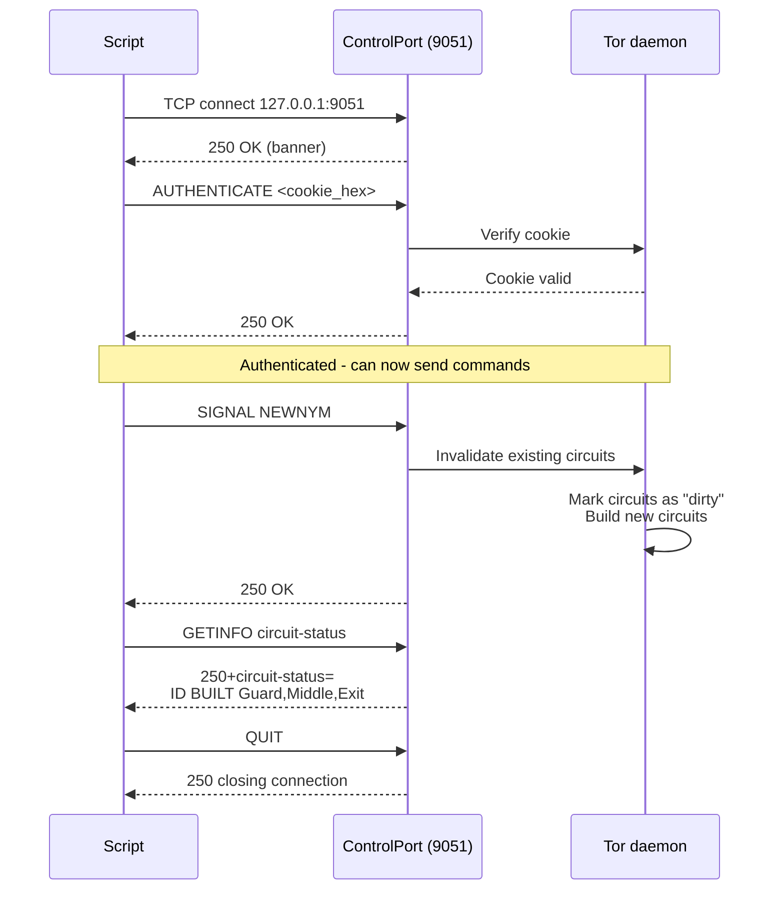

> **Lingua / Language**: [Italiano](../../04-strumenti-operativi/controllo-circuiti-e-newnym.md) | English

# Circuit Control and NEWNYM - Managing Tor via ControlPort

This document provides an in-depth analysis of Tor's control protocol
(ControlPort 9051), the NEWNYM signal for IP rotation, circuit inspection,
and automation through scripts and Python libraries (Stem).

Based on my direct experience creating the `newnym` script, debugging
cookie authentication, and daily use of IP rotation.

---
---

## Table of Contents

- [The ControlPort protocol](#the-controlport-protocol)
- [SIGNAL NEWNYM - IP rotation](#signal-newnym---ip-rotation)
- [ControlPort commands - Complete catalog](#controlport-commands---complete-catalog)
- [Automation with Python Stem](#automation-with-python-stem)
- [Advanced scripts](#advanced-scripts)
- [ControlPort security](#controlport-security)


## The ControlPort protocol

### What it is

The ControlPort is a text-based interface (similar to SMTP/FTP) that allows
external programs to communicate with the Tor daemon. It listens on `127.0.0.1:9051`.

### Authentication

There are two methods:

**1. Cookie Authentication (my method)**:
```bash
# The cookie is a 32-byte file
> xxd /run/tor/control.authcookie
00000000: 7a3b 2e4f 8c01 d2a3 ... (32 binary bytes)

# Convert to hex for authentication
> xxd -p /run/tor/control.authcookie | tr -d '\n'
7a3b2e4f8c01d2a3...  (64 hex characters)
```

To authenticate:
```
AUTHENTICATE 7a3b2e4f8c01d2a3...\r\n
250 OK\r\n
```

**2. Hashed password**:
```bash
> tor --hash-password "MySecretPassword"
16:872860B76453A77D60CA2BB8C1A7042072093276A3D701AD684053EC4C
```

```
AUTHENTICATE "MySecretPassword"\r\n
250 OK\r\n
```

### In my experience with authentication

My first NEWNYM attempt failed with:
```
514 Authentication required
```

The problem: my user did not have permissions to read the cookie:
```bash
> ls -la /run/tor/control.authcookie
-rw-r----- 1 debian-tor debian-tor 32 ...
```

Solution:
```bash
sudo usermod -aG debian-tor $USER
pkill -KILL -u $USER   # restart session
```

After re-login, the cookie was readable and my script worked.

### Diagram: ControlPort protocol and NEWNYM



---

## SIGNAL NEWNYM - IP rotation

### How it works

`SIGNAL NEWNYM` tells Tor:
1. Mark all current circuits as "dirty" (not usable for new streams)
2. Circuits with active streams **continue** (they are not interrupted)
3. New connections will use **new circuits** with new exit nodes
4. The new circuit will (probably) have a different exit node - different IP

### My newnym script

```bash
#!/bin/bash
COOKIE=$(xxd -p /run/tor/control.authcookie | tr -d '\n')
printf "AUTHENTICATE %s\r\nSIGNAL NEWNYM\r\nQUIT\r\n" "$COOKIE" | nc 127.0.0.1 9051
```

Detailed analysis:
- `xxd -p` - converts the binary file to hex
- `tr -d '\n'` - removes newlines (the cookie must be on a single line)
- `printf ... | nc` - sends the commands to the ControlPort via netcat
- `\r\n` - the protocol requires CRLF (like HTTP/SMTP)

### Usage

```bash
> ~/scripts/newnym
250 OK                    # AUTHENTICATE succeeded
250 OK                    # SIGNAL NEWNYM accepted
250 closing connection    # QUIT

# Verify the IP change
> proxychains curl -s https://api.ipify.org
185.220.101.143           # old IP

> ~/scripts/newnym
250 OK
250 OK
250 closing connection

> proxychains curl -s https://api.ipify.org
104.244.76.13             # new IP → different circuit, different exit
```

### NEWNYM cooldown

Tor enforces a cooldown of **~10 seconds** between consecutive NEWNYM signals.

If I send NEWNYM too soon:
```
250 OK                    # AUTHENTICATE ok
250 OK                    # Tor says OK but internally ignores the request
```

The `250 OK` is misleading: Tor does not return an error, it simply does not change the circuit.
To verify, check whether the IP has actually changed.

### NEWNYM vs restart

| Operation | Effect | Interruption | Time |
|-----------|--------|-------------|------|
| NEWNYM | New circuits, active streams continue | None | ~10s cooldown |
| systemctl restart | Process restarted, everything reset | Yes, total | ~15-30s bootstrap |
| systemctl reload | Re-reads torrc, circuits maintained | Minimal | Immediate |

---

## ControlPort commands - Complete catalog

### Signals (SIGNAL)

```
SIGNAL NEWNYM       → New circuits (IP rotation)
SIGNAL CLEARDNSCACHE → Clear Tor's DNS cache
SIGNAL HEARTBEAT    → Emit a heartbeat in the logs
SIGNAL DORMANT      → Enter dormant mode (reduce network activity)
SIGNAL ACTIVE       → Exit dormant mode
SIGNAL DUMP         → Dump internal state to logs
SIGNAL HALT         → Clean daemon shutdown
SIGNAL TERM         → Same as HALT
SIGNAL SHUTDOWN     → Same as HALT
```

### Informational queries (GETINFO)

```bash
# Tor version
GETINFO version

# Circuit status
GETINFO circuit-status

# Stream status
GETINFO stream-status

# Entry guard status
GETINFO entry-guards

# Network information
GETINFO ns/all          # all relays in the consensus
GETINFO ns/id/FINGERPRINT  # info on a specific relay

# Traffic (bytes sent/received)
GETINFO traffic/read
GETINFO traffic/written

# Bootstrap status
GETINFO status/bootstrap-phase

# IP address (if Tor knows it)
GETINFO address
```

### Example: inspect circuits

```bash
COOKIE=$(xxd -p /run/tor/control.authcookie | tr -d '\n')
printf "AUTHENTICATE %s\r\nGETINFO circuit-status\r\nQUIT\r\n" "$COOKIE" | nc 127.0.0.1 9051
```

Output:
```
250+circuit-status=
5 BUILT $AAAA~GuardNick,$BBBB~MiddleNick,$CCCC~ExitNick BUILD_FLAGS=NEED_CAPACITY PURPOSE=GENERAL TIME_CREATED=2025-01-15T12:00:00
7 BUILT $DDDD~Guard2,$EEEE~Middle2,$FFFF~Exit2 BUILD_FLAGS=IS_INTERNAL,NEED_CAPACITY PURPOSE=HS_SERVICE_INTRO
.
250 OK
```

Each line:
- Circuit ID (5, 7, ...)
- State (BUILT, LAUNCHED, EXTENDED, FAILED, CLOSED)
- Hops: `$FINGERPRINT~Nickname` separated by commas
- BUILD_FLAGS: circuit type
- PURPOSE: purpose (GENERAL, HS_SERVICE_INTRO, HS_SERVICE_REND, etc.)

### Example: monitor events in real time

```bash
printf "AUTHENTICATE %s\r\nSETEVENTS CIRC STREAM\r\n" "$COOKIE" | nc -q -1 127.0.0.1 9051
```

This keeps the connection open and shows circuit and stream events in real time:
```
650 CIRC 12 LAUNCHED
650 CIRC 12 EXTENDED $AAAA~Guard
650 CIRC 12 EXTENDED $BBBB~Middle
650 CIRC 12 BUILT $AAAA~Guard,$BBBB~Middle,$CCCC~Exit
650 STREAM 1 NEW 0 api.ipify.org:443
650 STREAM 1 SENTCONNECT 12 api.ipify.org:443
650 STREAM 1 SUCCEEDED 12 api.ipify.org:443
```

---

## Automation with Python Stem

### Installation

```bash
pip install stem
# or
sudo apt install python3-stem
```

### Example: NEWNYM in Python

```python
from stem import Signal
from stem.control import Controller

with Controller.from_port(port=9051) as ctrl:
    ctrl.authenticate()  # uses cookie authentication automatically
    ctrl.signal(Signal.NEWNYM)
    print("New circuit requested")
```

### Example: list circuits

```python
from stem.control import Controller

with Controller.from_port(port=9051) as ctrl:
    ctrl.authenticate()
    for circ in ctrl.get_circuits():
        if circ.status == 'BUILT':
            path = ' → '.join([f"{n.nickname}({n.fingerprint[:8]})" for n in circ.path])
            print(f"Circuit {circ.id}: {path}")
```

Output:
```
Circuit 5: GuardNick(AABBCCDD) → MiddleNick(EEFFGGHH) → ExitNick(11223344)
Circuit 7: Guard2(55667788) → Middle2(99AABBCC) → Exit2(DDEEFF00)
```

### Example: continuous monitoring with Stem

```python
from stem.control import Controller, EventType

def circuit_event(event):
    if event.status == 'BUILT':
        print(f"Circuit {event.id} built: {event.path}")
    elif event.status == 'CLOSED':
        print(f"Circuit {event.id} closed: {event.reason}")

with Controller.from_port(port=9051) as ctrl:
    ctrl.authenticate()
    ctrl.add_event_listener(circuit_event, EventType.CIRC)
    input("Press Enter to terminate...\n")
```

### Example: NEWNYM with IP verification

```python
import time
import requests
from stem import Signal
from stem.control import Controller

def get_tor_ip():
    proxies = {'http': 'socks5h://127.0.0.1:9050',
               'https': 'socks5h://127.0.0.1:9050'}
    return requests.get('https://api.ipify.org', proxies=proxies).text

with Controller.from_port(port=9051) as ctrl:
    ctrl.authenticate()
    
    old_ip = get_tor_ip()
    print(f"Current IP: {old_ip}")
    
    ctrl.signal(Signal.NEWNYM)
    time.sleep(10)  # wait for cooldown
    
    new_ip = get_tor_ip()
    print(f"New IP: {new_ip}")
    print(f"Change {'succeeded' if old_ip != new_ip else 'failed (same IP)'}")
```

---

## Advanced scripts

### Continuous IP rotation (use with caution)

```bash
#!/bin/bash
# WARNING: excessive use can cause blocks from websites

COOKIE=$(xxd -p /run/tor/control.authcookie | tr -d '\n')
INTERVAL=60  # seconds between each rotation

while true; do
    printf "AUTHENTICATE %s\r\nSIGNAL NEWNYM\r\nQUIT\r\n" "$COOKIE" | nc 127.0.0.1 9051
    NEW_IP=$(proxychains curl -s https://api.ipify.org 2>/dev/null)
    echo "[$(date)] IP: $NEW_IP"
    sleep $INTERVAL
done
```

In my experience, **I have not implemented** continuous rotation because:
- Many sites notice sudden IP changes and block the connection
- CAPTCHAs become more frequent
- It degrades circuit quality (Tor must continuously build new ones)

I only use it manually, when I need a new IP for a specific test.

---

## ControlPort security

### Risks

The ControlPort allows:
- Viewing all circuits and streams (privacy)
- Sending signals (NEWNYM, SHUTDOWN)
- Reading the configuration
- Potentially deanonymizing the user (if accessible remotely)

### Mitigations

1. **Localhost only**: `ControlPort 9051` listens only on 127.0.0.1
2. **Cookie authentication**: the cookie is only readable by debian-tor
3. **NEVER expose the ControlPort on the network**: `ControlListenAddress 127.0.0.1`
4. **Cookie permissions**: `chmod 640 /run/tor/control.authcookie`

---

## See also

- [Nyx and Monitoring](nyx-e-monitoraggio.md) - Visualize circuits in real time
- [torrc - Complete Guide](../02-installazione-e-configurazione/torrc-guida-completa.md) - ControlPort configuration
- [Multi-Instance and Stream Isolation](../06-configurazioni-avanzate/multi-istanza-e-stream-isolation.md) - NEWNYM per instance
- [Guard Nodes](../03-nodi-e-rete/guard-nodes.md) - Why NEWNYM does not change the Guard
- [Incident Response](../09-scenari-operativi/incident-response.md) - NEWNYM as recovery after leak

---

## Cheat Sheet - ControlPort commands

| ControlPort command | Description |
|--------------------|-------------|
| `AUTHENTICATE "password"` | Password authentication |
| `AUTHENTICATE <cookie_hex>` | Cookie authentication |
| `SIGNAL NEWNYM` | New identity (new circuits) |
| `SIGNAL RELOAD` | Reload torrc |
| `SIGNAL SHUTDOWN` | Clean shutdown |
| `GETINFO version` | Tor version |
| `GETINFO circuit-status` | Active circuit list |
| `GETINFO stream-status` | Active stream list |
| `GETINFO address` | Detected external IP |
| `GETINFO traffic/read` | Total bytes read |
| `GETINFO traffic/written` | Total bytes written |
| `GETINFO ns/all` | All relays in the consensus |
| `SETCONF MaxCircuitDirtiness=1800` | Runtime torrc modification |
| `CLOSECIRCUIT <id>` | Close a specific circuit |
| `EXTENDCIRCUIT 0` | Create a new circuit |
