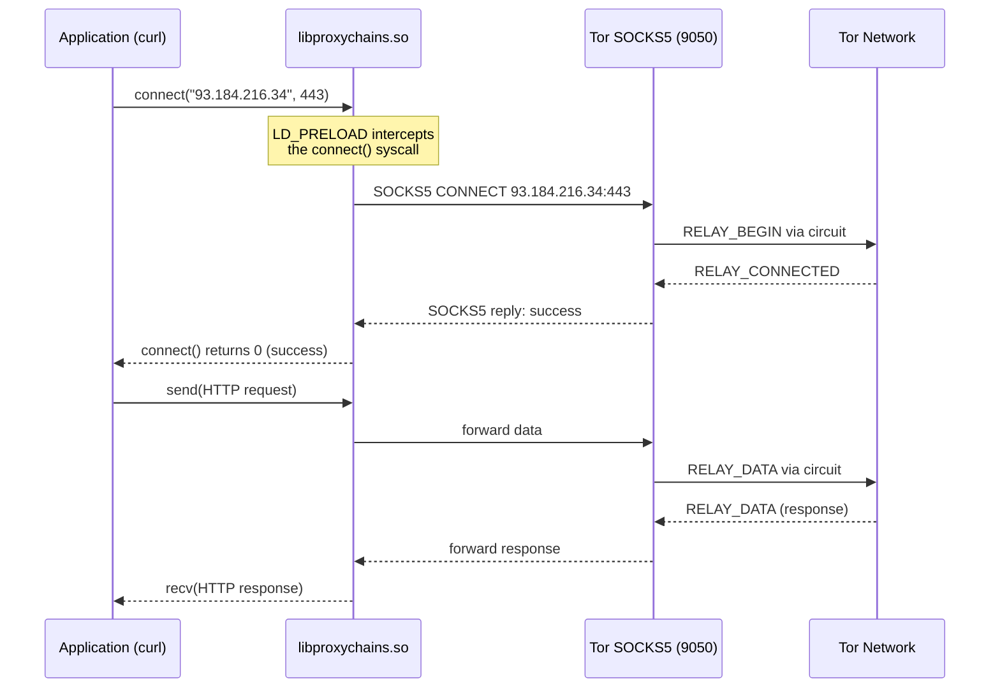

> **Lingua / Language**: [Italiano](../../04-strumenti-operativi/proxychains-guida-completa.md) | English

# ProxyChains - Complete Guide and Low-Level Analysis

This document provides an in-depth analysis of ProxyChains: how it works internally
(LD_PRELOAD, syscall hooking), all chain modes, DNS configuration, debugging,
and the real-world limitations when used with Tor.

Based on my direct experience with `proxychains4` on Kali Linux, where I use it
daily to route `curl`, `firefox`, and other tools through Tor.

---
---

## Table of Contents

- [What is ProxyChains and how it works internally](#what-is-proxychains-and-how-it-works-internally)
- [The configuration file - Complete analysis](#the-configuration-file---complete-analysis)
- [Practical usage - Everyday commands](#practical-usage---everyday-commands)
- [Debugging ProxyChains](#debugging-proxychains)
- [ProxyChains vs alternatives](#proxychains-vs-alternatives)
- [My proxychains4.conf configuration](#my-proxychains4conf-configuration)


## What is ProxyChains and how it works internally

### The LD_PRELOAD mechanism

ProxyChains **is not a proxy**. It is a wrapper that intercepts applications'
network calls through Linux's `LD_PRELOAD` mechanism:

```
Without proxychains:
curl → connect("93.184.216.34", 443) → kernel → Internet → Server

With proxychains:
curl → connect("93.184.216.34", 443) → libproxychains.so (intercepts!) →
  connect("127.0.0.1", 9050) → Tor → Internet → Server
```

When you run `proxychains curl https://example.com`:

1. The system loads `libproxychains.so.4` BEFORE the standard libraries (LD_PRELOAD)
2. The library overrides (hooks) the functions:
   - `connect()` - redirected to the SOCKS proxy
   - `getaddrinfo()` / `gethostbyname()` - intercepted for DNS proxy (if `proxy_dns`)
   - `close()` - to handle cleanup
3. When curl calls `connect()`, the call goes to the proxychains function
4. ProxyChains opens a SOCKS5 connection to `127.0.0.1:9050`
5. Sends the SOCKS5 CONNECT command with the original destination
6. Tor receives the SOCKS5 request and routes it through the circuit

### Diagram: LD_PRELOAD flow



### What this means in practice

```bash
> proxychains curl https://api.ipify.org
[proxychains] config file found: /etc/proxychains4.conf
[proxychains] preloading /usr/lib/x86_64-linux-gnu/libproxychains.so.4
[proxychains] DLL init: proxychains-ng 4.17
[proxychains] Dynamic chain  ...  127.0.0.1:9050  ...  api.ipify.org:443  ...  OK
185.220.101.143
```

Line by line:
- `config file found` - it found and read `/etc/proxychains4.conf`
- `preloading` - it loaded the interception library
- `DLL init` - the library was initialized (proxychains-ng version 4.17)
- `Dynamic chain ... OK` - the SOCKS5 connection was established successfully
- `185.220.101.143` - IP of the Tor exit node (not my real IP)

### Limitations of the LD_PRELOAD mechanism

**LD_PRELOAD does NOT work with**:
- Statically linked binaries (they do not load dynamic libraries)
- setuid/setgid binaries (LD_PRELOAD is ignored for security)
- Applications that use direct syscalls (bypass libc)
- Some statically compiled Go/Rust applications

**LD_PRELOAD works with**:
- Most dynamically linked C/C++ applications
- Python, Ruby, Perl (interpreted, they use libc)
- Java (JVM uses libc for networking)
- Node.js (V8 uses libc)

---

## The configuration file - Complete analysis

### File path

```
/etc/proxychains4.conf         # System configuration
~/.proxychains/proxychains.conf # User configuration (higher priority)
```

ProxyChains searches in order: `PROXYCHAINS_CONF_FILE` environment variable, then
home directory, then `/etc/`.

### Chain modes

#### dynamic_chain (my choice)

```ini
dynamic_chain
```

- If a proxy in the list is offline, it is **skipped**
- At least one proxy must be working
- Proxies are tried in order
- If all fail - error

**Why I use it**: with a single proxy (Tor on 9050), dynamic_chain is equivalent to
strict_chain. But if I were to add other proxies as fallback, dynamic_chain would
automatically skip them if offline.

#### strict_chain

```ini
strict_chain
```

- **All** proxies in the list must be online
- If one fails - the entire chain fails
- Proxies are used in exact order

**When to use it**: if you have a chain of multiple proxies and want to be sure that
traffic passes through all of them (e.g. SOCKS-HTTP-SOCKS).

#### round_robin_chain

```ini
round_robin_chain
chain_len = 2
```

- Selects `chain_len` proxies from the list in a round-robin fashion
- On each connection, the starting point in the list advances
- Useful for distributing load across multiple proxies

#### random_chain

```ini
random_chain
chain_len = 1
```

- Selects `chain_len` proxies randomly from the list
- Each connection uses different proxies
- Useful for IDS testing or varying the path

### DNS configuration

#### proxy_dns (essential for privacy)

```ini
proxy_dns
```

**What it does**: intercepts `getaddrinfo()` and `gethostbyname()` calls and redirects
them through the proxy. Without this option, DNS is resolved **locally** before
reaching the proxy - **DNS leak**.

```
Without proxy_dns:
curl example.com → DNS query to local resolver (ISP sees "example.com")
                 → gets IP → connect via proxy

With proxy_dns:
curl example.com → proxychains intercepts the DNS query
                 → sends "example.com" as hostname to the SOCKS5 proxy
                 → Tor resolves DNS through the Tor network (no leak)
```

**How it works internally**: proxychains uses an internal DNS thread that assigns
dummy IPs from the `remote_dns_subnet` subnet (default 224.x.x.x) and maintains
a hostname-to-dummy-IP mapping. When the application connects to the dummy IP,
proxychains remaps it to the original hostname and sends it to the proxy.

#### remote_dns_subnet

```ini
remote_dns_subnet 224
```

The subnet used for the DNS proxy dummy IPs. Default 224 (range 224.0.0.0/8).
This range is normally reserved for multicast, so it should not conflict
with real traffic.

**Note**: if the application validates the IP (e.g. rejects multicast addresses),
you can change the subnet:
```ini
remote_dns_subnet 10    # uses 10.x.x.x (RFC1918 private range)
```

### Timeout

```ini
tcp_read_time_out 15000      # 15 seconds for reading
tcp_connect_time_out 8000    # 8 seconds for connection
```

**In my experience**, the default timeouts are adequate for Tor. If obfs4
bridges are slow, I might need to increase them:
```ini
tcp_read_time_out 30000
tcp_connect_time_out 15000
```

### Localnet - Proxy exclusions

```ini
# Connections to these ranges do NOT pass through the proxy
localnet 127.0.0.0/255.0.0.0      # localhost
localnet 192.168.0.0/255.255.0.0   # local network
```

**When to enable**: if you need to access local services (e.g. database on localhost,
Docker) through the same shell where you use proxychains. Without localnet, even
local connections would be redirected to Tor (and would fail, because the exit
node cannot reach your localhost).

### ProxyList - The proxies to use

```ini
[ProxyList]
socks5 127.0.0.1 9050
```

Format: `<type> <IP> <port> [username password]`

Supported types:
- `http` - HTTP CONNECT proxy
- `socks4` - SOCKS4 (does not support hostnames, only IPs)
- `socks5` - SOCKS5 (supports hostnames - necessary for Tor)
- `raw` - direct forwarding without proxy protocol

**Why socks5 and not socks4**: SOCKS5 allows sending hostnames as strings
(DOMAINNAME). This is essential for Tor: the hostname is resolved by the exit node,
not locally. SOCKS4 requires a numeric IP - forces local DNS resolution - leak.

---

## Practical usage - Everyday commands

### Verify IP

```bash
# Real IP (without proxy)
curl https://api.ipify.org
# → xxx.xxx.xxx.xxx (my Parma IP)

# IP via Tor
proxychains curl https://api.ipify.org
# → 185.220.101.143 (Tor exit node)
```

### Anonymous web browsing

```bash
# Create a dedicated Firefox profile (one-time)
firefox -no-remote -CreateProfile tor-proxy

# Browse via Tor
proxychains firefox -no-remote -P tor-proxy & disown
```

### Network tools via Tor

```bash
# wget via Tor
proxychains wget https://example.com/file.zip

# nmap via Tor (TCP connect scan only, not SYN scan)
proxychains nmap -sT -Pn target.com

# ssh via Tor
proxychains ssh user@server.com

# git via Tor
proxychains git clone https://github.com/user/repo.git
```

### In my experience

Tools that work well with proxychains:
- `curl` - perfect, it is my primary test tool
- `wget` - works well for downloads
- `firefox` - works with a dedicated profile
- `git` - works for clone/pull/push over HTTPS

Tools that work poorly or do not work:
- `ping` - uses ICMP (not TCP), does not work
- `nmap -sS` - SYN scan requires raw sockets, not intercepted by LD_PRELOAD
- `traceroute` - uses ICMP/UDP, does not work
- Statically compiled applications - bypass LD_PRELOAD

---

## Debugging ProxyChains

### quiet_mode

```ini
quiet_mode
```

Disables all proxychains output. Useful for scripts where you do not want
`[proxychains] ...` in the output.

### Verbose output

By default, proxychains shows the chain and the result. For more details:

```bash
# See connections in detail
PROXYCHAINS_CONF_FILE=/etc/proxychains4.conf proxychains -f /etc/proxychains4.conf curl https://api.ipify.org
```

### Common errors

**"need more proxies !!!"**:
```
[proxychains] Dynamic chain  ...  127.0.0.1:9050  ...  timeout
!!! need more proxies !!!
```

Cause: Tor is not running or has not completed bootstrap.
Solution:
```bash
sudo systemctl start tor@default.service
# Wait for bootstrap
sudo journalctl -u tor@default.service | grep "Bootstrapped 100%"
```

**"connection refused"**:
```
[proxychains] Dynamic chain  ...  127.0.0.1:9050  ...  connection refused
```

Cause: Tor is running but not accepting connections on 9050.
Verify:
```bash
sudo ss -tlnp | grep 9050
grep SocksPort /etc/tor/torrc
```

**DNS leak despite proxy_dns**:
If you suspect a DNS leak, verify:
```bash
# DNS should be resolved by Tor, not locally
proxychains curl https://dnsleaktest.com/
# Or better:
proxychains curl -s https://ipleak.net/json/
```

---

## ProxyChains vs alternatives

### ProxyChains vs torsocks

| Feature | ProxyChains | torsocks |
|---------|-------------|----------|
| Mechanism | LD_PRELOAD | LD_PRELOAD |
| Multiple chains | Yes | No (Tor only) |
| DNS proxy | Yes (proxy_dns) | Yes (automatic) |
| UDP | No (TCP only) | Actively rejects UDP |
| Configurability | High | Low (designed for Tor) |
| Output | Verbose by default | Silent |

### ProxyChains vs curl --socks5-hostname

For single commands, `curl --socks5-hostname 127.0.0.1:9050` is more direct than
`proxychains curl`. I use proxychains when:
- I need to force applications that do not natively support SOCKS
- I want a "general" solution for any application
- I need to use Firefox or other browsers

---

## My proxychains4.conf configuration

```ini
dynamic_chain
proxy_dns
remote_dns_subnet 224
tcp_read_time_out 15000
tcp_connect_time_out 8000

[ProxyList]
socks5 127.0.0.1 9050
```

This configuration:
- Uses dynamic chain (skips offline proxies)
- Prevents DNS leak (proxy_dns)
- Has reasonable timeouts for Tor
- Uses Tor as the only SOCKS5 proxy

---

## See also

- [torsocks](torsocks.md) - Alternative to proxychains with UDP blocking
- [DNS Leak](../05-sicurezza-operativa/dns-leak.md) - proxy_dns and leak prevention
- [Tor Browser and Applications](tor-browser-e-applicazioni.md) - Application compatibility matrix
- [IP, DNS and Leak Verification](verifica-ip-dns-e-leak.md) - Tests after proxychains configuration
- [Application Limitations](../07-limitazioni-e-attacchi/limitazioni-applicazioni.md) - What works with proxychains

---

## Cheat Sheet - Quick ProxyChains commands

| Command | Description |
|---------|-------------|
| `proxychains curl -s https://api.ipify.org` | Verify IP via Tor |
| `proxychains curl --socks5-hostname 127.0.0.1:9050 URL` | Direct curl via SOCKS5 |
| `proxychains firefox -no-remote -P tor-proxy` | Firefox with Tor profile |
| `proxychains nmap -sT -Pn -p 80,443 target` | TCP port scan via Tor |
| `proxychains git clone https://url` | Anonymous git clone |
| `proxychains ssh user@host` | SSH via Tor |
| `proxychains wget https://url` | Download via Tor |
| `proxychains pip install pkg` | pip via Tor |
| `PROXYCHAINS_CONF_FILE=/path proxychains cmd` | Custom config file |
