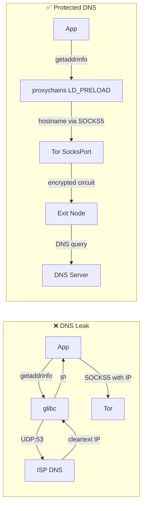

> **Lingua / Language**: [Italiano](../../05-sicurezza-operativa/dns-leak.md) | English

# DNS Leak - How They Happen and How to Prevent Them

This document analyzes DNS leaks in the Tor context: how they occur at a technical
level, all the scenarios that cause them, how to test for them with tcpdump and
scripts, complete multi-layer mitigations, and forensic leak verification.

DNS leaks are probably the most common vulnerability when using Tor from the CLI,
because many applications resolve DNS locally before passing traffic to the proxy.
In my experience, correctly configuring `proxy_dns` in proxychains and `DNSPort`
in the torrc has been essential.

---

## Table of Contents

- [What is a DNS leak](#what-is-a-dns-leak)
- [Technical anatomy of a DNS query](#technical-anatomy-of-a-dns-query)
- [Scenarios that cause DNS leaks](#scenarios-that-cause-dns-leaks)
- [Practical DNS leak verification](#practical-dns-leak-verification)
**Deep dives** (dedicated files):
- [DNS Leak - Prevention and Hardening](dns-leak-prevenzione-e-hardening.md) - Mitigations, firewall, systemd-resolved, DoH/DoT, forensics

---

## What is a DNS leak

A DNS leak occurs when a DNS query leaves your system **without going through
Tor**, revealing to your ISP (or the DNS resolver) which site you are about to
visit.

```
CORRECT SCENARIO (no leak):
Browser → "example.com" → ProxyChains → SOCKS5 (hostname) → Tor → Exit (resolves DNS)
  ISP sees: encrypted traffic toward Guard/Bridge
  ISP DOES NOT see: "example.com"

LEAK SCENARIO:
Browser → DNS query "example.com" → ISP DNS resolver → IP response
       → then → ProxyChains → SOCKS5 (IP) → Tor → Exit → Server
  ISP sees: DNS query for "example.com" IN CLEARTEXT
  HTTPS traffic is protected, but the ISP knows you visit example.com
```

### Why it is serious

Even if the connection content is encrypted (HTTPS via Tor), the DNS leak reveals:
- **Which sites you visit** (the domain is in cleartext in the DNS query)
- **When you visit them** (query timestamp)
- **How often** (query frequency)
- **Behavioral patterns** (schedules, site sequences, interests)
- This metadata is sufficient to profile your behavior

A single DNS leak completely nullifies the privacy benefit offered by Tor
for that specific connection. It does not matter that subsequent traffic is encrypted
over 3 hops: the ISP has already seen the domain.

### What the ISP sees with a DNS leak

```
# Cleartext DNS query captured by the ISP (Comeser in my case):
Frame 42: 74 bytes on wire
  Internet Protocol: 192.168.1.100 → 192.168.1.1
  User Datagram Protocol: Src Port: 53421, Dst Port: 53
  Domain Name System (query)
    Queries:
      example.com: type A, class IN
      
# The ISP sees exactly:
# - Source IP: my local IP (192.168.1.100)
# - Destination: the ISP router/DNS (192.168.1.1)
# - Requested domain: example.com
# - Timestamp: exactly when I made the request
```

---

## Technical anatomy of a DNS query

To understand where leaks occur, you need to understand the path of a DNS query
on a Linux system.

### The normal path (without Tor)

```
1. Application calls getaddrinfo("example.com")
2. glibc reads /etc/nsswitch.conf → "hosts: files dns"
3. First checks /etc/hosts (no match)
4. Then uses /etc/resolv.conf to find the nameserver
5. Sends UDP port 53 query to the configured nameserver
6. The nameserver (ISP or public) responds with the IP
7. glibc returns the IP to the application
```

### The path with proxychains (correct)

```
1. Application calls getaddrinfo("example.com")
2. proxychains LD_PRELOAD intercepts the call
3. proxy_dns is active → does NOT resolve locally
4. Assigns a fake IP (e.g., 224.x.x.x) temporarily
5. When the app connects to that IP via SOCKS5:
   proxychains sends the original hostname to the proxy
6. Tor resolves the DNS on the exit node
7. No local DNS query → no leak
```

### The path with proxychains (leak)

```
1. Application calls getaddrinfo("example.com")
2. proxychains LD_PRELOAD intercepts the call
3. proxy_dns is NOT active → resolves locally
4. DNS UDP:53 query goes out to the system nameserver
   → LEAK! The ISP sees the query
5. glibc returns the real IP
6. Proxychains sends the IP (not the hostname) via SOCKS5
7. Traffic goes through Tor, but the DNS already leaked in cleartext
```

### The critical point: SOCKS4 vs SOCKS5

```
SOCKS4: supports connections to IP only
  → The application MUST resolve DNS before connecting
  → Inevitable DNS leak (unless AutomapHosts is used)

SOCKS5: supports connections to hostname
  → The application CAN send the hostname to the proxy
  → The proxy (Tor) resolves the DNS on the exit
  → But the application must use SOCKS5 correctly
  → curl --socks5 → resolves first (leak)
  → curl --socks5-hostname → sends hostname (no leak)
```

---


### Diagram: DNS path with and without protection



## Scenarios that cause DNS leaks

### 1. curl with --socks5 (without hostname)

```bash
# LEAK! curl resolves locally before sending to the proxy
curl --socks5 127.0.0.1:9050 https://example.com

# CORRECT: hostname sent to the proxy, resolved by Tor
curl --socks5-hostname 127.0.0.1:9050 https://example.com

# CORRECT ALTERNATIVE: socks5h protocol (h = hostname resolution via proxy)
curl -x socks5h://127.0.0.1:9050 https://example.com
```

Verification with tcpdump:
```bash
# Terminal 1: capture DNS
sudo tcpdump -i eth0 port 53 -n

# Terminal 2: test with leak
curl --socks5 127.0.0.1:9050 https://check.torproject.org
# tcpdump shows: 192.168.1.100.43521 > 192.168.1.1.53: A? check.torproject.org

# Terminal 2: test without leak
curl --socks5-hostname 127.0.0.1:9050 https://check.torproject.org
# tcpdump: NO DNS query visible
```

### 2. ProxyChains without proxy_dns

If `proxy_dns` is not active in proxychains.conf, `getaddrinfo()` calls
are not intercepted and DNS goes out in cleartext.

```ini
# /etc/proxychains4.conf

# CORRECT:
proxy_dns
remote_dns_subnet 224

# WRONG (commented out or absent):
# proxy_dns
```

Verification:
```bash
# With proxy_dns disabled:
sudo tcpdump -i eth0 port 53 -n &
proxychains curl -s https://example.com
# tcpdump output: DNS query visible → LEAK

# With proxy_dns enabled:
sudo tcpdump -i eth0 port 53 -n &
proxychains curl -s https://example.com
# tcpdump output: no DNS query → OK
```

### 3. Applications that bypass the proxy

Applications that do not respect system proxy settings or that use
their own DNS resolvers:

```
Chrome/Chromium:
  - Uses DNS-over-HTTPS (DoH) to Google (8.8.8.8) by default
  - Completely bypasses /etc/resolv.conf
  - Completely bypasses proxychains for DNS
  
Electron apps (Slack, VS Code, Discord):
  - Often ignore LD_PRELOAD
  - Have their own Node.js network stack
  - DNS calls bypass proxychains

systemd-resolved:
  - Can perform DNS prefetch/caching
  - Can send queries in parallel to multiple resolvers
  - Can use DNS-over-TLS to external servers
```

### 4. systemd-resolved responding before the proxy

On many modern Linux systems, `systemd-resolved` manages DNS:

```bash
# Check if systemd-resolved is active
systemctl is-active systemd-resolved
# active → potential problem

# The /etc/resolv.conf file points to the local resolver:
cat /etc/resolv.conf
# nameserver 127.0.0.53   ← systemd-resolved
# nameserver 192.168.1.1  ← ISP router (fallback)
```

The problem: `systemd-resolved` has a DNS cache and can make queries
to upstream resolvers (ISP) even when the application uses proxychains.

### 5. IPv6 DNS queries

If IPv6 is active, the system might send AAAA DNS queries via IPv6,
bypassing the IPv4 proxy configuration:

```bash
# Check if IPv6 is active
cat /proc/sys/net/ipv6/conf/all/disable_ipv6
# 0 = IPv6 active (potential leak)
# 1 = IPv6 disabled (safe)

# The specific problem:
# 1. The app requests DNS resolution
# 2. glibc sends SIMULTANEOUSLY:
#    - A query (IPv4) → intercepted by proxychains
#    - AAAA query (IPv6) → NOT intercepted → leak
```

### 6. Applications with hardcoded DNS

Some applications have hardcoded DNS resolvers that bypass `/etc/resolv.conf`:

```
Google Chrome: 8.8.8.8, 8.8.4.4 (Google DNS)
Cloudflare WARP: 1.1.1.1, 1.0.0.1
Some games/clients: publisher's hardcoded DNS
Some malware/adware: own DNS for C2
```

Verification:
```bash
# Capture ALL outgoing DNS traffic (not just local port 53)
sudo tcpdump -i eth0 '(udp port 53) or (tcp port 53) or (udp port 853) or (tcp port 853)' -n
```

### 7. Browser DNS prefetch

Firefox and Chrome pre-resolve DNS for links on the current page:

```
# You are visiting a page with 20 links
# The browser pre-resolves the DNS for all 20 domains
# → 20 DNS queries go out BEFORE you click on anything
# → The ISP sees all the domains of the links on the page
```

Disabling in Firefox:
```
network.dns.disablePrefetch = true
network.prefetch-next = false
network.predictor.enabled = false
```

### 8. DNS rebinding attack

A malicious site can use DNS rebinding to force the browser to connect
to internal addresses, bypassing Tor:

```
1. The site evil.com has a DNS with very low TTL (1 second)
2. First response: evil.com → Tor exit IP (connection via Tor OK)
3. The JavaScript on the page waits 2 seconds
4. Second response: evil.com → 127.0.0.1 (localhost!)
5. The browser connects to 127.0.0.1 (bypasses Tor)
6. Can access local services (ControlPort, dev server, etc.)
```

---

## Practical DNS leak verification

### Test 1: real-time tcpdump

```bash
# Capture DNS on the main interface
sudo tcpdump -i eth0 port 53 -n -l 2>/dev/null &
TCPDUMP_PID=$!

# Execute the command to test
proxychains curl -s https://check.torproject.org/api/ip

# Check: if tcpdump shows DNS queries → LEAK
# If tcpdump shows nothing → OK

kill $TCPDUMP_PID 2>/dev/null
```

### Test 2: automated script with counting

```bash
#!/bin/bash
# test-dns-leak.sh - Verify DNS leak with precise counting

IFACE="eth0"  # Adjust to your interface
PCAP="/tmp/dns-leak-test.pcap"

echo "=== DNS Leak Test ==="

# Capture DNS in background
sudo tcpdump -i "$IFACE" port 53 -w "$PCAP" -c 100 &
TCPDUMP_PID=$!
sleep 1

# Test 1: curl with --socks5-hostname (should be clean)
echo "[TEST 1] curl --socks5-hostname (expected: 0 leaks)"
curl --socks5-hostname 127.0.0.1:9050 -s https://example.com > /dev/null 2>&1
sleep 2

# Test 2: proxychains curl (should be clean with proxy_dns)
echo "[TEST 2] proxychains curl (expected: 0 leaks with proxy_dns)"
proxychains curl -s https://example.com > /dev/null 2>&1
sleep 2

# Stop capture
sudo kill $TCPDUMP_PID 2>/dev/null
sleep 1

# Analyze results
DNS_QUERIES=$(sudo tcpdump -r "$PCAP" -n 2>/dev/null | grep -c "A?")
echo ""
echo "DNS queries captured: $DNS_QUERIES"
if [ "$DNS_QUERIES" -eq 0 ]; then
    echo "[OK] No DNS leak detected"
else
    echo "[!!] DNS LEAK DETECTED! $DNS_QUERIES cleartext queries"
    sudo tcpdump -r "$PCAP" -n 2>/dev/null | grep "A?"
fi

rm -f "$PCAP"
```

### Test 3: verification with a controlled DNS server

```bash
# Use dig toward a domain with a DNS you control (or a test service)
# If the query reaches the server → leak

# Simple method with dnsleaktest.com:
proxychains curl -s https://bash.ws/dnsleak/test/$(proxychains curl -s https://bash.ws/dnsleak/id 2>/dev/null) 2>/dev/null

# Method with torproject:
proxychains curl -s https://check.torproject.org/api/ip 2>/dev/null
# {"IsTor":true,"IP":"185.220.101.x"} → OK
# {"IsTor":false,...} → problem (not necessarily DNS, but connection not via Tor)
```

### Test 4: continuous monitoring

```bash
# DNS monitoring during a browsing session
sudo tcpdump -i eth0 port 53 -n -l 2>/dev/null | while read line; do
    echo "[$(date '+%H:%M:%S')] DNS LEAK DETECTED: $line"
done
# Leave active in a terminal while browsing
# If lines appear → there is a leak
```

---

---

> **Continues in**: [DNS Leak - Prevention and Hardening](dns-leak-prevenzione-e-hardening.md)
> for multi-layer prevention, iptables/nftables hardening, systemd-resolved,
> DoH/DoT and forensic detection.

---

## See also

- [DNS Leak - Prevention and Hardening](dns-leak-prevenzione-e-hardening.md) - Mitigations, firewall, systemd-resolved, DoH/DoT
- [Tor and DNS - Resolution](../04-strumenti-operativi/tor-e-dns-risoluzione.md) - DNSPort, AutomapHosts, DNS configuration
- [IP, DNS and Leak Verification](../04-strumenti-operativi/verifica-ip-dns-e-leak.md) - IP test, DNS leak, IPv6 leak
- [System Hardening](hardening-sistema.md) - sysctl, nftables, firewall rules
- [OPSEC and Common Mistakes](opsec-e-errori-comuni.md) - DNS leak as an OPSEC mistake
- [ProxyChains - Complete Guide](../04-strumenti-operativi/proxychains-guida-completa.md) - proxy_dns and configuration
- [Real-World Scenarios](scenari-reali.md) - Operational cases from a pentester
