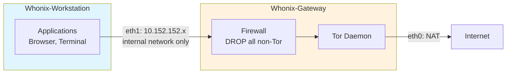

> **Lingua / Language**: [Italiano](../../05-sicurezza-operativa/isolamento-e-compartimentazione.md) | English

# Isolation and Compartmentalization - System-Level Protection

This document analyzes solutions for completely isolating Tor traffic
from normal traffic at the operating system level: Whonix, Tails, Qubes OS,
Linux network namespaces, Docker containerization, and hybrid configurations.
For each solution, I provide architecture, practical setup, and threat model.

---

## Table of Contents

- [Why isolation is necessary](#why-isolation-is-necessary)
- [Comparative matrix of solutions](#comparative-matrix-of-solutions)
- [Whonix - Two-VM isolation](#whonix--two-vm-isolation)
- [Tails - Amnesic system](#tails--amnesic-system)
**Deep dives** (dedicated files):
- [Advanced Isolation](isolamento-avanzato.md) - Qubes, namespaces, Docker, transparent proxy, threat model comparison

---

## Why isolation is necessary

My setup (Tor daemon + proxychains on Kali) has a fundamental problem:
**non-Tor traffic can still go out**. If an application does not respect the proxy
or leaks DNS, my real IP is exposed.

```
Without isolation:
[App] ─proxy→ [Tor] → Internet    (intended traffic)
[App] ─direct→ Internet           (leak!)
[OS services] ─direct→ Internet   (NTP, updates, telemetry, etc.)
[Browser plugin] ─direct→ Internet (WebRTC, DNS prefetch, etc.)

With isolation:
[App] → [firewall: MUST go through Tor] → [Tor] → Internet
[App] → [firewall: BLOCKED] ✗ Internet   (leak impossible)
[OS services] → [firewall: BLOCKED] ✗ Internet (leak impossible)
```

### Leak vectors without isolation

```
1. DNS leak: DNS queries go out in cleartext (see dns-leak.md)
2. WebRTC: reveals real and local IP
3. IPv6: IPv6 traffic bypasses IPv4 proxy
4. UDP: applications using UDP (not supported by Tor)
5. NTP: time synchronization reveals timezone and network
6. OS updates: direct connections for updates
7. systemd-resolved: cache and direct DNS queries
8. D-Bus: system services that communicate over the network
9. mDNS/Avahi: discovery on the local network
10. Opened files: PDF, DOCX that load remote resources
```

The only complete solution is to prevent **at the network level** any
traffic from going out without passing through Tor.

---

## Comparative matrix of solutions

| Feature | proxychains | iptables TP | Namespace | Docker | Whonix | Tails | Qubes+Whonix |
|---------|-------------|-------------|-----------|--------|--------|-------|-------------|
| Leak prevention | Low | High | High | Medium | Very high | Very high | Extreme |
| Amnesia (no traces) | No | No | No | Partial | No | **YES** | No |
| Setup ease | High | Medium | Low | Medium | Medium | High | Low |
| Performance | Good | Good | Good | Good | Medium | Medium | Low |
| HW resources | Minimal | Minimal | Minimal | Low | 4GB+ RAM | 2GB+ RAM | 16GB+ RAM |
| Flexibility | High | Medium | High | High | Medium | Low | High |
| Exploit protection | None | None | Low | Low | Medium | High | Very high |
| Suitable for daily use | **YES** | Partial | No | Partial | YES | Partial | YES |

---

## Whonix - Two-VM isolation

### Architecture

Whonix is a two-virtual-machine system that guarantees traffic isolation
by design:

```
┌────────────────────────────────────────────────────┐
│                    Host OS (KVM/VirtualBox)          │
│                                                      │
│  ┌──────────────────────┐  ┌────────────────────┐  │
│  │  Whonix-Workstation   │  │  Whonix-Gateway    │  │
│  │                       │  │                    │  │
│  │  - Applications       │  │  - Tor daemon      │  │
│  │  - Browser            │  │  - Firewall        │  │
│  │  - Terminal           │  │  - DNS via Tor     │  │
│  │                       │  │                    │  │
│  │  eth0: 10.152.152.11  │  │  eth1: 10.152.152.10│ │
│  │  (internal network)   │  │  (internal network) │  │
│  │                       │  │  eth0: NAT/bridge   │  │
│  │  Default GW:          │  │  (Internet access)  │  │
│  │  10.152.152.10        │  │                    │  │
│  └──────────┬───────────┘  └─────────┬──────────┘  │
│              │     internal network    │              │
│              └────────────────────────┘              │
└──────────────────────────────────────────────────────┘
```


### Diagram: Whonix architecture



### Why it is secure

```
The Workstation:
  - Has ONLY one internal network interface (10.152.152.0/24)
  - Its default gateway is the Gateway (10.152.152.10)
  - Has NO direct Internet access
  - Does not know the host's real IP
  - Even if an application is compromised, it cannot bypass Tor

The Gateway:
  - Has two interfaces: one internal, one external
  - Firewall: BLOCKS all traffic from the Workstation except via Tor
  - All DNS is forced through Tor
  - All TCP is forced through Tor's TransPort
  - UDP: completely blocked (leak impossible)
```

### Practical setup with KVM

```bash
# 1. Install KVM/libvirt
sudo apt install qemu-kvm libvirt-daemon-system virt-manager

# 2. Download Whonix images
# From: https://www.whonix.org/wiki/KVM
# Gateway: Whonix-Gateway.qcow2
# Workstation: Whonix-Workstation.qcow2

# 3. Import the VMs
sudo virsh define Whonix-Gateway.xml
sudo virsh define Whonix-Workstation.xml

# 4. Start (Gateway first, then Workstation)
sudo virsh start Whonix-Gateway
# Wait for Tor to bootstrap
sudo virsh start Whonix-Workstation

# 5. In the Workstation, verify:
curl https://check.torproject.org/api/ip
# {"IsTor":true,...}
```

### Setup with VirtualBox

```bash
# 1. Install VirtualBox
sudo apt install virtualbox

# 2. Download and import the OVAs
# Files: Whonix-Gateway.ova, Whonix-Workstation.ova

# 3. Import
VBoxManage import Whonix-Gateway.ova
VBoxManage import Whonix-Workstation.ova

# 4. The internal network is already configured in the OVAs
# 5. Start Gateway, then Workstation
```

### Gateway firewall (key rules)

```bash
# Whonix Gateway rules (simplified):

# Default policy: DROP everything
iptables -P INPUT DROP
iptables -P FORWARD DROP
iptables -P OUTPUT DROP

# Allow traffic from Workstation ONLY to Tor
iptables -A FORWARD -i eth1 -o eth0 -j DROP  # NO direct forwarding

# All TCP from Workstation → Tor's TransPort
iptables -t nat -A PREROUTING -i eth1 -p tcp -j REDIRECT --to-ports 9040

# All DNS from Workstation → Tor's DNSPort
iptables -t nat -A PREROUTING -i eth1 -p udp --dport 53 -j REDIRECT --to-ports 5353

# Allow the Tor process to go out
iptables -A OUTPUT -m owner --uid-owner debian-tor -j ACCEPT

# DROP everything else
iptables -A OUTPUT -j DROP
```

### When to use Whonix

```
✓ You want complete traffic isolation
✓ You can dedicate 4-8 GB of RAM
✓ You want a persistent system (not amnesic)
✓ You want to install custom software in the Workstation
✓ You need protection even from browser exploits

✗ You do not have resources for virtualization
✗ You need amnesia (use Tails)
✗ You want multi-identity compartmentalization (use Qubes)
```

---

## Tails - Amnesic system

### Architecture

Tails (The Amnesic Incognito Live System) is a live operating system that:
- Boots from USB/DVD
- Routes ALL traffic through Tor
- Leaves no traces on disk (amnesic)
- Completely resets on every reboot

```
┌─────────────────────────────────────────────┐
│              Tails (live USB)                 │
│                                               │
│  ┌──────────┐  ┌────────┐  ┌──────────────┐ │
│  │Tor Browser│  │Thunderb│  │  Terminal    │ │
│  └─────┬─────┘  └───┬────┘  └──────┬───────┘ │
│        │             │              │          │
│  ┌─────▼─────────────▼──────────────▼───────┐ │
│  │          Firewall (iptables)              │ │
│  │  BLOCKS all non-Tor traffic               │ │
│  └──────────────────┬───────────────────────┘ │
│                     │                          │
│              ┌──────▼──────┐                   │
│              │  Tor daemon  │                   │
│              └──────┬──────┘                   │
│                     │                          │
└─────────────────────┼──────────────────────────┘
                      │
                  Internet
```

### Key features

```
Amnesia:
  - The system runs entirely in RAM
  - On reboot, EVERYTHING is wiped
  - No artifacts on disk (no swap, no temp)
  - MAC address randomized at boot

Network isolation:
  - iptables blocks ALL non-Tor traffic
  - DNS forced through Tor (identical to Whonix Gateway)
  - IPv6 completely disabled
  - ICMP/UDP blocked

Included software:
  - Tor Browser (with all protections)
  - Thunderbird (email with Enigmail/OpenPGP)
  - KeePassXC (password manager)
  - OnionShare (file sharing via Tor)
  - MAT2 (Metadata Anonymization Toolkit)
  - Electrum (Bitcoin wallet)
  - Pidgin (messaging with OTR)
```

### Practical setup

```bash
# 1. Download Tails
# From: https://tails.net/install/
# Verify the GPG signature!

# 2. Write to USB (at least 8 GB)
# On Linux:
sudo dd if=tails-amd64-*.img of=/dev/sdX bs=16M status=progress

# Or use Tails Installer (recommended):
# https://tails.net/install/linux/

# 3. Boot from BIOS/UEFI
# Select the USB as boot device
# Tails boots and automatically connects to Tor

# 4. Persistent Storage (optional)
# Tails can create encrypted storage on the USB for:
# - GPG keys
# - KeePassXC passwords
# - Personal files
# - WiFi configuration
# Storage is encrypted with LUKS and requires passphrase at boot
```

### Persistent Storage - what to save

```
Activatable in: Applications → Tails → Persistent Storage

Options:
  ☑ Personal Data       → ~/Persistent/
  ☑ GnuPG keys         → ~/.gnupg/
  ☑ SSH keys            → ~/.ssh/
  ☑ Network Connections → WiFi passwords
  ☑ Browser Bookmarks   → Tor Browser bookmarks
  ☐ Dotfiles            → Custom configuration files
  ☐ Additional Software → Installed additional packages

IMPORTANT: every persistent piece of data is a potential forensic artifact.
Storage is encrypted, but if the passphrase is compromised, the data
is accessible. Use persistent storage only if necessary.
```

### When to use Tails

```
✓ High-risk scenario (journalism, whistleblowing, activism)
✓ You need ZERO traces to remain on the computer
✓ You use shared or untrusted computers
✓ You want the highest level of "out of the box" protection
✓ You do not need custom software

✗ You need a full persistent system
✗ You want to install a lot of additional software
✗ You need performance (Tails is slow)
✗ You cannot reboot the computer (Tails requires booting from USB)
```


---

> **Continues in**: [Advanced Isolation](isolamento-avanzato.md) for Qubes OS,
> Linux network namespaces, Docker, transparent proxy and threat model comparison.

---

## See also

- [Advanced Isolation](isolamento-avanzato.md) - Qubes, namespaces, Docker, threat model comparison
- [Transparent Proxy](../06-configurazioni-avanzate/transparent-proxy.md) - Complete iptables/nftables setup
- [System Hardening](hardening-sistema.md) - sysctl, AppArmor, nftables
- [DNS Leak](dns-leak.md) - DNS leak prevention at all levels
- [OPSEC and Common Mistakes](opsec-e-errori-comuni.md) - Isolation does not replace OPSEC
- [Forensic Analysis and Artifacts](analisi-forense-e-artefatti.md) - What leaves traces on disk and RAM
- [Real-World Scenarios](scenari-reali.md) - Operational cases from a pentester
