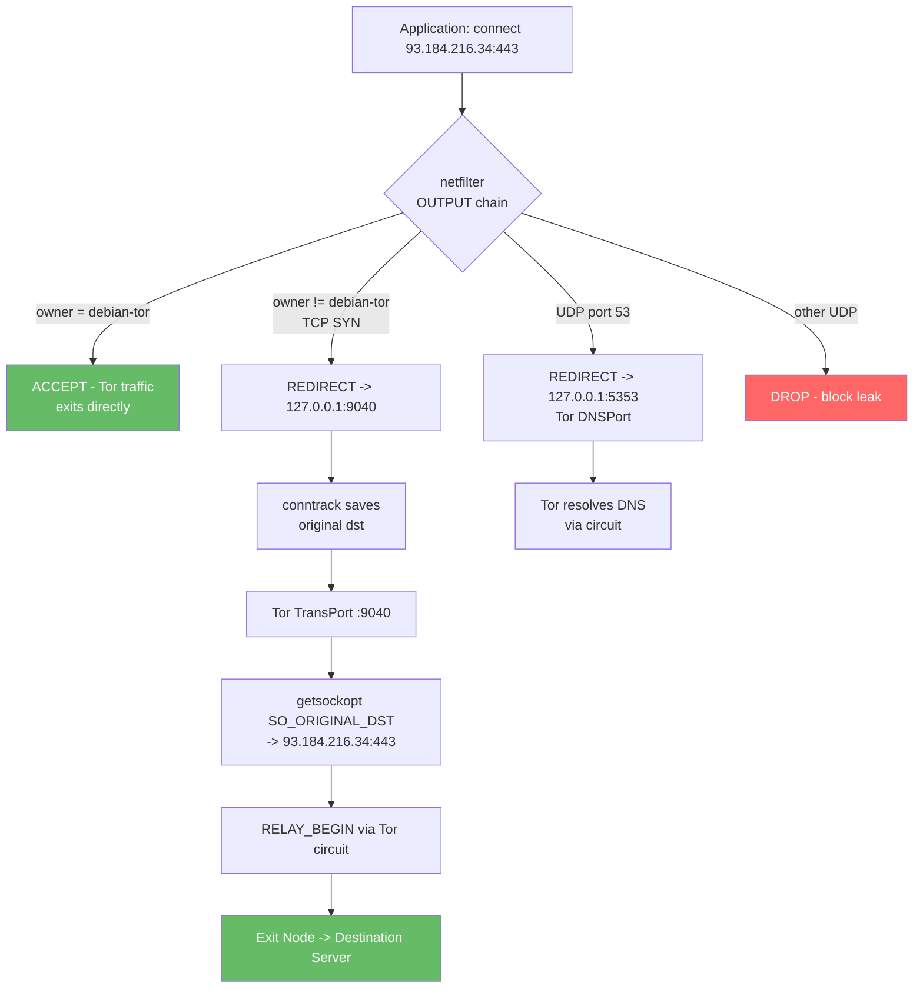

> **Lingua / Language**: [Italiano](../../06-configurazioni-avanzate/transparent-proxy.md) | English

# Transparent Proxy - Forcing All Traffic Through Tor with iptables/nftables

This document analyzes how to configure a Tor transparent proxy using iptables
and nftables, which routes all system TCP traffic through Tor without requiring
per-application configuration.

> **See also**: [VPN and Tor Hybrid](./vpn-e-tor-ibrido.md) for selective routing,
> [DNS Leak](../05-sicurezza-operativa/dns-leak.md) for DNS leak prevention,
> [Isolation and Compartmentalization](../05-sicurezza-operativa/isolamento-e-compartimentazione.md)
> for Whonix/Tails, [torrc Complete Guide](../02-installazione-e-configurazione/torrc-guida-completa.md)
> for TransPort.

---

## Table of Contents

- [What is a Transparent Proxy](#what-is-a-transparent-proxy)
- [How TransPort works at the kernel level](#how-transport-works-at-the-kernel-level)
- [torrc configuration](#torrc-configuration)
- [iptables rules - line-by-line analysis](#iptables-rules--line-by-line-analysis)
- [nftables - modern equivalent](#nftables--modern-equivalent)
- [IPv6 and transparent proxy](#ipv6-and-transparent-proxy)
**Deep dives** (dedicated files):
- [Advanced Transparent Proxy](transparent-proxy-avanzato.md) - LAN, troubleshooting, hardening, script, comparison

---

## What is a Transparent Proxy

A transparent proxy intercepts traffic at the kernel level (netfilter) and
redirects it to Tor, without the applications being aware:

```
Without transparent proxy:
[App] -> connect(93.184.216.34:443) -> Internet (direct, your real IP)

With transparent proxy:
[App] -> connect(93.184.216.34:443)
  -> netfilter intercepts (REDIRECT rule)
  -> redirects to 127.0.0.1:9040 (Tor TransPort)
  -> Tor builds circuit
  -> Exit node connects to 93.184.216.34:443
  -> Visible IP: exit node, not yours
```

The advantage: **no per-application configuration**. Every process on
the system is forced through Tor. The disadvantage: **all or nothing** - you cannot
selectively exclude applications (except with iptables exceptions by UID).

---

## How TransPort works at the kernel level

### The REDIRECT mechanism

When iptables executes `REDIRECT --to-ports 9040` on a TCP packet:

1. **Interception**: netfilter captures the packet in the OUTPUT chain
2. **Destination rewrite**: the kernel rewrites `dst_addr:dst_port` to `127.0.0.1:9040`
3. **Conntrack**: the kernel stores the original destination in the conntrack table:
   ```
   conntrack entry:
     src=127.0.0.1:45678 dst=93.184.216.34:443 -> redirect to 127.0.0.1:9040
   ```
4. **Delivery to Tor**: the packet arrives at Tor's TransPort socket
5. **SO_ORIGINAL_DST**: Tor calls `getsockopt(SO_ORIGINAL_DST)` to retrieve
   the original destination (93.184.216.34:443) from the conntrack table
6. **Connection via circuit**: Tor builds a circuit and issues `RELAY_BEGIN`
   toward the original destination

```
Kernel flow:
[App: connect(93.184.216.34:443)]
  |
[netfilter OUTPUT chain]
  | match: -p tcp --syn
  | target: REDIRECT --to-ports 9040
  |
[conntrack: saves original dst = 93.184.216.34:443]
  |
[packet arrives at 127.0.0.1:9040 (Tor TransPort)]
  |
[Tor: getsockopt(fd, SOL_IP, SO_ORIGINAL_DST) -> 93.184.216.34:443]
  |
[Tor: RELAY_BEGIN "93.184.216.34:443" via circuit]
```

### Diagram: netfilter/iptables flow



### Difference from SocksPort

| Aspect | SocksPort | TransPort |
|--------|-----------|-----------|
| Protocol | SOCKS5 (application-aware) | Native TCP (transparent) |
| DNS | Hostname via SOCKS5 (ATYP=0x03) | IP only (hostname lost) |
| App configuration | Required (proxy setting) | Not required |
| Isolation | Per-stream (IsolateSOCKSAuth) | No (all share the same circuit) |
| Overhead | SOCKS5 handshake | None (kernel redirect) |

**Critical issue**: TransPort receives only the destination IP, not the hostname.
Tor does not know which site you are visiting (only the IP). This can cause problems with
shared hosting (multiple sites on the same IP). This is why DNS must be resolved
separately via DNSPort.

---

## torrc configuration

```ini
# Standard ports
SocksPort 9050
DNSPort 5353
ControlPort 9051
CookieAuthentication 1

# TransPort for transparent proxy
TransPort 9040

# AutomapHosts for DNS mapping
AutomapHostsOnResolve 1
VirtualAddrNetworkIPv4 10.192.0.0/10

# Security
ClientUseIPv6 0
```

### Directive details

| Directive | Value | Purpose |
|-----------|-------|---------|
| `TransPort 9040` | TCP port for redirected connections | Accepts native TCP (not SOCKS) |
| `DNSPort 5353` | UDP port for DNS | Resolves DNS via Tor |
| `AutomapHostsOnResolve 1` | Maps hostnames -> fictitious IPs | Required for DNS->TransPort mapping |
| `VirtualAddrNetworkIPv4` | Fictitious IP range | For AutomapHosts |
| `ClientUseIPv6 0` | Disables IPv6 | Prevents IPv6 leaks |

---

## iptables rules - line-by-line analysis

### Complete annotated script

```bash
#!/bin/bash
TOR_UID=$(id -u debian-tor)
TRANS_PORT=9040
DNS_PORT=5353

# --- NAT table: redirection ---

# Rule 1: Do not touch Tor's own traffic
iptables -t nat -A OUTPUT -m owner --uid-owner $TOR_UID -j RETURN
# -m owner: match based on the process UID
# --uid-owner $TOR_UID: only the Tor process (user debian-tor)
# -j RETURN: do not apply other NAT rules -> Tor traffic exits directly
# WITHOUT THIS RULE: Tor's traffic would be redirected to itself -> infinite loop

# Rule 2: Redirect DNS to Tor's DNSPort
iptables -t nat -A OUTPUT -p udp --dport 53 -j REDIRECT --to-ports $DNS_PORT
# -p udp --dport 53: captures all DNS queries (UDP port 53)
# -j REDIRECT: rewrites the destination to 127.0.0.1:DNS_PORT
# Effect: every system DNS query is resolved via Tor

# Rule 3: Do not redirect localhost
iptables -t nat -A OUTPUT -d 127.0.0.0/8 -j RETURN
# -d 127.0.0.0/8: traffic directed to localhost
# RETURN: let pass without redirect
# Required for: ControlPort, SocksPort, internal communication

# Rule 4: Do not redirect local network
iptables -t nat -A OUTPUT -d 192.168.0.0/16 -j RETURN
iptables -t nat -A OUTPUT -d 10.0.0.0/8 -j RETURN
# Required for: DHCP, LAN services, printers, NAS

# Rule 5: Redirect ALL remaining TCP to TransPort
iptables -t nat -A OUTPUT -p tcp --syn -j REDIRECT --to-ports $TRANS_PORT
# --syn: SYN packets only (new connections)
# WHY --syn: already established connections continue normally
# without --syn, every TCP packet would be processed -> enormous overhead

# --- FILTER table: leak blocking ---

# Rule 6: Allow Tor traffic
iptables -A OUTPUT -m owner --uid-owner $TOR_UID -j ACCEPT

# Rule 7: Allow local traffic
iptables -A OUTPUT -d 127.0.0.0/8 -j ACCEPT

# Rule 8: Allow DNS to DNSPort
iptables -A OUTPUT -p udp -d 127.0.0.1 --dport $DNS_PORT -j ACCEPT

# Rule 9: BLOCK EVERYTHING ELSE
iptables -A OUTPUT -j DROP
# This is the safety rule: if something escapes the NAT redirect,
# it gets dropped here. Prevents any leak.
```

### Rule order is critical

Rules are evaluated in order. If we inverted rules 1 and 5:
- Tor's TCP traffic would be redirected to TransPort
- TransPort would send traffic to Tor -> which gets redirected -> loop
- **Result: no connectivity, possible Tor crash**

---

## nftables - modern equivalent

Kali Linux and Debian are migrating from iptables to nftables. Here is the equivalent:

### Full conversion

```nft
#!/usr/sbin/nft -f

# Flush existing rules
flush ruleset

# Variables
define TOR_UID = debian-tor
define TRANS_PORT = 9040
define DNS_PORT = 5353

table ip tor_proxy {
    
    chain output_nat {
        type nat hook output priority -100; policy accept;
        
        # Do not touch Tor's own traffic
        meta skuid $TOR_UID return
        
        # Redirect DNS to Tor's DNSPort
        udp dport 53 redirect to :$DNS_PORT
        
        # Do not redirect localhost and LAN
        ip daddr 127.0.0.0/8 return
        ip daddr 192.168.0.0/16 return
        ip daddr 10.0.0.0/8 return
        
        # Redirect all TCP to TransPort
        tcp flags syn / syn,ack redirect to :$TRANS_PORT
    }
    
    chain output_filter {
        type filter hook output priority 0; policy drop;
        
        # Allow Tor traffic
        meta skuid $TOR_UID accept
        
        # Allow local traffic
        ip daddr 127.0.0.0/8 accept
        
        # Allow DNS to DNSPort
        udp dport $DNS_PORT ip daddr 127.0.0.1 accept
        
        # Everything else: DROP (policy)
    }
}
```

### iptables -> nftables conversion table

| iptables | nftables |
|----------|----------|
| `-t nat -A OUTPUT` | `chain output_nat { type nat hook output ... }` |
| `-m owner --uid-owner` | `meta skuid` |
| `-p tcp --syn` | `tcp flags syn / syn,ack` |
| `-j REDIRECT --to-ports` | `redirect to :PORT` |
| `-j RETURN` | `return` |
| `-j ACCEPT` | `accept` |
| `-j DROP` | `drop` (or policy drop) |
| `-d 127.0.0.0/8` | `ip daddr 127.0.0.0/8` |
| `iptables -F` | `flush ruleset` |

### Advantages of nftables

- **Unified syntax**: IPv4 and IPv6 in a single file (with `inet` family)
- **Performance**: single-pass evaluation, less overhead
- **Atomicity**: the entire ruleset is loaded atomically
- **Sets and maps**: data structures for complex rules

### nftables rollback

```bash
# Remove all rules
nft flush ruleset

# Verify it is empty
nft list ruleset
```

---

## IPv6 and transparent proxy

### The IPv6 problem

IPv6 is handled separately by the Linux kernel:
- `iptables` -> IPv4 only
- `ip6tables` -> IPv6 only
- `nftables` with family `inet` -> both

If you configure only iptables for the transparent proxy, IPv6 traffic exits
directly -> **complete leak**.

### Complete IPv6 block

```bash
# Method 1: sysctl (disable IPv6 at the kernel level)
sudo sysctl -w net.ipv6.conf.all.disable_ipv6=1
sudo sysctl -w net.ipv6.conf.default.disable_ipv6=1
sudo sysctl -w net.ipv6.conf.lo.disable_ipv6=1

# Persistent in /etc/sysctl.d/99-disable-ipv6.conf:
net.ipv6.conf.all.disable_ipv6 = 1
net.ipv6.conf.default.disable_ipv6 = 1
net.ipv6.conf.lo.disable_ipv6 = 1

# Method 2: ip6tables DROP all (if you cannot disable IPv6)
ip6tables -A OUTPUT -j DROP
ip6tables -A INPUT -j DROP
ip6tables -A FORWARD -j DROP
```

### nftables with IPv6

With nftables family `inet`, you can handle both:

```nft
table inet tor_proxy {
    chain output_filter {
        type filter hook output priority 0; policy drop;
        
        # Allow Tor traffic (IPv4 only)
        meta skuid debian-tor accept
        
        # Allow IPv4 localhost
        ip daddr 127.0.0.0/8 accept
        
        # Block ALL IPv6 (policy drop handles it automatically)
        # No explicit rule needed: without an accept for IPv6, it gets dropped
    }
}
```

---

> **Continues in**: [Advanced Transparent Proxy](transparent-proxy-avanzato.md) for
> LAN gateway, troubleshooting, hardening, production-ready script, and Whonix/Tails comparison.

---

## See also

- [Advanced Transparent Proxy](transparent-proxy-avanzato.md) - LAN, troubleshooting, script, comparison
- [VPN and Tor Hybrid](vpn-e-tor-ibrido.md) - TransPort as a quasi-VPN alternative
- [DNS Leak](../05-sicurezza-operativa/dns-leak.md) - DNS leak prevention with TransPort
- [Multi-Instance and Stream Isolation](multi-istanza-e-stream-isolation.md) - Circuit isolation
- [System Hardening](../05-sicurezza-operativa/hardening-sistema.md) - nftables and firewall rules
- [Real-World Scenarios](scenari-reali.md) - Operational cases from a pentester
