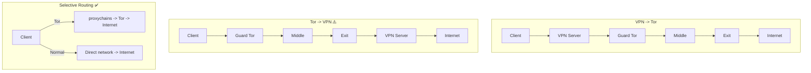

> **Lingua / Language**: [Italiano](../../06-configurazioni-avanzate/vpn-e-tor-ibrido.md) | English

# VPN and Tor - Hybrid Configurations

This document provides an in-depth analysis of why Tor is not a VPN, hybrid VPN+Tor
configurations, the trade-offs of each approach, DNS management in every scenario,
kill switches, split tunneling, and which configuration is actually useful in the
real world.

Based on my experience attempting to use Tor as a VPN, configuring bridges to
bypass blocks, and understanding why a hybrid approach is the most practical
solution.

---

## Table of Contents

- [Why Tor is not a VPN](#why-tor-is-not-and-cannot-be-a-vpn)
- [Hybrid configurations](#hybrid-configurations)
- [VPN -> Tor in detail](#vpn--tor-in-detail)
- [Tor -> VPN and why to avoid it](#tor--vpn-and-why-to-avoid-it)
- [TransPort + iptables (quasi-VPN)](#transparent-proxy-quasi-vpn)
**Deep dives** (dedicated files):
- [VPN and Tor - Routing, DNS and Kill Switch](vpn-tor-routing-e-dns.md) - Selective routing, DNS, kill switch, ExitNodes

---

## Why Tor is not (and cannot be) a VPN

### Fundamental architectural differences

| Characteristic | VPN | Tor |
|---------------|-----|-----|
| OSI layer | Layer 3/4 (IP/TCP) | Layer 7 (application, SOCKS5) |
| Network interface | Creates `tun0`/`tap0` | No interface (proxy) |
| Routing | `ip route` handles all traffic | Only configured application traffic |
| Supported protocols | TCP, UDP, ICMP - everything | TCP only |
| Exit IP | One fixed IP (VPN server) | Variable IP (different exit nodes) |
| Number of hops | 1 (client->VPN server) | 3 (guard->middle->exit) |
| Server control | Owned by a company/individual | Anonymous volunteers |
| Latency | Low (1 hop, ~10-30ms) | High (3+ hops, ~200-500ms) |
| Bandwidth | High (100+ Mbps) | Limited (1-10 Mbps typical) |
| Privacy from whom? | ISP, local network | ISP, websites, surveillance |
| Trust model | Trust in VPN provider | Zero trust (no single relay sees everything) |

### What "does not create a network interface" means

With a VPN:
```bash
# After VPN connection:
> ip route
default via 10.8.0.1 dev tun0    # ALL traffic goes via VPN
10.8.0.0/24 dev tun0 scope link
192.168.1.0/24 dev eth0 scope link

> ip addr show tun0
tun0: flags=4305<UP,POINTOPOINT,RUNNING,NOARP,MULTICAST>
    inet 10.8.0.2/24 scope global tun0

# The Linux kernel sees tun0 as a network interface
# Every IP packet is automatically routed via VPN
# Applications, services, DNS - EVERYTHING goes through the VPN
```

With Tor:
```bash
# After starting Tor:
> ip route
default via 192.168.1.1 dev eth0  # System routing has NOT changed
192.168.1.0/24 dev eth0 scope link

> ip addr
# NO new interface

# Tor does not modify routing. Only applications that explicitly
# connect to the SocksPort (9050) go through Tor.
# Everything else exits normally: DNS, NTP, updates, etc.
```

### The fundamental gap

```
VPN:
  [Kernel] -> [tun0] -> [VPN Tunnel] -> [VPN Server] -> Internet
  ALL IP traffic is captured at the kernel level
  Applications do not need to do anything special

Tor:
  [App] -> [SOCKS5 proxy] -> [Tor] -> [Guard] -> [Middle] -> [Exit] -> Internet
  ONLY apps that speak SOCKS5 go through Tor
  The kernel knows nothing about Tor
  DNS, UDP, ICMP bypass Tor completely
```

### In my experience

I tried to make Tor "system-wide" with various approaches:
- `proxychains` on every application -> inconvenient, does not cover system services
- `torsocks` as a global wrapper -> does not cover already-running processes
- TransPort + iptables -> quasi-VPN but without UDP, fragile
- Network namespace -> works but complex configuration

The conclusion: Tor cannot replace a VPN. They solve different problems.
VPN is for universal routing; Tor is for application-level anonymity.

---

## Hybrid configurations

### Overview of options

```
1. VPN -> Tor:     You -> [VPN] -> [Tor] -> Internet
2. Tor -> VPN:     You -> [Tor] -> [VPN] -> Internet (DISCOURAGED)
3. TransPort:      You -> [iptables] -> [Tor TransPort] -> Internet
4. Selective:      Specific apps -> [Tor], rest -> [VPN or direct]
```

---


### Diagram: configuration comparison



## VPN -> Tor in detail

### Architecture

```
You (192.168.1.100)
  |
  |--[VPN tunnel]-->  VPN Server (85.x.x.x)
  |                    |
  |                    |-->  Guard Tor (relay1)
  |                    |      |
  |                    |      |-->  Middle (relay2)
  |                    |      |      |
  |                    |      |      |-->  Exit (relay3)
  |                    |      |      |      |
  |                    |      |      |      |-->  Internet
```

### Who sees what

```
Your ISP sees:
  Y Connection to the VPN server
  X Does NOT see Tor
  X Does NOT see the final destination

The VPN provider sees:
  Y Your real IP
  Y Connection to the Tor Guard (knows you use Tor)
  X Does NOT see the final destination (encrypted by Tor)

The Tor Guard sees:
  Y The VPN server IP (NOT your real IP)
  X Does NOT see the destination

The Tor Exit sees:
  Y The final destination
  X Does NOT see your IP (sees the Guard)
  X Does NOT know you use a VPN
```

### Practical setup with WireGuard

```bash
# 1. Connect the VPN (WireGuard example)
sudo wg-quick up wg0

# 2. Verify traffic goes through the VPN
curl https://api.ipify.org
# Should show the VPN server IP

# 3. Start Tor (will route through the VPN)
sudo systemctl start tor@default.service

# 4. Verify Tor works through the VPN
curl --socks5-hostname 127.0.0.1:9050 https://check.torproject.org/api/ip
# {"IsTor":true,"IP":"exit-ip-different-from-vpn"}

# The order matters:
# VPN first, then Tor -> VPN -> Tor
# If Tor is already running and you then connect the VPN, existing circuits
# might have issues. Better to restart Tor after the VPN.
```

### Setup with OpenVPN

```bash
# 1. Connect OpenVPN
sudo openvpn --config provider.ovpn --daemon

# 2. Wait for tun0 to come up
while ! ip link show tun0 &>/dev/null; do sleep 1; done

# 3. Start Tor
sudo systemctl start tor@default.service

# 4. The torrc requires no changes:
# Tor connects to the Guard via tun0 (VPN) automatically
# because system routing directs everything through tun0
```

### Advantages

- The ISP does not know you use Tor (traffic looks like normal VPN)
- If Tor is blocked on your network, the VPN can bypass the block
- The exit node does not see your real IP (it sees the guard)
- Double layer of encryption (VPN + Tor) on the first leg

### Disadvantages

- The VPN provider knows your real IP AND knows you use Tor
- Adds latency (VPN + 3 Tor hops = 300-600ms)
- If the VPN logs, your Tor connection is logged
- If the VPN drops without a kill switch -> Tor connects directly (leak)
- VPN subscription cost
- Centralization point (the VPN provider)

### When to use it

- The network blocks Tor (alternative to bridges when bridges do not work)
- You want to hide Tor usage from the ISP without obfs4 bridges
- On corporate networks that allow VPN but block Tor

**In my experience**: obfs4 bridges are a better solution for hiding Tor
from the ISP, because they do not require trusting a VPN provider. VPN->Tor
only makes sense if bridges do not work (e.g., in China or Russia).

---

## Tor -> VPN and why to avoid it

### Architecture

```
You -> [Guard] -> [Middle] -> [Exit] -> [VPN Server] -> Internet
```

### Critical problems

```
1. The VPN becomes the single exit point
   -> All Tor circuits converge toward a single IP (the VPN)
   -> Huge fingerprint: "all traffic from Tor exit to VPN IP"
   -> The VPN becomes an identifiable bottleneck

2. The VPN knows the destination AND the traffic
   -> Even if not your IP (it sees the Tor exit)
   -> Can correlate sessions (same VPN account)
   -> Can be compelled to log (court order)

3. Breaks Tor's anonymity
   -> The exit sends to a single IP (the VPN)
   -> The Tor circuit is "pinned" to one endpoint
   -> NEWNYM changes circuit but not endpoint

4. Very few VPN providers accept connections from Tor exits
   -> Many block Tor IPs due to anti-abuse policy
   -> VPN account must be paid for (financial tracking)

5. Additional DNS leak
   -> The VPN uses its own DNS
   -> If the VPN pushes DNS -> DNS bypasses Tor
```

**Do not use this configuration.** It adds no security and creates
additional vulnerabilities compared to Tor alone.

---

## Transparent proxy (quasi-VPN)

### How it works

Routes all system TCP traffic through Tor using iptables, without
requiring applications to be configured for SOCKS5:

```ini
# In torrc
TransPort 9040
DNSPort 5353
VirtualAddrNetworkIPv4 10.192.0.0/10
AutomapHostsOnResolve 1
```

```bash
#!/bin/bash
# transparent-tor-proxy.sh

TOR_USER="debian-tor"

# 1. Allow Tor's own traffic
sudo iptables -t nat -A OUTPUT -m owner --uid-owner $TOR_USER -j RETURN

# 2. Redirect DNS -> Tor's DNSPort
sudo iptables -t nat -A OUTPUT -p udp --dport 53 -j REDIRECT --to-ports 5353

# 3. Redirect TCP -> Tor's TransPort
sudo iptables -t nat -A OUTPUT -p tcp --syn -j REDIRECT --to-ports 9040

# 4. Allow only Tor traffic outbound
sudo iptables -A OUTPUT -m state --state ESTABLISHED,RELATED -j ACCEPT
sudo iptables -A OUTPUT -m owner --uid-owner $TOR_USER -j ACCEPT
sudo iptables -A OUTPUT -o lo -j ACCEPT

# 5. Block everything else
sudo iptables -A OUTPUT -j REJECT
```

### Advantages

- Quasi-VPN effect: all TCP traffic goes through Tor
- DNS forced via Tor (no leak possible)
- Applications do not need to be configured individually
- Leak prevention at the firewall level

### Disadvantages

- **UDP not supported** -> no NTP, QUIC, VoIP, gaming, direct DNS
- If Tor stalls, all networking is blocked
- Fragile: a mistake in the iptables rules can cause leaks
- Poor performance (all traffic over 3 hops)
- Does not isolate circuits per application (everything shares a circuit)
- If an application sends identifying data -> all circuits correlated

For a complete guide, see `docs/06-configurazioni-avanzate/transparent-proxy.md`.


---

> **Continues in**: [VPN and Tor - Selective Routing, DNS and Kill Switch](vpn-tor-routing-e-dns.md)
> for selective routing, hybrid DNS, kill switch, WireGuard vs OpenVPN, and ExitNodes.

---

## See also

- [VPN and Tor - Routing, DNS and Kill Switch](vpn-tor-routing-e-dns.md) - Selective routing, DNS, kill switch, WireGuard/OpenVPN
- [Transparent Proxy](transparent-proxy.md) - Complete iptables/nftables TransPort setup
- [Multi-Instance and Stream Isolation](multi-istanza-e-stream-isolation.md) - Per-app circuit isolation
- [DNS Leak](../05-sicurezza-operativa/dns-leak.md) - DNS leak prevention
- [Bridges and Pluggable Transports](../03-nodi-e-rete/bridges-e-pluggable-transports.md) - Alternative to VPN for hiding Tor
- [Real-World Scenarios](scenari-reali.md) - Operational cases from a pentester
