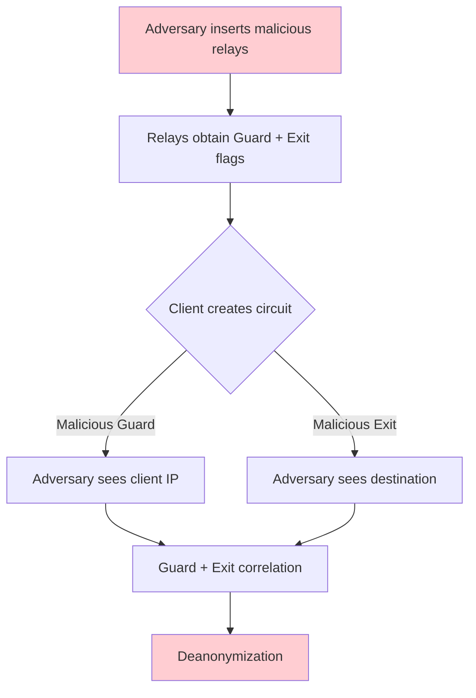

> **Lingua / Language**: [Italiano](../../07-limitazioni-e-attacchi/attacchi-noti.md) | English

# Known Attacks on the Tor Network - Timeline and Technical Analysis

This document catalogs documented attacks against the Tor network: correlation
attacks, Sybil, relay early tagging, HSDir enumeration, website fingerprinting,
DoS, browser exploits, supply chain, and BGP routing attacks. For each attack,
I analyze the technique, the real-world case, the consequences for Tor, and the
countermeasures adopted.

---

## Table of Contents

- [Timeline of major attacks](#timeline-of-major-attacks)
- [Sybil Attack](#1-sybil-attack)
- [Relay Early Tagging Attack](#2-relay-early-tagging-attack)
- [End-to-end correlation attack](#3-end-to-end-correlation-attack)
- [Website Fingerprinting](#4-website-fingerprinting)
- **Deep dives** (dedicated files)
  - [HSDir, DoS, Browser Exploits and Countermeasures](attacchi-noti-avanzati.md)

---

## Timeline of major attacks

```
2007  |  Egerstad: exit node sniffing (cleartext passwords)
2011  |  First paper on website fingerprinting (Panchenko et al.)
2013  |  Freedom Hosting: FBI browser exploit (CVE-2013-1690)
2013  |  Eldo Kim: deanonymization via temporal correlation (Harvard)
2014  |  CMU/FBI: Sybil + relay early tagging (Silk Road 2, etc.)
2014  |  Operation Onymous: seizure of dozens of hidden services
2015  |  RAPTOR: BGP routing attacks (academic paper)
2015  |  Sniper Attack: targeted relay DoS (paper)
2016  |  HSDir probing: hidden service enumeration
2018  |  DeepCorr: correlation with deep learning (96%+ accuracy)
2020  |  KAX17: group of malicious relays discovered (~10% of the network)
2021  |  DoS on Tor network (onion service flooding)
2023  |  Mass removal of malicious relays (KAX17 and others)
2024  |  PoW anti-DoS implemented for onion services
```

---

## 1. Sybil Attack

### How it works

An adversary operates a large number of relays in the Tor network to increase
the probability of controlling both the Guard and the Exit of a circuit:

```
Base scenario:
  Tor network: 7000 legitimate relays
  Adversary adds: 700 malicious relays (10% of the network)
  
  Probability of controlling Guard AND Exit of a circuit:
  P(malicious Guard) × P(malicious Exit) = 0.1 × 0.1 = 1%
  
  But selection is weighted by bandwidth:
  If malicious relays have high bandwidth:
  P(Guard) ≈ 15%, P(Exit) ≈ 15% → P(both) ≈ 2.25%
  
  With thousands of circuits created by the user over time:
  P(at least one compromised circuit) = 1 - (1 - 0.0225)^n
  After 100 circuits: ~90% probability
  → Deanonymization nearly certain for active users
```


### Diagram: Sybil attack



### Real-world case: CMU/FBI (2014)

Researchers at Carnegie Mellon University inserted ~115 relays into the Tor
network between January and July 2014. These relays:

```
Characteristics of CMU relays:
  - Had the HSDir flag (to intercept hidden service descriptors)
  - Had the Guard flag (to be selected as the first hop)
  - Used the "relay early tagging" technique to mark circuits
  - Operated from IPs in the CMU range (128.2.0.0/16)
  - High bandwidth → frequent selection

Objectives:
  - Collect information on users of specific hidden services
  - Identify the location of hidden services
  - Information was shared with the FBI

Result:
  - Deanonymization of users and operators of darknet markets
  - Arrests linked to Silk Road 2.0, Agora, and others
  - The Tor Project discovered and removed the relays in July 2014
```

### Countermeasures adopted after CMU/FBI

```
1. Directory Authorities monitoring:
   - Alert for addition of many relays from the same subnet
   - Manual review of suspicious relays
   - Analysis of relay properties (uptime, bandwidth)

2. /16 subnet rule:
   - Relays in the same /16 are not used in the same circuit
   - E.g.: 128.2.1.1 and 128.2.2.1 will not be Guard+Exit together

3. MyFamily:
   - Co-operated relays MUST declare themselves in the same "family"
   - Relays in the same family are not used in the same circuit
   - If they fail to declare → detection and removal

4. Bandwidth Authorities:
   - Limit the influence of new relays (gradual ramp-up)
   - A newly added relay does not immediately get high bandwidth weight
   - Warm-up period before being selected frequently

5. RELAY_EARLY cells:
   - Monitored and limited (see next section)
```

### KAX17 (2020-2023)

```
An unknown group (identified as "KAX17") operated
hundreds of relays for years:
  - ~900 relays at one point (~10% of the network)
  - Predominantly middle relays (not exits)
  - Distributed across many different ASes (hard to detect)
  - No MyFamily declared

Suspected purpose:
  - Deanonymization via correlation
  - Traffic metadata collection
  - Possible intelligence agency operation

The Tor Project removed KAX17 relays in 2021-2023
after in-depth network analysis.
```

---

## 2. Relay Early Tagging Attack

### How it works

A malicious relay (middle) inserts information in `RELAY_EARLY` cells
that normally should not contain user data:

```
Normal protocol:
  RELAY_EARLY cells are used ONLY during circuit creation
  Limit: max 8 RELAY_EARLY cells per circuit
  After creation: only normal RELAY cells

Attack:
  1. Client → Guard → Malicious Middle → Malicious Exit
  2. The Middle encodes information in the RELAY_EARLY cell fields:
     - IP of the Guard from which the circuit originates
     - Timestamp
     - Circuit identifier
  3. The Exit (controlled by the same adversary) decodes the tag
  4. The Exit now knows:
     - From which Guard the circuit originates
     - Which destination it is reaching
     → If the adversary knows the Guard's IP, they can narrow
       the set of possible users

For hidden services:
  1. Client → Guard → Malicious Middle → Introduction Point
  2. The Middle tags the circuit
  3. The adversary (who also controls HSDir or Rend Point)
     sees the tag at the other point of the circuit
  → Correlation: this client is accessing this hidden service
```

### Real-world case: CMU/FBI (2014)

This is the same attack as the Sybil case above. The CMU relays used
relay early tagging to mark circuits toward specific hidden services.

```
Detailed technique:
  1. CMU relays were positioned as Guard and HSDir
  2. When a client connected to a monitored HS:
     a. The malicious Guard saw the connection from the client
     b. The malicious HSDir saw the descriptor request
     c. Relay early tagging correlated the two points
  3. Result: client IP linked to the visited HS
```

### Countermeasures adopted (Tor 0.2.4.23+)

```
1. Clients count RELAY_EARLY cells:
   - Maximum 8 per circuit (during creation)
   - If a relay sends more than 8 → circuit closed + relay reported

2. Relays that send anomalous RELAY_EARLY:
   - Reported to Directory Authorities
   - Removed from the consensus

3. RELAY_EARLY → RELAY conversion:
   - The Guard does not forward RELAY_EARLY cells toward the middle/exit
   - Converts them to normal RELAY cells
   - The middle can no longer use RELAY_EARLY for tagging

4. Continuous monitoring:
   - The Tor Project analyzes traffic for anomalous patterns
   - Automatic alerts for relays with suspicious behavior
```

---

## 3. End-to-end correlation attack

### How it works

If the adversary controls (or observes) both the first hop (guard or client→guard
link) and the last hop (exit or exit→destination link), they can correlate
traffic timing to deanonymize the user.

```
Ingress-side observation:            Egress-side observation:
t=0.00 [burst 5 cells]              t=0.15 [burst 5 cells]
t=0.50 [pause]                      t=0.65 [pause]
t=0.55 [burst 3 cells]              t=0.70 [burst 3 cells]

Statistical correlation → same flow with ~95% confidence
```

### Documented effectiveness

```
Academic research (evolution over time):

2004 - Levine et al.: "Timing Attacks in Low-Latency Mix Systems"
  - >80% true positive with passive observation
  - Cell-level padding insufficient

2005 - Murdoch & Danezis: first practical attacks
  - ~50% true positive in a few minutes

2013 - Johnson et al.: "Users Get Routed"
  - Simulation on real Tor network with AS data
  - >80% users deanonymized in 6 months of use
  - Persistent Guard helps but does not eliminate the risk

2018 - Nasr et al.: "DeepCorr"
  - Deep learning (CNN) for correlation
  - >96% true positive with <0.1% false positive
  - Works with only 25 seconds of observation
  - Resists Tor circuit padding

2020+ - Continued improvements with transformers and attention
```

### Who can carry out this attack

```
1. Intelligence agencies with global surveillance capability
   - NSA (XKeyscore, PRISM)
   - GCHQ (Tempora)
   - Five Eyes cooperation

2. Cooperating ISPs
   - The client's ISP + the destination's ISP
   - Possible with a court order

3. Organizations that control guard + exit relays
   - Sybil attack (see above)
   - Requires significant resources

4. CDNs with wide visibility
   - Cloudflare sees ~15-20% of web traffic
   - If your ISP cooperates AND the site uses Cloudflare → correlation

5. Internet Exchange Points (IXPs)
   - A large IXP can observe traffic from many ISPs
   - Privileged observation point
```

### Fundamental limitation

Tor **is not designed** to resist an adversary who controls both
endpoints. This is a declared limitation in Tor's threat model.

The countermeasures (padding, connection padding) make the attack more costly
but do not prevent it. This is an intrinsic limitation of low-latency networks.

---

## 4. Website Fingerprinting

### How it works

A local adversary (e.g., ISP) observes only the client→guard traffic and
determines which site the user is visiting by analyzing the patterns:

```
Training phase:
  The adversary visits thousands of sites via Tor
  Records for each site: sequence of (direction, size, timing) per packet
  Trains an ML classifier

Attack phase:
  Observes the victim's traffic
  Extracts the same features
  The classifier returns: "Site X with probability Y%"
```

### State of the art

```
Classifier evolution:

2011 - Panchenko et al.: SVM
  - ~90% accuracy, 100 monitored sites (closed world)

2016 - Panchenko et al.: "Website Fingerprinting at Internet Scale"
  - Random Forest + feature engineering
  - 90%+ on 100 sites

2018 - Sirinam et al.: "Deep Fingerprinting"
  - CNN (deep learning)
  - >98% accuracy (closed world, 95 sites)
  - ~95% with multi-tab browsing

2019 - Bhat et al.: "Var-CNN"
  - Variational CNN
  - Improved performance in open world

2020 - Rahman et al.: "Tik-Tok"
  - Includes timing features
  - >96% accuracy

2022+ - Transformer-based models
  - Attention mechanisms to capture long-range dependencies
  - State-of-the-art performance
```

### Conditions that degrade the attack

```
In real-world conditions, accuracy degrades significantly:

1. Multi-tab browsing: traffic from different tabs mixes → noise
2. Background traffic: downloads, updates → alter the pattern
3. CDN and cache: the same page served differently → variability
4. A/B testing: different page versions → different fingerprints
5. Dynamic content: ads, personalized content
6. HTTP/2 multiplexing: requests mixed in a single stream
7. Network variability: jitter, loss, congestion

Accuracy in realistic open world:
  - 60-80% true positive
  - 5-15% false positive
  - High computational cost for large-scale monitoring
```

### Countermeasures in Tor

```
1. Circuit padding framework:
   - State machines that add padding
   - Currently protect HS rendezvous
   - Under development for general circuits

2. Connection padding:
   - Periodic dummy cells on TLS connections between relays
   - ~5% overhead

3. Ongoing research:
   - WTF-PAD: adaptive padding (~30% accuracy reduction)
   - FRONT: padding only in the initial portion (~40% reduction)
   - TrafficSliver: traffic splitting across parallel circuits
```

---

> **Continues in** [Known Attacks - HSDir, DoS, BGP and Countermeasures](attacchi-noti-avanzati.md)
> - HSDir enumeration, DoS on the network, browser exploits (Freedom Hosting, Playpen),
> supply chain, BGP/RAPTOR, Sniper Attack, attacks on Onion Services, complete
> matrix and countermeasure timeline.

---

## See also

- [Traffic Analysis](../05-sicurezza-operativa/traffic-analysis.md) - End-to-end correlation, website fingerprinting
- [OPSEC and Common Mistakes](../05-sicurezza-operativa/opsec-e-errori-comuni.md) - Human errors that cause deanonymization
- [Protocol Limitations](limitazioni-protocollo.md) - Architectural limits of Tor
- [Onion Services v3](../03-nodi-e-rete/onion-services-v3.md) - v3 protections against HSDir attacks
